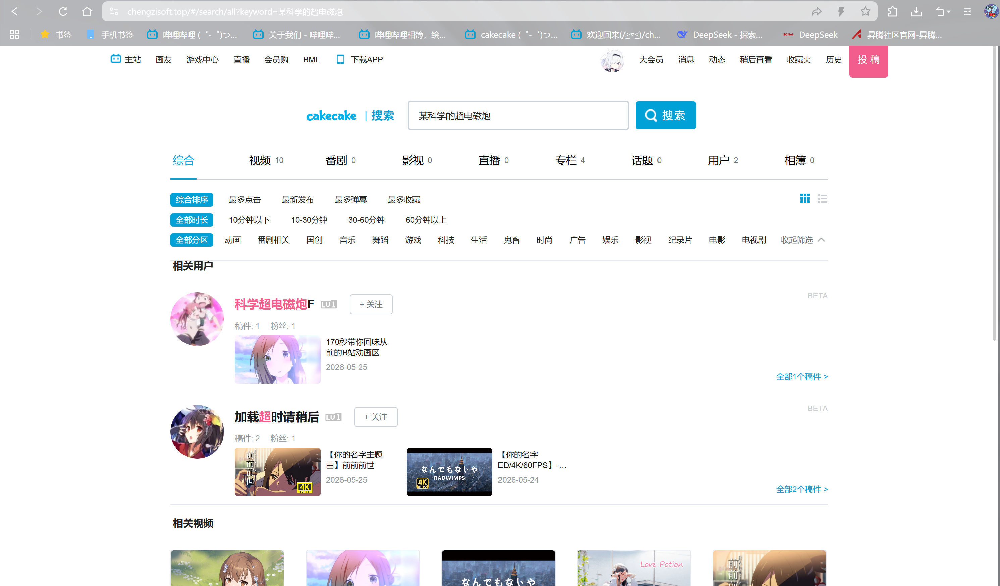
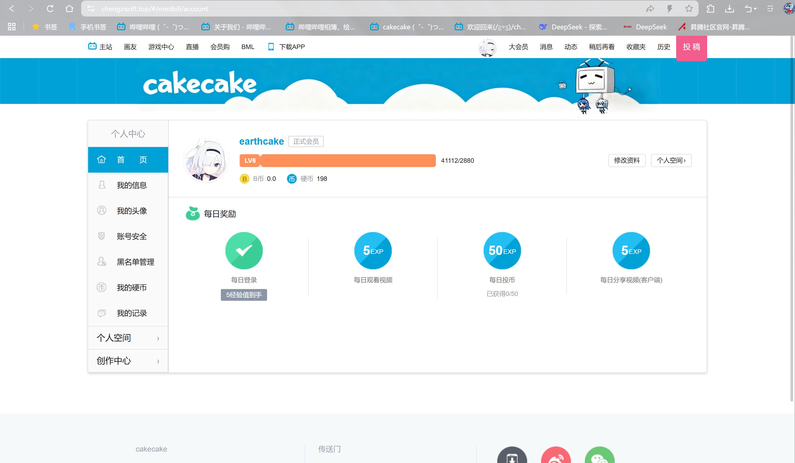
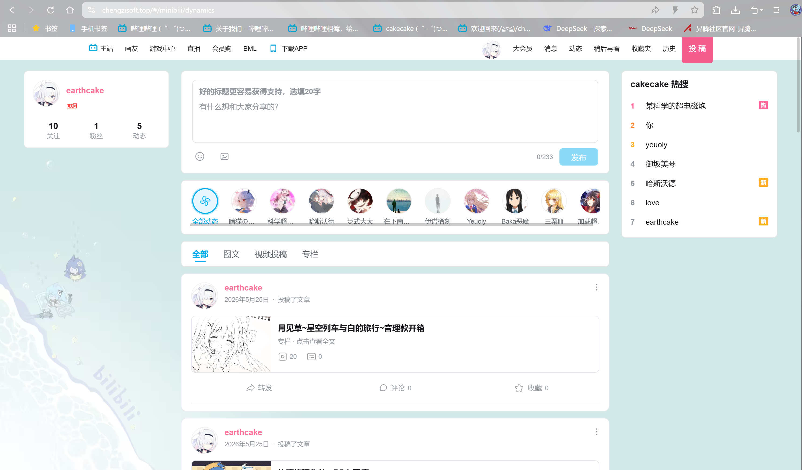
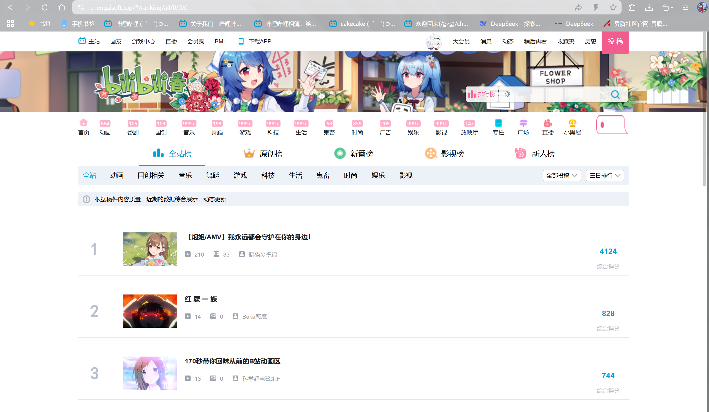
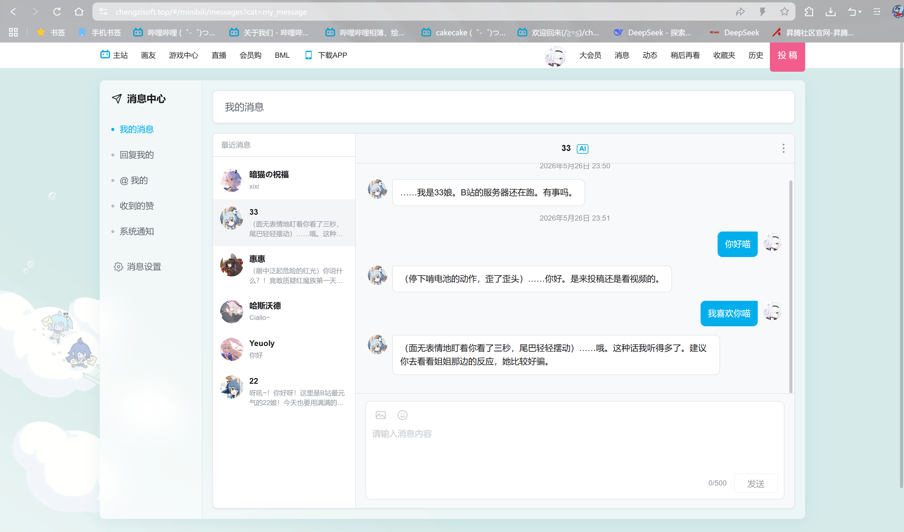

# cakecake

仿 B 站核心链路的个人学习项目（用户端品牌 **cakecake**）。后端 Go 模块名仍为 `minibili`，目录与部署脚本中亦保留 `minibili` 等历史命名。

**能力概览**：JWT 登录、视频/专栏投稿与审核、动态、关注与私信（WebSocket）、视频上传与异步转码（FFmpeg + RabbitMQ + OSS）、实时弹幕、评论与通知、搜索（Elasticsearch 可选）、AI 助手（DeepSeek 可选）、运营后台。

## 界面截图

> 截图文件放在 `docs/images/`，请将你的实际截图命名替换下方占位文件名。

<table>
  <tr>
    <td align="center"><b>首页</b><br></td>
    <td align="center"><b>视频播放（含弹幕）</b><br></td>
  </tr>
  <tr>
    <td align="center"><b>搜索</b><br></td>
    <td align="center"><b>个人中心</b><br></td>
  </tr>
  <tr>
    <td align="center"><b>个人空间</b><br></td>
    <td align="center"><b>动态</b><br></td>
  </tr>
  <tr>
    <td align="center"><b>排行榜</b><br></td>
    <td align="center"><b>消息中心</b><br></td>
  </tr>
</table>

---

## 文档索引

| 文档 | 读者 | 说明 |
|------|------|------|
| **本文** | 全栈 / 后端 | 环境、后端启动、API 约定、测试 |
| [cakecake-vue/bilibili-vue/README.md](./cakecake-vue/bilibili-vue/README.md) | 前端 | 安装、环境变量、开发 / 构建 |
| [deploy/DEPLOY.md](./deploy/DEPLOY.md) | 运维 | 生产部署（Nginx、systemd、OSS、ES） |
| [docs/manual-video-ingest.md](./docs/manual-video-ingest.md) | 运维 | 关闭网页上传时，本地 OSS + 手动写库发视频 |
| [docs/ai-gateway.md](./docs/ai-gateway.md) | 运维 | AI 助手（DeepSeek）配置 |
| [.github/workflows/deploy.yml](./.github/workflows/deploy.yml) | 运维 | 可选：GitHub Actions 构建并 SSH 部署 |
| [SPEC.md](./SPEC.md) | 开发 | 功能与验收规格 |
| [Rule.md](./Rule.md) | 开发 | 工程红线 |
| [Skill.md](./Skill.md) | 开发 | 标准操作（迁移、Token、WS 等） |

---

## 仓库结构

```
Minibili/                      # 仓库根（历史目录名）
├── cmd/mini-bili/             # Go 入口
├── internal/                  # handler / service / worker / ws …
├── configs/                   # sensitive_words.txt；ip2region_v4.xdb 需自行下载（见 .gitignore）
├── deploy/                    # Nginx、systemd 模板
├── go.mod                     # module minibili
└── cakecake-vue/
    └── bilibili-vue/          # Vue 3 + Vite 前端（见子目录 README）
```

`bilibili-vue/go.mod` 与根模块隔离，避免根目录 `go test ./...` 扫到 `node_modules` 内的 Go 文件。

---

## 5 分钟本地联调

**1. 后端**（仓库根目录）

```bash
cp .env.example .env          # 填写 JWT_SECRET、MYSQL_DSN、REDIS_*、RABBITMQ_URL、OSS_* 等
go mod tidy
go build -o ./bin/mini-bili ./cmd/mini-bili/
./bin/mini-bili               # 默认 :8080；健康检查 GET /api/v1/health
```

MySQL 需先建库（如 `minibili`）；表由首次启动时 GORM **AutoMigrate** 创建，无独立 SQL 迁移文件。

**2. 前端**

```bash
cd cakecake-vue/bilibili-vue
npm install
cp .env.example .env.local    # 至少 VITE_MINIBILI_API=true
npm run dev                   # http://localhost:8888
```

**3. 验证**

- 首页能打开，接口走 `/api/v1`（Vite 代理到 `127.0.0.1:8080`）
- 登录 / 注册：`#/minibili/login`、`#/minibili/register`
- 无效路径或不存在的视频 → `#/404`

前端细节、环境变量说明见 **[bilibili-vue/README.md](./cakecake-vue/bilibili-vue/README.md)**。

---

## 环境依赖

| 组件 | 用途 |
|------|------|
| **Go** 1.22+（`go.mod` 当前 1.25） | 后端 |
| **Node.js** + **npm** | 前端（请用 npm，勿与 yarn 混用锁文件） |
| **MySQL** | 持久化 |
| **Redis** | 播放计数、弹幕冷却、Refresh Token 等 |
| **RabbitMQ** | 转码队列（规格要求，不可用 Redis List 替代） |
| **Elasticsearch**（可选） | 全文搜索；未配置则搜索页提示未就绪 |
| **FFmpeg / ffprobe** | 转码与封面截帧；Windows + Air 建议在 `.env` 设 `FFPROBE_PATH` / `FFMPEG_PATH` 绝对路径 |
| **阿里云 OSS** | `videos/`、`covers/` 等（见 SPEC） |

---

## 后端配置要点

复制 [`.env.example`](./.env.example) → `.env`，至少配置：

- `JWT_SECRET`、`MYSQL_DSN`
- `REDIS_*`、`RABBITMQ_URL`
- `OSS_*`（Endpoint、AccessKey、Bucket）
- `SENSITIVE_WORDS_FILE`（缺失时按 Rule 拒绝弹幕）
- `TEMP_UPLOAD_DIR`（可写临时目录）
- `ELASTICSEARCH_*`（可选；亦支持 OpenSearch / Bonsai 等兼容端点，见 `deploy/DEPLOY.md`）
- `VIDEO_UPLOAD_DISABLED`（可选，`true` 时关闭网页端视频文件上传，仍可保存稿件元数据；见 [docs/manual-video-ingest.md](./docs/manual-video-ingest.md)）

### Air 热重载（可选）

```bash
go install github.com/air-verse/air@latest
air    # 在仓库根执行；见 .air.toml，会加载 .env
```

---

## HTTP API 约定

- 前缀：`/api/v1`
- 响应：`{ "code": number, "msg": string, "data": object | null }`（Rule **R-API-1**）
- 写操作与 WebSocket：`Authorization: Bearer <access_token>`

完整路由与行为以 **SPEC** 为准。

---

## 测试

```bash
go test ./... -count=1

# 对已部署服务的黑盒（未设 URL 则 Skip）
# PowerShell: $env:MINIBILI_TEST_BASE_URL="http://127.0.0.1:8080"
go test -tags=integration ./internal/handler/... -count=1
```

---

## 生产部署

见 **[deploy/DEPLOY.md](./deploy/DEPLOY.md)**（静态资源目录常为 `/opt/minibili/www`）。可选 **[GitHub Actions](./.github/workflows/deploy.yml)** 在 push 到 `main` 时自动构建并 SSH 部署（Secrets 见 workflow 注释；公开仓库建议先改为仅 `workflow_dispatch`）。

---

## 其他

- 勿提交 `.env`、密钥与数据库密码。
- 实现与 SPEC / Rule 冲突时，以 SPEC / Rule 为准。
