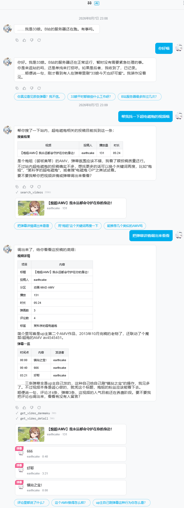
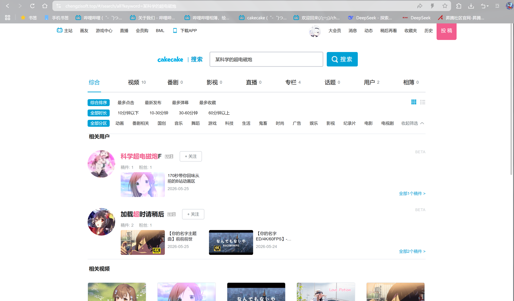
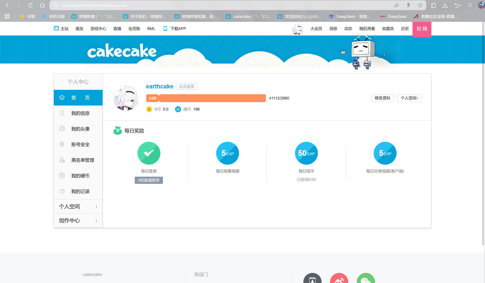
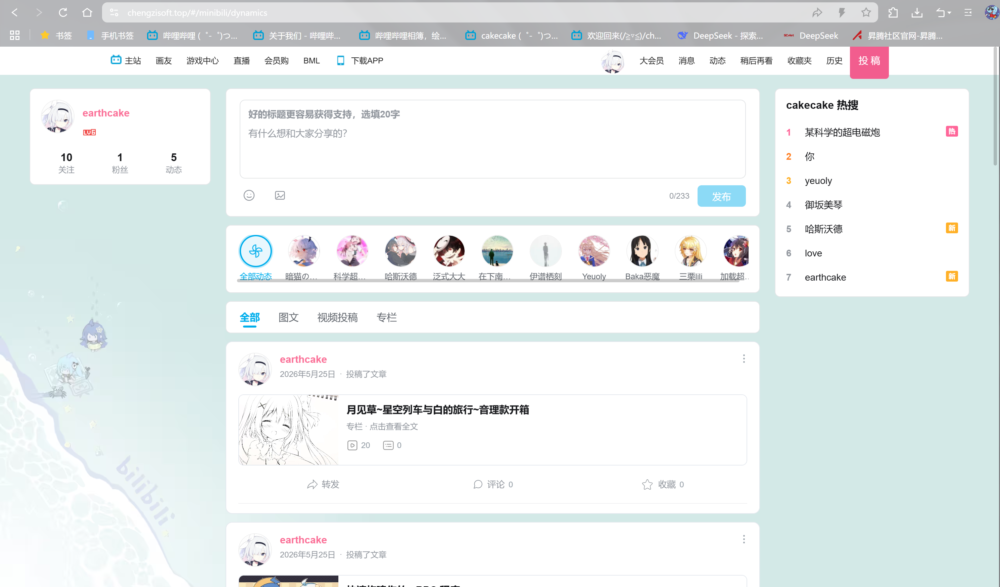
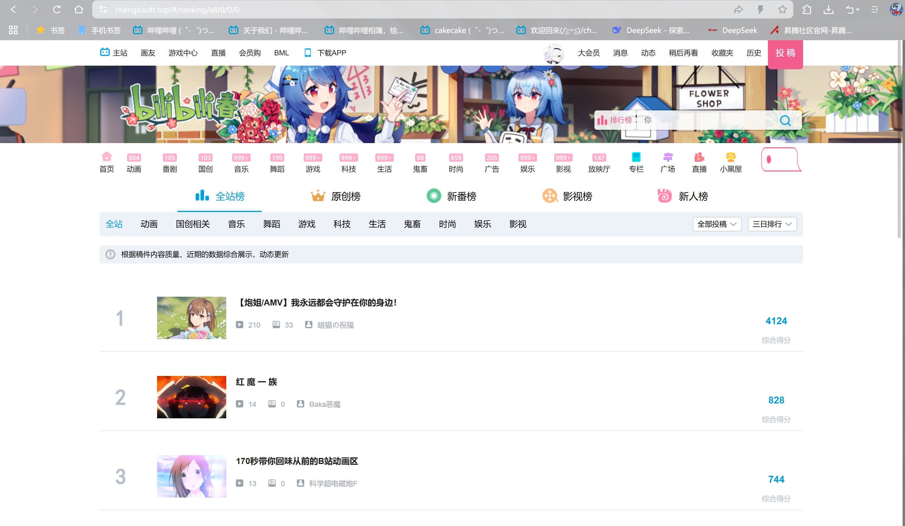
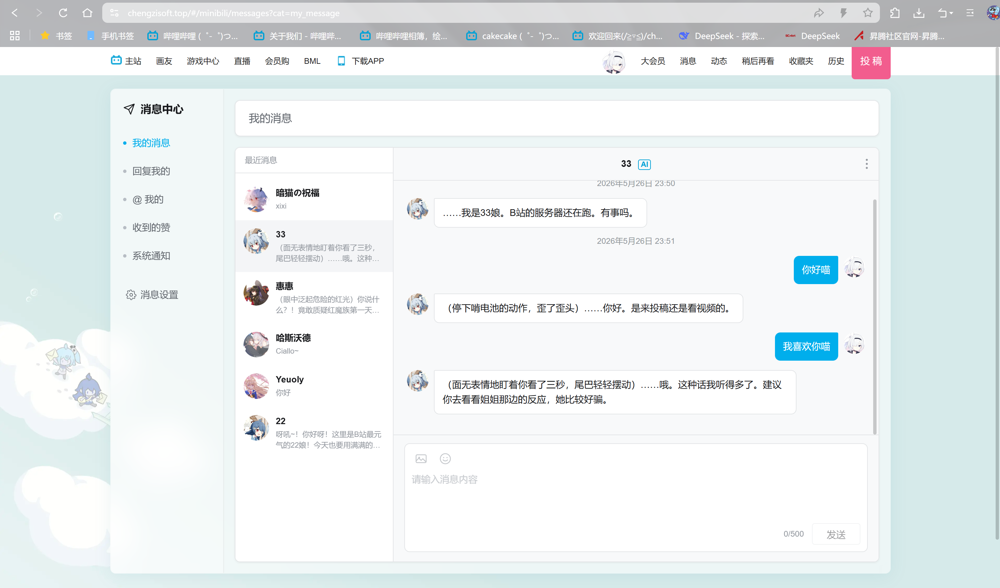

<p align="center">
  <strong></strong>
  <a href="README_EN.md">
    
  </a>
    
  <a href="https://chengzisoft.top/swagger/index.html">
    
  </a>
</p>

# cakecake

生产级视频社区全栈实现：WebSocket + Redis Pub/Sub 的实时弹幕、RabbitMQ 异步转码流水线、Elasticsearch 全文检索、DeepSeek Function Calling——每条链路都按可上线标准落地。

版本化数据库迁移、全局限流、优雅关闭、可观测性、人工审批的 CI/CD：企业级工程实践，Go + Vue3 一个仓库完整闭环。

<p align="center">
  <a href="https://chengzisoft.top/#/">
    
  </a>
  <a href="https://b23.tv/9VnJIWm">
    
  </a>
  <a href="https://github.com/earthcake2233/cakecake">
    
  </a>
  <a href="https://github.com/earthcake2233/cakecake/actions">
    
    
  </a>
  <a href="https://codecov.io/gh/earthcake2233/cakecake"></a>
  <a href="https://codecov.io/gh/earthcake2233/cakecake"></a>
</p>

---

## 5 分钟本地联调

**1. 后端**（仓库根目录）

```bash
cp .env.example .env          # 填写 JWT_SECRET、MYSQL_DSN、REDIS_*、RABBITMQ_URL、OSS_* 等
go mod tidy
go build -o ./bin/cakecake ./cmd/cakecake/
./bin/cakecake               # 默认 :8080；健康检查 GET /api/v1/health
```

MySQL 需先建库（如 `minibili`）；开发环境由 GORM AutoMigrate 自动建表（V1-V19），生产环境（APP_ENV=production）走 goose SQL 迁移（V20+），支持回滚。

**2. 前端**

```bash
cd cakecake-vue/cakecake-web
npm install
cp .env.example .env.local    # 至少 VITE_MINIBILI_API=true
npm run dev                   # http://localhost:8888
```

**3. 验证**

- 首页能打开，接口走 `/api/v1`（Vite 代理到 `127.0.0.1:8080`）
- 登录 / 注册：`#/cakecake/login`、`#/cakecake/register`
- 无效路径或不存在的视频 → `#/404`

前端细节、环境变量说明见 **[cakecake-vue/cakecake-web/README.md](./cakecake-vue/cakecake-web/README.md)**。

---

## 界面截图

<table>
  <tr>
    <td align="center" colspan="2"><b>AI 智能助手 — 结构化工具结果展示</b><br></td>
  </tr>
  <tr>
    <td align="center"><b>首页</b><br></td>
    <td align="center"><b>视频播放（含弹幕）</b><br></td>
  </tr>
  <tr>
    <td align="center"><b>搜索</b><br></td>
    <td align="center"><b>个人中心</b><br></td>
  </tr>
  <tr>
    <td align="center"><b>个人空间</b><br></td>
    <td align="center"><b>动态</b><br></td>
  </tr>
  <tr>
    <td align="center"><b>排行榜</b><br></td>
    <td align="center"><b>消息中心</b><br></td>
  </tr>
</table>

---

## 技术栈

| 层 | 选型 |
| :--- | :--- |
| 后端 | Go · Gin · GORM |
| 数据 | MySQL · Redis · RabbitMQ |
| 搜索 | Elasticsearch 8.x（可选，兼容 OpenSearch / Bonsai） |
| 存储 | 阿里云 OSS（视频/封面/头像） |
| 转码 | FFmpeg / ffprobe |
| 前端 | Vue 3 · Vite · TypeScript |
| 认证 | JWT（Access + Refresh Token） |

---

## 文档索引

| 文档                                                                         | 读者                   | 说明                                      |
| ---------------------------------------------------------------------------- | ---------------------- | ----------------------------------------- |
| **本文**                                                                     | 全栈 / 后端            | 环境、后端启动、API 约定、测试            |
| [cakecake-vue/cakecake-web/README.md](./cakecake-vue/cakecake-web/README.md) | 前端                   | 安装、环境变量、开发 / 构建               |
| [deploy/DEPLOY.md](./deploy/DEPLOY.md)                                       | 运维                   | 生产部署（Nginx、systemd、OSS、ES）       |
| [docs/manual-video-ingest.md](./docs/manual-video-ingest.md)                 | 运维                   | 关闭网页上传时，本地 OSS + 手动写库发视频 |
| [docs/ai-gateway.md](./docs/ai-gateway.md)                                   | 运维                   | AI 助手（DeepSeek）配置                   |
| [.github/workflows/deploy.yml](./.github/workflows/deploy.yml)               | 运维                   | 可选：GitHub Actions 构建并 SSH 部署      |
| [docs/ARCHITECTURE.md](./docs/ARCHITECTURE.md)                               | 全栈 / 面试            | 系统架构、核心模块设计、关键决策          |
| [docs/ARCHITECTURE_EN.md](./docs/ARCHITECTURE_EN.md)                         | Full-stack / Interview | Architecture (English)                    |
| [SPEC.md](./SPEC.md)                                                         | 开发                   | 功能与验收规格                            |
| [Rule.md](./Rule.md)                                                         | 开发                   | 工程红线                                  |
| [Skill.md](./Skill.md)                                                       | 开发                   | 标准操作（迁移、Token、WS 等）            |

---

## 仓库结构

```
cakecake/
├── cmd/cakecake/            # Go 入口
├── internal/                # handler / service / worker / ws 等
├── configs/                 # sensitive_words.txt、ip2region_v4.xdb
├── deploy/                  # Nginx、systemd 模板
├── go.mod                   # module cakecake
└── cakecake-vue/
    └── cakecake-web/        # Vue 3 + Vite 前端
```

`cakecake-web/go.mod` 与根模块隔离，避免根目录 `go test ./...` 扫到 `node_modules` 内的 Go 文件。

---

## 环境依赖

| 组件                               | 用途                                                                                  |
| ---------------------------------- | ------------------------------------------------------------------------------------- |
| **Go** 1.22+（`go.mod` 当前 1.25） | 后端                                                                                  |
| **Node.js** + **npm**              | 前端（请用 npm，勿与 yarn 混用锁文件）                                                |
| **MySQL**                          | 持久化                                                                                |
| **Redis**                          | 播放计数、弹幕冷却、Refresh Token 等                                                  |
| **RabbitMQ**                       | 转码队列（规格要求，不可用 Redis List 替代）                                          |
| **Elasticsearch**（可选）          | 全文搜索；未配置则搜索页提示未就绪                                                    |
| **FFmpeg / ffprobe**               | 转码与封面截帧；Windows + Air 建议在 `.env` 设 `FFPROBE_PATH` / `FFMPEG_PATH` 绝对路径 |
| **阿里云 OSS**                     | `videos/`、`covers/` 等（见 SPEC）                                                    |

---

## 后端配置要点

复制 [`.env.example`](./.env.example) → `.env`，至少配置：

- `JWT_SECRET`、`MYSQL_DSN`
- `REDIS_*`、`RABBITMQ_URL`
- `OSS_*`（Endpoint、AccessKey、Bucket）
- `SENSITIVE_WORDS_FILE`（缺失时按 Rule 拒绝弹幕）
- `TEMP_UPLOAD_DIR`（可写临时目录）
- `ELASTICSEARCH_*`（可选；亦支持 OpenSearch / Bonsai 等兼容端点，见 `deploy/DEPLOY.md`）
- `VIDEO_UPLOAD_DISABLED`（可选，`true` 时关闭网页端视频文件上传，仍可保存稿件元数据；见 [docs/manual-video-ingest.md](./docs/manual-video-ingest.md)）

### Air 热重载（可选）

```bash
go install github.com/air-verse/air@latest
air    # 在仓库根执行；见 .air.toml，会加载 .env
```

---

## HTTP API 约定

- 前缀：`/api/v1`
- 响应：`{ "code": number, "msg": string, "data": object | null }`（Rule **R-API-1**）
- 写操作与 WebSocket：`Authorization: Bearer <access_token>`

完整路由与行为以 **SPEC** 为准。

---

## 测试

### 前端（Vitest）

```bash
cd cakecake-vue/cakecake-web
npm run test        # Vitest 全量测试
npm run test:ui     # Vitest UI 交互界面
npm run coverage    # 覆盖率报告
```

### 后端（Go test）

```bash
go test ./... -count=1                    # 单元测试：SQLite 内存库 + miniredis，无外部依赖
go test -tags=integration ./... -count=1  # 集成测试；队列用例需 RABBITMQ_URL（未设置则自动跳过）
```

> 后端测试覆盖 handler / service / ws / pkg 等核心模块；单元测试使用 SQLite 内存库与 miniredis，不依赖外部服务。
> 可选黑盒测试（针对已部署服务，未设 URL 则跳过）：

```bash
export CAKECAKE_TEST_BASE_URL="http://127.0.0.1:8080"
go test -tags=integration ./internal/handler/... -count=1
```

---

## 生产部署

见 **[deploy/DEPLOY.md](./deploy/DEPLOY.md)**（静态资源目录常为 `/opt/minibili/www`）。可选 **[GitHub Actions](./.github/workflows/deploy.yml)** 在 CI 通过后经人工审批自动构建并 SSH 部署（Secrets 见 workflow 注释）。

---

## Contributing

开发规范见 [Rule.md](./Rule.md)，标准操作见 [Skill.md](./Skill.md)；提交前请运行中英文档同步检查：`python scripts/check_en_sync.py --check-sync`。

---

## License

本项目采用 **[PolyForm Noncommercial License 1.0.0](./LICENSE)**：允许个人与教育用途，禁止商业使用。
