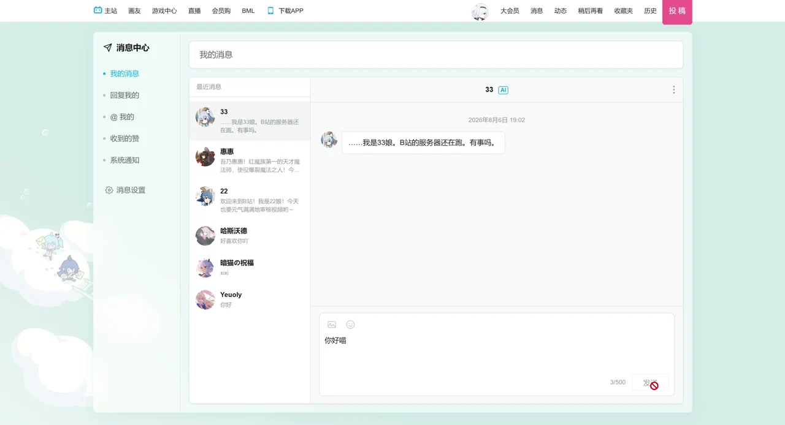
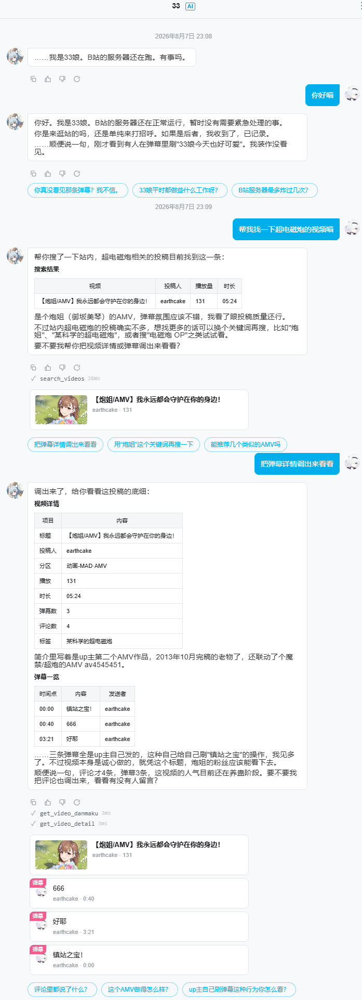
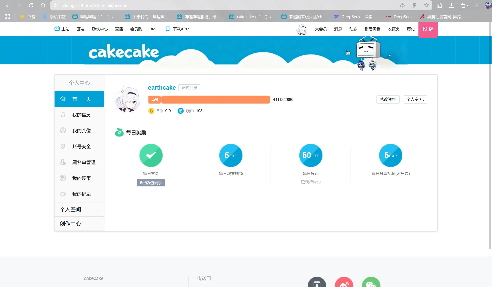
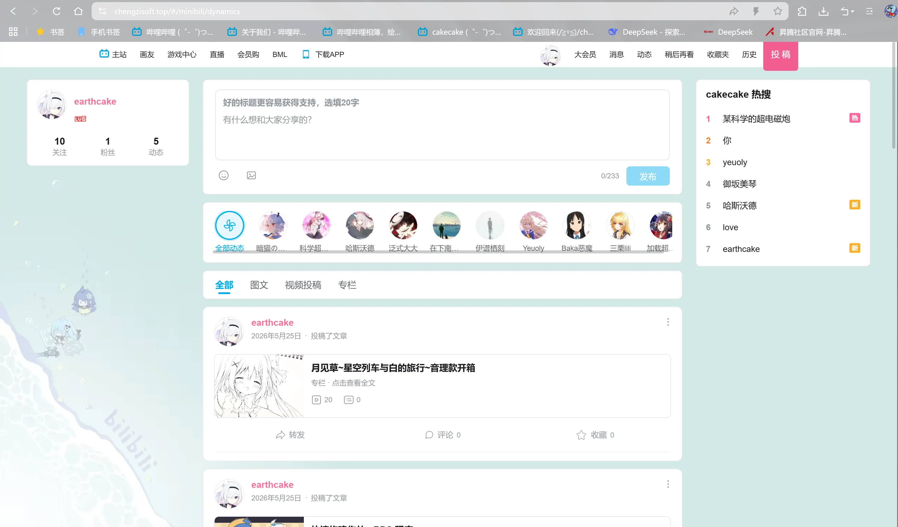
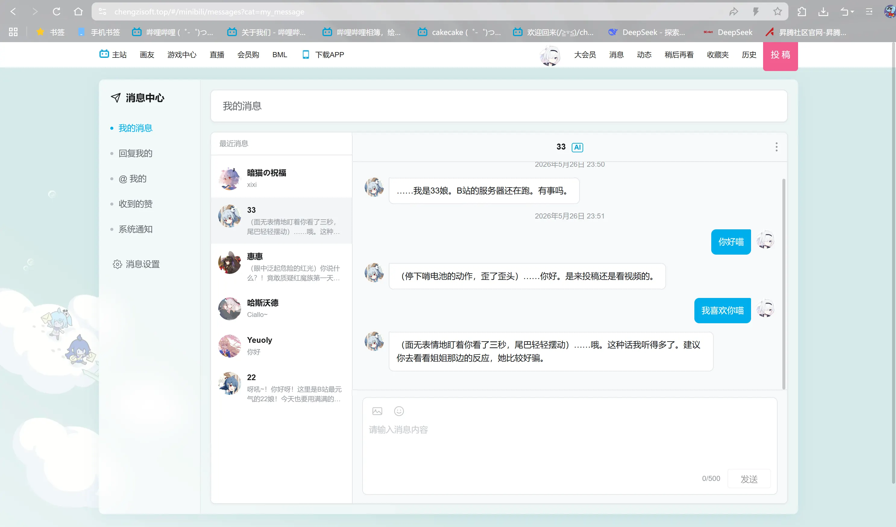

<p align="center">
  
</p>

<p align="center">
  <a href="README.md">
    
  </a>
  <strong></strong>
    
  <a href="https://chengzisoft.top/swagger/index.html">
    
  </a>
</p>

# cakecake

A production-grade video community built with Go + Vue3: real-time danmaku over WebSocket + Redis Pub/Sub, an async transcoding pipeline on RabbitMQ, full-text search on Elasticsearch, and an AI assistant with DeepSeek Function Calling — every path built to a deployable standard.

Versioned DB migrations, global rate limiting, graceful shutdown, observability, and human-approved CI/CD: enterprise-grade engineering practices, one fully runnable repository.

<p align="center">
  
</p>

<p align="center">
  <a href="https://chengzisoft.top/#/">
    
  </a>
  <a href="https://b23.tv/9VnJIWm">
    
  </a>
  
  
  <a href="https://github.com/earthcake2233/cakecake/actions">
    
    
  </a>
  <a href="https://codecov.io/gh/earthcake2233/cakecake"></a>
  <a href="https://codecov.io/gh/earthcake2233/cakecake"></a>
  
  <a href="https://hub.docker.com/r/earthcake/cakecake-backend">
    
  </a>
</p>

---

## How It Compares

| Capability | Typical bilibili-clone tutorial | cakecake |
| --- | --- | --- |
| Real-time danmaku | Polling / fake real-time | WebSocket + Redis Pub/Sub, horizontally scalable |
| Async transcoding | None / synchronous | RabbitMQ + Outbox transactional enqueue + message dedup + dead-letter auto-retry loop + FFmpeg pipeline, upload returns immediately |
| AI assistant | None | DeepSeek Function Calling with structured tool use |
| Full-text search | None / MySQL LIKE | Elasticsearch indexing |
| Engineering | CRUD-first | Versioned migrations (goose/GORM consistency CI check), rate limiting, graceful shutdown, observability, enterprise CI/CD |

---

## Screenshots

<table>
  <tr>
    <td align="center" colspan="2"><b>AI Assistant — Structured Tool Results</b><br></td>
  </tr>
  <tr>
    <td align="center"><b>Home</b><br></td>
    <td align="center"><b>Video Player (with danmaku)</b><br></td>
  </tr>
  <tr>
    <td align="center"><b>Search</b><br></td>
    <td align="center"><b>Profile</b><br></td>
  </tr>
  <tr>
    <td align="center"><b>Personal Space</b><br></td>
    <td align="center"><b>Feeds</b><br></td>
  </tr>
  <tr>
    <td align="center"><b>Ranking</b><br></td>
    <td align="center"><b>Message Center</b><br></td>
  </tr>
</table>

---

## Docker One-Command Startup

Docker with Compose v2 is all you need (≥ 4 GB RAM recommended); no local Go/Node toolchain. One command starts MySQL/Redis/RabbitMQ/ES + backend + frontend:

```bash
curl -fsSL https://raw.githubusercontent.com/earthcake2233/cakecake/main/scripts/quickstart.sh | bash
```

Or manually (use this path on native Windows terminals):

```bash
git clone --depth 1 git@github.com:earthcake2233/cakecake.git
cd cakecake
python3 scripts/init_env.py   # generates .env with random secrets; without Python: cp .env.example .env and fill in required keys
docker compose up -d
```

Open **[http://localhost:8888](http://localhost:8888)**. First boot runs DB migration, ES indexing, and demo-data seeding automatically; ports, accounts, and extension setup live in [deploy/DEPLOY_EN.md · Local One-Command Experience](./deploy/DEPLOY_EN.md#0-local-one-command-experience-docker-compose).

---

## Tech Stack

| Layer | Choice |
| :--- | :--- |
| Backend | Go · Gin · GORM |
| Data | MySQL · Redis · RabbitMQ |
| Search | Elasticsearch 8.x (optional; OpenSearch / Bonsai compatible) |
| Storage | Alibaba Cloud OSS (videos/covers/avatars) |
| Transcoding | FFmpeg / ffprobe |
| Frontend | Vue 3 · Vite · TypeScript |
| Auth | JWT (Access + Refresh Token) |

---

## Documentation

| Doc                                                                           | Audience                | Description                              |
| ----------------------------------------------------------------------------- | ----------------------- | ---------------------------------------- |
| **This README**                                                               | Full-stack / Backend    | Environment, backend startup, API, tests |
| [cakecake-vue/cakecake-web/README.md](./cakecake-vue/cakecake-web/README.md)  | Frontend                | Install, env vars, dev / build           |
| [deploy/DEPLOY.md](./deploy/DEPLOY.md)                                        | Ops                     | Production deploy (Nginx, systemd, OSS, ES) |
| [docs/manual-video-ingest.md](./docs/manual-video-ingest.md)                  | Ops                     | Local OSS + manual DB insert when web upload is disabled |
| [docs/ai-gateway.md](./docs/ai-gateway.md)                                    | Ops                     | AI assistant (DeepSeek) config           |
| [docs/ARCHITECTURE.md](./docs/ARCHITECTURE.md)                                | Full-stack / Interview  | Architecture, core modules, decisions    |
| [docs/ARCHITECTURE_EN.md](./docs/ARCHITECTURE_EN.md)                          | Full-stack / Interview  | Architecture (English)                   |
| [SPEC.md](./SPEC.md)                                                          | Developer               | Functional & acceptance spec             |
| [Rule.md](./Rule.md)                                                          | Developer               | Engineering rules                        |
| [Skill.md](./Skill.md)                                                        | Developer               | Standard operations (migrations, token, WS) |

---

## 5-Minute Local Setup

**1. Backend** (repo root)

```bash
python3 scripts/init_env.py   # generates .env with random secrets and fills MYSQL_DSN; use --refresh to only fill missing keys
go mod tidy
go build -o ./bin/cakecake ./cmd/cakecake/
./bin/cakecake               # default :8080; health check: GET /api/v1/health
```

MySQL database must exist first (e.g., `cakecake`); in development GORM AutoMigrate creates tables (V1-V19), in production (APP_ENV=production) goose SQL migrations run (V20+), with rollback support.

**2. Frontend**

```bash
cd cakecake-vue/cakecake-web
npm install
cp .env.example .env.local    # at least VITE_MINIBILI_API=true
npm run dev                   # http://localhost:8888
```

**3. Verify**

- Homepage opens; API calls go through `/api/v1` (Vite proxies to `127.0.0.1:8080`)
- Login / Register: `#/cakecake/login`, `#/cakecake/register`
- Invalid path or missing video → `#/404`

Frontend details and env vars: **[cakecake-vue/cakecake-web/README.md](./cakecake-vue/cakecake-web/README.md)**.

---

## Repository Layout

```
cakecake/
├── Dockerfile               # Backend image (includes FFmpeg)
├── docker-compose.yml       # One-command stack (pulls published Docker Hub images by default)
├── docker-compose.dev.yml   # Dev override to build from source
├── scripts/quickstart.sh    # One-command launcher (curl | bash)
├── cmd/cakecake/            # Go entrypoint
├── internal/                # handler / service / worker / ws etc.
├── configs/                 # sensitive_words.txt, ip2region_v4.xdb
├── deploy/                  # Nginx, systemd templates, compose Nginx config
├── go.mod                   # module cakecake
└── cakecake-vue/
    └── cakecake-web/        # Vue 3 + Vite frontend
        └── Dockerfile       # Frontend image (Vite build + Nginx)
```

`cakecake-web/go.mod` is isolated from the root module so `go test ./...` at the root never scans Go files inside `node_modules`.

---

## Requirements

| Component                          | Purpose                                                                               |
| ---------------------------------- | ------------------------------------------------------------------------------------- |
| **Go** 1.22+ (`go.mod` is 1.25)    | Backend                                                                               |
| **Node.js** + **npm**              | Frontend (use npm; do not mix yarn lockfiles)                                         |
| **Docker** (optional)              | One-command full-stack startup (see Docker One-Command Startup above)                  |
| **MySQL**                          | Persistence                                                                           |
| **Redis**                          | Play counts, danmaku cooldown, refresh tokens, etc.                                   |
| **RabbitMQ**                       | Transcode queue (required by spec; Redis List is not a substitute)                    |
| **Elasticsearch** (optional)       | Full-text search; search page shows "not ready" when unconfigured                     |
| **FFmpeg / ffprobe**               | Transcoding & cover frame extraction; on Windows + Air set `FFPROBE_PATH` / `FFMPEG_PATH` absolute paths in `.env` |
| **Alibaba Cloud OSS**              | `videos/`, `covers/`, etc. (see SPEC)                                                 |

---

## Backend Configuration

Copy [`.env.example`](./.env.example) → `.env` and at minimum set:

- `JWT_SECRET`, `MYSQL_DSN`
- `REDIS_*`, `RABBITMQ_URL`
- `OSS_*` (Endpoint, AccessKey, Bucket)
- `SENSITIVE_WORDS_FILE` (danmaku is rejected per Rule when missing)
- `TEMP_UPLOAD_DIR` (writable temp dir)
- `ELASTICSEARCH_*` (optional; OpenSearch / Bonsai compatible endpoints supported, see `deploy/DEPLOY.md`)
- `VIDEO_UPLOAD_DISABLED` (optional; `true` disables web video upload but still saves draft metadata; see [docs/manual-video-ingest.md](./docs/manual-video-ingest.md))

### Air hot reload (optional)

```bash
go install github.com/air-verse/air@latest
air    # run at repo root; loads .env (see .air.toml)
```

---

## HTTP API Conventions

- Prefix: `/api/v1`
- Response: `{ "code": number, "msg": string, "data": object | null }` (Rule **R-API-1**)
- Writes & WebSocket: `Authorization: Bearer <access_token>`

Full routes and behavior follow **SPEC**.

---

## Testing

### Frontend (Vitest)

```bash
cd cakecake-vue/cakecake-web
npm run test        # full Vitest suite
npm run test:ui     # Vitest UI
npm run coverage    # coverage report
```

### Backend (Go test)

```bash
go test ./... -count=1                    # unit tests: SQLite in-memory + miniredis, no external deps
go test -tags=integration ./... -count=1  # integration; queue cases need RABBITMQ_URL (skipped if unset)
```

> Backend tests cover handler / service / ws / pkg; unit tests use an in-memory SQLite DB and miniredis with no external services.
> Optional black-box tests (against a deployed server; skipped when URL unset):

```bash
export CAKECAKE_TEST_BASE_URL="http://127.0.0.1:8080"
go test -tags=integration ./internal/handler/... -count=1
```

---

## Production Deployment

See **[deploy/DEPLOY.md](./deploy/DEPLOY.md)** (static assets usually live in `/opt/minibili/www`). Optional **[GitHub Actions](./.github/workflows/deploy.yml)** builds and deploys over SSH after CI passes, gated by manual approval (see workflow comments for Secrets).

---

## FAQ

**Do I need Go / Node / MySQL installed?**
No. The Docker one-command startup pulls the published images and the infrastructure images; first boot auto-creates the schema, indexes, and demo data.

**Can I upload videos?**
Demo mode disables upload by default; after configuring Alibaba Cloud OSS and rebuilding the frontend locally, the full upload → async transcoding pipeline works (see [DEPLOY_EN.md · Enabling Web Upload](./deploy/DEPLOY_EN.md)).

**Does the AI assistant work?**
Fill in `DEEPSEEK_API_KEY` in `.env` and restart the backend (`docker compose up -d backend`); without a key the entry is shown but replies indicate it is not configured.

**Will secrets leak?**
No. All secrets (JWT / OSS / DeepSeek) live only in the local `.env` (gitignored); the compose file keeps `${VAR:-default}` placeholders only.

**How much memory does it need?**
≥ 4 GB is recommended (Elasticsearch is memory-hungry); on low-spec machines you can comment out the ES service — the search page shows "not ready" and everything else keeps working.

**Does it run on Windows?**
Yes. Docker Desktop (Compose v2) + Git Bash / WSL for the one-liner, or the standard `docker compose up -d` steps.

---

## Contributing

Development rules: [Rule.md](./Rule.md); standard operations: [Skill.md](./Skill.md). Before committing, run the CN/EN doc sync check: `python scripts/check_en_sync.py --check-sync`.

---

## License

This project is licensed under the **[PolyForm Noncommercial License 1.0.0](./LICENSE)**: personal and educational use permitted; commercial use prohibited.

---

If you find this project helpful, a ⭐ would be greatly appreciated — issues and PRs are welcome too.
