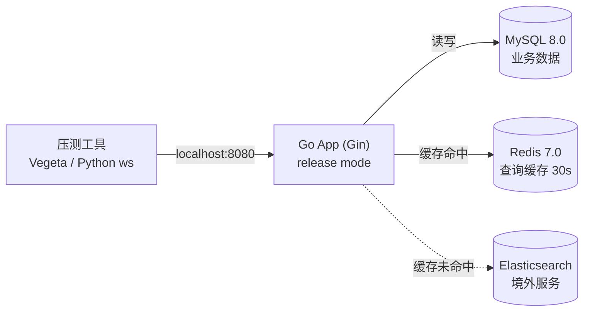

<p align="center">
  <a href="Skill.md">
    
  </a>
  <strong></strong>
</p>

## Mini-Bili v1.0 Skill Manual

**Version**: v1.0
**Last updated**: 2026-07-31
**Dependencies**: Mini-Bili v1.0 SPEC, Mini-Bili v1.0 Rule

### About Skill

This document is the project's "standard operating manual". It tells the AI how specific, fixed actions must be executed. Skill exists so that the AI does not improvise and perform the same task differently every time.

Rule says "this thing MUST be done"; Skill says "this is HOW it is done".

---

### S-001: Build Verification

**Corresponding Rule**: R-DEV-1 (code must be runnable after changes)

**Trigger**: This Skill MUST be executed after every code modification.

**Steps**:

1. In the project root, run in order:
   ```go
   go mod tidy
   go build -o ./bin/mini-bili ./cmd/
   ```
   `go mod tidy` MUST run before `go build` to keep `go.mod` and `go.sum` consistent with the imports in the current code.
2. Check the build output:
   - If `go build` exits 0 with no error-level stderr output → build passed.
   - If the exit code is non-zero or error-level output exists → build failed.
3. On failure:
   - Read the full compiler error output.
   - Fix the FIRST error (not the last one).
   - Restart from step 1 after fixing.
   - If the same error still fails after 3 fix attempts, stop and report the exact error and the attempts made.
4. After a successful build, confirm `./bin/mini-bili` exists and is executable.

**Forbidden**:
- NEVER skip `go mod tidy` and run `go build` directly.
- NEVER claim "the code is fine" without building.
- NEVER use `go run` instead of `go build` as the build verification.
- NEVER modify unrelated code "to get lucky" when the build fails.

---

### S-002: Database Migration (Versioned)

**Corresponding Rule**: R-DB-3 (migration scripts), R-DB-4 (indexes), R-DB-5 (goose SQL files)

**Trigger**: Any operation that adds a table, changes a table structure, or adds an index.

**Migration architecture**:

- V1–V19: Go function migrations, registered in `RegisteredMigrations()` in `internal/data/migrate.go`, executed in order by `RunVersionedMigrations` and recorded in the `schema_versions` table
- V20+: SQL file migrations in the `migrations/` directory (e.g. `00002_add_xxx.sql`), managed by goose, supporting up/down rollback
- In production (`APP_ENV=production`), only goose SQL migrations run by default; Go AutoMigrate is skipped

**Steps**:

1. Determine the change type:
   - New GORM model/field/index → append a new version entry at the end of `RegisteredMigrations()` in `internal/data/migrate.go` and write a Go migration function
   - Schema changes at V20+ → create `NNNNN_desc.sql` under `migrations/` containing `-- +goose Up` and `-- +goose Down`
2. Go migration function signature: `func xxx(db *gorm.DB, lg *zap.Logger) error`. The function MUST be idempotent (check `HasColumn` / `HasIndex` etc.) so repeated execution is safe.
3. SQL migration file format:
   ```sql
   -- +goose Up
   ALTER TABLE videos ADD COLUMN new_field VARCHAR(255);
   -- +goose Down
   ALTER TABLE videos DROP COLUMN new_field;
   ```
4. Local verification: `go vet ./internal/data/ && go test ./internal/data/ -count=1`
5. Start the app and check the logs to confirm the migration ran.

### S-003: Logger Initialization

**Corresponding Rule**: R-OBS-1 (NEVER use fmt.Println for logging), R-OBS-2 (logs must distinguish levels)

**Trigger**: Project initialization, or any time the logging module must be replaced/reconfigured.

**Steps**:

1. Add the `go.uber.org/zap` dependency to `go.mod`:
   ```go
   go get -u go.uber.org/zap
   ```
2. Create the logger initialization file under `internal/logger/`.
3. Initialize zap with the following standard configuration:
   ```go
   import "go.uber.org/zap"
   import "go.uber.org/zap/zapcore"
   
   func InitLogger() *zap.Logger {
       config := zap.NewProductionConfig()
       config.EncoderConfig.TimeKey = "timestamp"
       config.EncoderConfig.EncodeTime = zapcore.ISO8601TimeEncoder
       logger, _ := config.Build()
       return logger
   }
   ```
4. Log injection (BOTH of the following steps are mandatory, not either/or):
   - **Gin middleware injection**: at Gin route initialization, inject the `*zap.Logger` instance into `*gin.Context` via a custom middleware:
     ```go
     func LoggerMiddleware(logger *zap.Logger) gin.HandlerFunc {
         return func(c *gin.Context) {
             c.Set("logger", logger)
             c.Next()
         }
     }
     ```
   - **Package-level fallback**: expose a package variable `L` in `internal/logger/` for non-HTTP contexts (RabbitMQ consumers, scheduled tasks):
     ```go
     var L *zap.Logger
     
     func Init() {
         L = InitLogger()
     }
     ```
5. Business log invocation:
   - In HTTP handlers: `c.MustGet("logger").(*zap.Logger).Info("用户登录成功", zap.String("username", username))`
   - In non-HTTP contexts: `logger.L.Error("数据库连接失败", zap.Error(err))`
6. Confirm there is no `fmt.Println` or `fmt.Printf` in the project (except temporary debugging in `main.go` before startup, which MUST be removed before committing).

**Forbidden**:
- NEVER use `fmt.Println` or `fmt.Printf` for logging in production code.
- NEVER log everything at the same level (e.g. outputting errors as Info).
- NEVER use `zap.NewExample()` or `zap.NewDevelopment()` as the production config (MUST use `NewProductionConfig`).
- NEVER do only the package-level injection and skip the Gin middleware injection, or vice versa.

---

### S-004: Transcode Retry

**Corresponding Rule**: R-DEV-4 (transcode failure retry limit)

**Trigger**: This Skill MUST be executed when a video transcode task fails.

**Steps**:

1. Capture the FFmpeg transcode error message and exit code.
2. **Error classification (MUST be done before retrying)**:
   - Read the FFmpeg stderr output.
   - If it contains any of the following markers, classify as a **permanent error**, **immediately mark `failed`, do NOT retry**:
     - `Invalid data found when processing input` (corrupted source file)
     - `Unsupported codec` (unsupported codec)
     - `No such file or directory` (source file missing)
     - `Permission denied` (insufficient permissions)
   - For permanent errors, write the full FFmpeg error output into the failure reason field.
3. If not a permanent error, check the current retry count:
   - Read the current retry count from the task message attributes (initially 0).
4. If retry count < 3:
   - Increment the retry counter by 1.
   - Wait `30s × current retry count` before redelivering the task (i.e. 30s for the 1st, 60s for the 2nd, 90s for the 3rd).
   - Write the updated retry count into the task message and re-enqueue it via RabbitMQ.
5. If retry count = 3 (already retried 3 times and the last attempt also failed):
   - Update the video status to `failed` and write the failure reason field (F2-b).
   - **Critical**: the record must be visible to the uploader, but MUST NOT appear in public lists (home `/` path). Strictly follow the SPEC F2-b visibility rule: only `published` videos are visible site-wide; `failed` videos are visible only to the uploader. The home video list data source is limited to `published` videos (F10) and MUST NOT include `failed` videos.
   - Do not re-enqueue.

**Forbidden**:
- NEVER retry permanent errors.
- NEVER retry in an infinite loop.
- NEVER retry without updating the retry count.
- NEVER use a vague reason (e.g. "转码失败") when marking `failed`; MUST include FFmpeg's concrete error output.
- NEVER let `failed` videos appear in the home public video list.

---

### S-005: Cover Validation

**Corresponding Rule**: R-BIZ-3 (cover images must be validated for format and size)

**Trigger**: This Skill MUST be executed when the user uploads a video with a `cover` file (F2), or uploads a new cover through the cover-modify endpoint (F3).

**Steps**:

1. Read the uploaded file name suffix and extract the extension (lowercase).
2. Validate the extension against the allowed set:
   - Allowed: `.jpg`, `.jpeg`, `.png`, `.gif`, `.bmp`, `.webp`
   - If the extension is not in the set, return an error immediately using error code `40002` (registered in S-006).
3. Validate the file size:
   - Read `multipart.FileHeader.Size` to get the size in bytes.
   - If the size > 10MB (i.e. > 10485760 bytes), return an error immediately using error code `40003` (registered in S-006).
4. After format and size pass, continue the normal flow (save to the local temp directory, enter the transcode queue).

**Forbidden**:
- NEVER validate only on the frontend; NEVER store or use a file without backend validation.
- NEVER use the same error code for format errors and size errors (MUST use 40002 and 40003 respectively).
- NEVER just log and continue when requirements are not met.

**Extension (F0 user avatar)**: the extension set is **the same** as steps 1–2; the per-file size limit is **5 MB**, error codes **40015 / 40016** (Rule **R-BIZ-8**). Implementation uses `internal/pkg/coverval.ValidateAvatarHeader`.

---

### S-006: Error Code Registration

**Corresponding Rule**: R-API-1 (unified response format), R-DEV-3 (errors must provide clear information)

**Trigger**: This Skill MUST be executed whenever a new business error code is needed.

**Error code allocation table** (currently registered):

| Code  | Constant                  | Message template                                  |
| :---- | :------------------------ | :------------------------------------------------ |
| `0`   | `CodeSuccess`             | `"ok"`                                            |
| `40001` | `CodeParamError`        | `"参数错误"`                                      |
| `40002` | `CodeCoverFormat`       | `"封面格式不支持，仅支持 JPEG/PNG/GIF/BMP/WEBP"`  |
| `40003` | `CodeCoverSize`         | `"封面大小超过 10MB，请压缩后重新上传"`           |
| `40004` | `CodeDanmakuCooldown`   | `"发送过于频繁，请稍后再试"`                      |
| `40005` | `CodeDanmakuSensitive`  | `"弹幕内容包含违规信息"`                          |
| `40006` | `CodeUsernameExists`    | `"用户名已存在"`                                  |
| `40007` | `CodeMultipartParseError` | `"multipart 请求解析失败，请检查网络或稍后重试"` |
| `40008` | `CodeUploadMissingFile` | `"未收到视频文件，请重新选择文件后再提交"`        |
| `40009` | `CodeVideoProbeFailed`  | `"无法解析视频：请确认文件为有效视频；服务器 PATH 中需有 ffprobe，或在环境变量 FFPROBE_PATH 中填写其绝对路径"` |
| `40010` | `CodeVideoDurationExceeded` | `"视频时长超过 30 分钟上限"`                  |
| `40011` | `CodeVideoFileTooLarge`  | `"视频文件超过 500 MB 上限"`                      |
| `40012` | `CodeTitleInvalid`       | `"标题须为 1–80 个字"`                            |
| `40013` | `CodeIntroTooLong`       | `"简介不能超过 2000 个字"`                        |
| `40014` | `CodeInvalidColor`       | `"弹幕颜色格式无效，请输入有效的十六进制色号（如 #FF0000）"` |
| `40015` | `CodeAvatarFormat`       | `"头像格式不支持，仅支持 JPEG/PNG/GIF/BMP/WEBP"`  |
| `40016` | `CodeAvatarSize`         | `"头像大小超过 5MB，请压缩后重新上传"`            |
| `40100` | `CodeUnauthorized`       | `"未登录或 Token 已过期"`                         |
| `40101` | `CodeInvalidLogin`       | `"用户名或密码错误"`                              |
| `40300` | `CodeForbidden`          | `"无权限执行此操作"`                              |
| `40301` | `CodePasswordMismatch`   | `"原密码错误"`                                    |
| `40400` | `CodeNotFound`           | `"资源不存在"`                                    |
| `50000` | `CodeInternalError`      | `"服务器内部错误"`                                |

**Steps to register a new error code**:

1. Add the new constant in the error code definition file under `internal/errcode/`, following the table structure above.
2. Error code numbering rules:
   - `40001-40099`: parameter validation errors
   - `40100-40199`: authentication/authorization errors
   - `40300-40399`: permission errors
   - `40400-40499`: resource-not-found errors
   - `50000-50099`: server internal errors
3. After adding, MUST update the allocation table in this document.

**Forbidden**:
- NEVER reuse the same error code for different business scenarios.
- NEVER hardcode error message strings in code (MUST go through the error code mapping table).
- NEVER add an error code without updating this table.

---

### S-007: Danmaku Cooldown Validation

**Corresponding Rule**: R-BIZ-1 (danmaku cooldown must be validated on both ends)

**Trigger**: This Skill MUST be executed when a user sends a danmaku request.

**Steps**:

1. Extract the current user ID from the JWT token.
2. Extract the target video ID from the request parameters.
3. Build the Redis key: `danmaku:cooldown:{user_id}:{video_id}`.
4. Check whether the key exists:
   - If it exists (not expired), return error `40004` (sending too frequently) and reject the request.
   - If it does not exist, continue to step 5.
5. Set the key in Redis with a TTL of **5 seconds**.
6. Proceed with the normal danmaku flow (S-013 color format validation → sensitive word filtering → store & broadcast).

**Note**:
- Steps 4 and 5 MUST use an atomic Redis operation (`SETNX` or `SET NX EX`) to prevent race conditions under concurrency.
- The frontend button greying and countdown are **UX aids**; the backend validation is the **only security gate**. Cooldown validation passes only after step 5 succeeds.

**Forbidden**:
- NEVER rely only on frontend cooldown logic.
- NEVER use non-atomic operations that allow concurrent bypass of the cooldown.

---

### S-008: Comment Deletion Cascade

**Corresponding Rule**: R-BIZ-2 (comment deletion must cascade), R-BIZ-6 (comment deletion permissions must be validated)

**Trigger**: This Skill MUST be executed when a user requests to delete a comment.

**Steps**:

1. Extract the current user ID from the JWT token.
2. Query the database by comment ID to get the comment's `user_id` (publisher) and the owning video's `uploader_id` (uploader).
3. **Permission check** (validate permission BEFORE deleting):
   - If current user ID = comment publisher ID → allowed.
   - If current user ID = owning video's uploader ID → allowed.
   - Otherwise → return error `40300` (no permission) and reject.
4. **Query all child comments**: query the database for all comments where `parent_id` = the current comment ID. If a child has children, recurse until no more descendants exist.
5. **Delete inside a transaction**:
   - Open a database transaction.
   - Batch DELETE all pending comment IDs (parent + all descendants).
   - Commit the transaction.
   - On failure, roll back and return error `50000`.
6. **After deletion**:
   - After the transaction commits, broadcast a deletion event through the video's WebSocket room:
     ```json
     {"type": "comment_deleted", "comment_id": "<deleted comment ID>"}
     ```
   - On receiving this event, the frontend **removes the comment node and all its child nodes from the DOM directly**, without showing any placeholder text.

**Forbidden**:
- NEVER delete only the parent comment without the children.
- NEVER delete outside a transaction.
- NEVER skip the permission check and delete directly.
- NEVER use logical (soft) deletion instead of physical deletion (SPEC F7 requires "all data removed from the database").

---

### S-009: Token Issuance, Refresh and Invalidation

**Corresponding Rule**: R-AUTH-1 (token security policy)

**Trigger**: This Skill MUST be executed when issuing tokens after a successful login, or when a user refreshes using a Refresh Token.

**Steps**:

**A. Issue on login**:

1. After a successful login, generate a unique Token ID (UUID).
2. Generate the **Access Token**:
   - Payload contains: `user_id`, `token_id`, `type: "access"`
   - Expiry: now + **2 hours**
   - Signed with HS256, secret read from the `JWT_SECRET` environment variable.
3. Generate the **Refresh Token**:
   - Payload contains: `user_id`, `token_id`, `type: "refresh"`
   - Expiry: now + **3 days**
   - Signed with HS256, secret read from the `JWT_SECRET` environment variable.
4. Return both the Access Token and Refresh Token to the client.

**B. On refresh**:

1. Receive the client's Refresh Token.
2. Validate the Refresh Token signature and expiry:
   - If the signature is invalid or expired → return `40100` and require re-login.
3. Extract `user_id` and `token_id` from the Refresh Token.
4. Check Redis for whether this Refresh Token has been marked invalid:
   - Redis key: `refresh_token:invalid:{token_id}`
   - If it exists → this Refresh Token has already been used; return `40100` (possible theft) and require re-login.
5. Mark the current Refresh Token's `token_id` as invalid:
   - Redis key: `refresh_token:invalid:{token_id}`, TTL **3 days** (same as the original Refresh Token validity).
6. Generate a new `token_id` and issue new Access/Refresh tokens following the "issue on login" flow, then return them to the client.

**Forbidden**:
- NEVER use the Refresh Token for business API access (it may only call the refresh endpoint).
- NEVER skip invalidating the old Refresh Token after a successful refresh.
- NEVER let the Access Token validity exceed 2 hours.
- NEVER let the Refresh Token validity exceed 3 days.
- NEVER store sensitive information in the Access Token (e.g. password).

---

### S-010: Like Notification Aggregation

**Corresponding Rule**: SPEC F9 (comment likes and notifications)

**Trigger**: This Skill MUST be executed when a user likes a comment.

**Steps**:

1. After the like succeeds (like count updated), get the liked comment's `comment_id` and the comment publisher's `comment_owner_id`.
2. If the liker = the comment publisher (self-like), skip the notification and end.
3. Query the notification table for an unread notification matching:
   - `recipient_id` = `comment_owner_id`
   - `type` = `"like_aggregation"`
   - `related_id` = `comment_id`
   - `is_read` = `false`
4. If it exists:
   - Append the current liker's username to the notification's `sender_names` field (JSON array).
   - Update `total_likes` = `total_likes + 1`.
   - Update `updated_at` to now.
   - **Do NOT create a new notification**.
5. If it does not exist:
   - Create a new notification record:
     - `recipient_id` = `comment_owner_id`
     - `type` = `"like_aggregation"`
     - `related_id` = `comment_id`
     - `sender_names` = `["liker username"]`
     - `total_likes` = 1
     - `comment_preview` = the **first 15 characters** of the liked comment
     - `is_read` = `false`
6. When displaying notifications (frontend or API), format as:
   - `total_likes` = 1 → "用户A 赞了你的评论"
   - `total_likes` = 2 → "用户A、用户B 赞了你的评论"
   - `total_likes` ≥ 3 → "用户A、用户B、用户C 等X人赞了你的评论" (show the first 3 usernames, X = total_likes)

**Forbidden**:
- NEVER create a separate notification per like (MUST aggregate).
- NEVER omit the comment preview in the notification.
- NEVER have multiple unread like-aggregation notifications for the same comment.

---

### S-011: WebSocket Authentication

**Corresponding Rule**: R-API-4 (WebSocket connections must be authenticated)

**Trigger**: This Skill MUST be executed when a client initiates a WebSocket connection.

**Steps**:

1. The client MUST carry the Access Token in the connection URL query parameter:
   ```
   ws://host/ws/danmaku?token=<access_token>
   ```
2. The server extracts `token` from the query parameters of the HTTP Upgrade request.
3. Validate the Access Token:
   - Validate the signature (HMAC-SHA256, secret `JWT_SECRET`).
   - Validate the expiry (current time < `exp`).
   - Validate the token type (`type` MUST be `"access"`; NEVER accept a Refresh Token).
4. On validation failure:
   - After the WebSocket handshake, **immediately send an error message**: `{"type": "auth_failed", "msg": "Token 无效或已过期"}`
   - **Immediately close the WebSocket connection** after sending.
5. On validation success:
   - Store `user_id` in the WebSocket connection context.
   - Proceed with normal danmaku send/receive logic.

**Forbidden**:
- NEVER keep a WebSocket connection alive without validating the token.
- NEVER accept a Refresh Token as WebSocket authentication.
- NEVER only log on auth failure without closing the connection.

---

### S-012: Technical Decision Record (ADR) Standard

**Purpose**: Prevent future maintainers (including future you and future AI) from forgetting the context behind technical choices, and prevent "refactoring for the sake of refactoring".

**When**: Whenever you complete a full business module (e.g. "user authentication module", "video upload module"), do this BEFORE committing the code.

**Process**: Append a record in the following format to `README_REFLECT.md` (architecture & reflection record) in the project root:

#### Module name: [e.g. Dual-token authentication mechanism]

**1. Problem encountered**
- [Briefly describe the technical pain point, e.g. How to prevent Refresh Token theft?]

**2. Solution**
- [Describe the final approach, e.g. Introduce a Redis blacklist with TTL equal to the token validity.]

**3. Rationale (why this option)**
- **Option A (JWT blacklist)**: [Pros: high performance] / [Cons: requires state management]
- **Option B (database polling)**: [Pros: strong consistency] / [Cons: poor performance, violates NF-3]
- **Conclusion**: chose Option A because this project is a high-concurrency scenario and performance comes first.

**4. Related constraints**
- This decision affects **Rule R-SEC-2** (security red line).
- This logic is implemented in **Skill S-009** (authentication flow).

---

### S-013: Danmaku Color Validation

**Corresponding Rule**: R-BIZ-7 (danmaku colors must be validated as hex format)

**Trigger**: This Skill MUST be executed when a user sends a danmaku request, after S-007 (cooldown validation) and before sensitive word filtering.

**Steps**:

1. Extract the `color` field from the request parameters.
2. If `color` is empty or not provided, use the default `#FFFFFF` (white) and skip the remaining validation.
3. Validate the `color` format with the regex `^#[0-9A-Fa-f]{6}$`:

```go
import "regexp"

var colorRegex = regexp.MustCompile(`^#[0-9A-Fa-f]{6}$`)
if !colorRegex.MatchString(color) {
    // return error code 40014
}
```

4. After validation passes, store `color` (normalized to uppercase).

**Forbidden**:
- NEVER skip color format validation.
- NEVER fill in a default or silently correct an invalid color (MUST reject explicitly and return an error).
- NEVER store an unvalidated color value in the database.

**Frontend cooperation**:

- The frontend should provide a color picker (`<input type="color">`) in the danmaku input box so users can visually choose any color.
- The frontend should also pre-validate manually entered hex colors for a better UX.

### S-014: Writing Mermaid Architecture Diagrams

**Corresponding Rule**: R-DOC-11 (diagram rules: flowcharts use Mermaid, project structure uses text)

**Trigger**: Every time you draw an architecture, topology, or flow diagram in a `.md` file, use this Skill.
**Exception**: Project directory structure trees (`├──` / `└──` format) do not need Mermaid; use a plain text ` ``` ` code block.

**Steps**:

1. Choose the diagram type
   - `flowchart` (recommended) or `graph` — architecture/topology/flow diagrams
   - `sequenceDiagram` — sequence diagrams
   - Prefer `flowchart` (newer syntax, better compatibility)

2. Write nodes per the standard
   - Normal node: `` Node["display text"] ``
   - Database node (cylinder): `` Node[("display text")] ``
   - Rounded node: `` Node("display text") ``
   - Diamond (decision): `` Node{"display text"} ``

3. Write edges per the standard
   - Solid arrow: `` A --> B ``
   - Solid with label: `` A -->|label| B ``
   - Dashed arrow: `` A -.-> B ``
   - Dashed with label: `` A -.->|label| B ``
   - Thick arrow: `` A ==> B ``

4. Subgraph notes
   - When a title contains parentheses or Chinese, use node name + quotes:
     ```
     subgraph Name["title text (with parentheses)"]
     ```
   - NEVER reference a node defined inside a subgraph after its `end` (some renderers error)

5. Label text
   - Use `<br/>` for line breaks
   - Labels usually need no extra quotes unless they contain special characters

6. Colors and styles (keep defaults unless specifically needed)
   - Use `` style Node fill:#e74c3c,stroke:#333 `` for custom styling

**Example** (topology from a load-test report):



**Common mistakes**:
- Subgraph title without quotes: `` subgraph ECS["标题"] `` not `` subgraph ECS[标题] ``
- Database parentheses misplaced: in `[("text")]`, the `)` must come after the `"`
- Cross-subgraph node references: nodes defined in a subgraph must not be used after `end`

**Verification**:
- Preview the Markdown locally before committing to confirm rendering works
- Pink/red background means a syntax error; check line by line per this Skill

### S-015: Debugging Pink Mermaid Backgrounds (Render Errors)

**Corresponding Rule**: R-DOC-11 (architecture diagrams must use Mermaid)

**Trigger**: When you see a Mermaid diagram with a pink/red background in the Markdown preview, the syntax has an error.

**Note**: Project directory structure trees (`├──` / `└──` format) do not need Mermaid; use plain text ` ``` ` code blocks instead. They are outside this Skill's scope.

**Common syntax error troubleshooting steps**:

1. **Check equals signs `=`**
   - Avoid `=` in node text (e.g. `status=ready`, `x=y`); some renderers interpret it as an attribute assignment
   - ✅ Use `status ready` instead
   - ❌ `L["DB: UPDATE SET status=ready"]` → ✅ `L["DB 更新状态为 ready"]`

2. **Check question marks `?`**
   - Avoid `?` inside diamond nodes `{}`
   - ❌ `O{"status ready?"}` → ✅ `O("status ready")` use a rounded rectangle

3. **Check cross-subgraph edges**
   - Some renderers error when a node defined in one subgraph connects to a node in another subgraph
   - ❌ `subgraph A / P --> Q / end` + `subgraph B / Q --> R` (cross-subgraph reference)
   - ✅ Avoid cross-subgraph edges, or merge the related subgraphs into a flat structure

4. **Check arrow label syntax**
   - ❌ `O -- "text" --> N` (quotes between the `--`)
   - ✅ `O -->|text| N` (pipe syntax)
   - ✅ `O -- text --> N` (no quotes)

5. **Check subgraph title brackets**
   - When the title contains parentheses or Chinese, MUST use `Name["title"]` format
   - ❌ `subgraph Name[标题]` → ✅ `subgraph Name["标题"]`

6. **Check Chinese special symbols**
   - Mermaid does not support arrow symbols like `→`, `←` in node text
   - ❌ `H["FFmpeg: 原始文件 → H.264"]` → ✅ `H["FFmpeg 转码 H.264"]`

7. **Minimal-reproduction verification**
   - First build a minimal renderable graph (3–5 nodes, no subgraphs, no labels) to confirm the renderer works
   - Gradually add subgraphs, labels, and branches, checking after each addition
   - The last step that turns pink is the problem

**Quick mnemonic**:
```
粉色出现不要慌，等号问号先提防
跨子图线是重灾，箭头标签管道扛
特殊符号不能放，简化验证找真凶
```

---

### S-016: Creating goose Migration Files

**Corresponding Rule**: R-DB-5 (new migrations must use goose SQL files)

**Trigger**: When a new V20+ database schema change is needed (add table, column, index, etc.).

**Steps**:

1. Determine the migration sequence number: check the largest number in `migrations/`; the new file number is largest + 1 (e.g. if the current max is `00001`, the new file is `00002_desc.sql`)
2. Create the migration file:
   ```sql
   -- +goose Up
   -- forward SQL (CREATE TABLE / ALTER TABLE / CREATE INDEX etc.)

   -- +goose Down
   -- rollback SQL (DROP TABLE / ALTER TABLE DROP / DROP INDEX etc.)
   ```
3. Write both Up and Down SQL, ensuring Down fully undoes Up
4. Verify the migration runs locally:
   - Start the app (`APP_ENV=development`); goose applies new migrations automatically
   - Or manually: `goose -dir migrations mysql "DSN" up`
5. Verify rollback: `goose -dir migrations mysql "DSN" down` to confirm the Down SQL works

**Notes**:

- Each migration file does ONE thing (single table column / single table index) for easy rollback targeting
- NEVER include data operations (INSERT/UPDATE) in migration SQL; data migrations belong in Go migration functions
- The `-- +goose Up` and `-- +goose Down` comments are goose directive markers and MUST NOT be omitted

---

### S-017: Graceful Shutdown Implementation

**Corresponding Rule**: R-SHUTDOWN-1 (graceful shutdown with timeout), R-SHUTDOWN-2 (final playcount flush), R-SHUTDOWN-3 (resource close order)

**Trigger**: Adding background goroutines, modifying the main.go startup/shutdown flow, or needing lifecycle management for async tasks.

**Steps**:

1. **Declare a WaitGroup**: `var wg sync.WaitGroup` in main(); call `wg.Add(1)` before each background goroutine starts, and `defer wg.Done()` inside the goroutine.
2. **HTTP Server MUST use http.Server**: NEVER use `gin.Run()` (cannot shut down gracefully). Use `srv := &http.Server{Addr, Handler}` + `srv.ListenAndServe()`, and call `srv.Shutdown(ctx)` on exit.
3. **Shutdown sequence** (in order):
   - Receive SIGTERM/SIGINT → log it
   - cancel() the main context + runtimeCancel() → stop accepting new tasks
   - srv.Shutdown(shutdownCtx) → drain existing HTTP connections
   - wg.Wait() with a timeout (via done channel + time.After)
   - On timeout, log a Warning and force exit
4. **Final playcount flush**: call `pc.Flush(context.Background())` in the defer of the PlayCount flush goroutine.
5. **Resource defer Close**: `defer Close()` for MQ, ES, etc. runs in reverse declaration order; no manual management needed.

**Forbidden**:
- NEVER use time.Sleep instead of WaitGroup waiting.
- NEVER use gin.Run() instead of http.Server.
- NEVER exit immediately after cancel() without waiting.
- NEVER omit the final playcount flush.

**Verification**:
- `go vet ./cmd/... ./internal/config/...` with zero errors
- `go build -o ./bin/mini-bili ./cmd/mini-bili/` succeeds
- Start the app and press Ctrl+C; confirm in logs: "shutting down gracefully" → "all background tasks finished"

---

### S-018: Push to GitHub from WSL (Fine-Grained PAT)

**Background**: This WSL sandbox has no outbound network by default (DNS/egress blocked at the container level), and Windows interop (`gh`/`powershell.exe`) is unavailable; network is released per command only after checking "Allow network access" in the approval dialog.

**Credential**: Create a fine-grained PAT on GitHub (name `WSL`), with repository permissions:

- `Contents: Read and write` (required to push)
- `Actions: Read` (to query CI runs)
- `Workflows: Read and write` (required if the pushed commit changes `.github/workflows/*`; otherwise GitHub rejects the push)
- Repository access: Only select repositories → `cakecake`

**Push method (token is stored in the system environment variable `GITHUB_PAT`, not written into git config; the askpass temp script is deleted after use)**:

```sh
# 1. One-shot askpass script (mode 0600)
cat > /tmp/gh-askpass.sh <<'EOF'
#!/bin/sh
case "$1" in
  *[Uu]sername*) echo "earthcake2233" ;;
  *) echo "$GITHUB_PAT" ;;
esac
EOF
chmod 700 /tmp/gh-askpass.sh

# 2. Push (remember to check "Allow network access" in the approval dialog)
GIT_ASKPASS=/tmp/gh-askpass.sh GIT_TERMINAL_PROMPT=0 git push origin main

# 3. Remove the temp credential file afterwards
rm -f /tmp/gh-askpass.sh
```

**Query CI results**:

```sh
TOKEN=$GITHUB_PAT
curl -sS -H "Authorization: Bearer $TOKEN" \
  "https://api.github.com/repos/earthcake2233/cakecake/actions/runs?branch=main&per_page=10"
```

**Note**: The token is a live credential; it is stored in the `GITHUB_PAT` environment variable in `~/.bashrc`. NEVER write the raw token into repository files (including Skill.md itself). Rotate the token on GitHub after use and update the environment variable accordingly.
