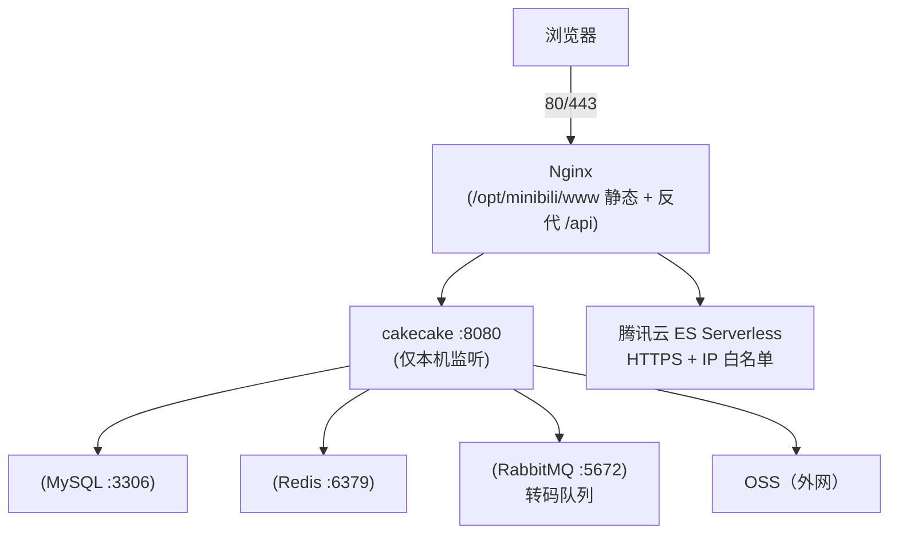

<p align="center">
  <strong></strong>
  <a href="deploy/DEPLOY_EN.md">
    
  </a>
</p>

  </a>
  </a>
</p>

  </a>
</p>

# cakecake 生产部署指南（阿里云 CentOS 7）

面向 **个人站 / 面试演示 / 小流量**。默认架构：

- **阿里云 ECS（CentOS 7，约 2 核 2G）**：Nginx + Go 后端 + MySQL + Redis + RabbitMQ + FFmpeg  
- **阿里云 OSS**：视频 / 封面 / 动态图片  
- **腾讯云 ES Serverless**：搜索（按量，个人用量极低；与 ECS 跨云公网连通）

> **不要在 2G 应用机上跑 Elasticsearch 集群。** CentOS 7 已停止维护，公网暴露请加固 SSH、改默认密码、仅开放 80/443。

---

## 〇、本地一键体验（Docker Compose）

想 30 秒看到效果，不必先走完整生产部署：仓库根的 [docker-compose.yml](../docker-compose.yml) 会把 **MySQL / Redis / RabbitMQ / ES + 后端 + 前端** 全部编排起来，并自动写入演示视频与弹幕。

### 前置要求

- Docker（含 Compose v2，`docker compose version` 可用）
- 建议宿主机 ≥ 4GB 内存（ES 是资源大户；低配机器可注释掉 `elasticsearch` 服务，搜索页提示"未就绪"，其余功能不受影响）
- Linux 主机需满足 ES 内核参数：`sudo sysctl -w vm.max_map_count=262144`（建议写入 `/etc/sysctl.conf` 持久化；macOS / Windows 的 Docker Desktop 已自动满足）

### 启动

```bash
cd <仓库根目录>
cp .env.example .env          # 可选：不复制也能用默认值
docker compose up -d --build
```

打开 **http://localhost:8888**。首次启动自动完成：GORM AutoMigrate 建表 → `SEED_DEMO_DATA=true` 写入演示用户 / 视频 / 弹幕 → ES 全量索引。

### 端口与账号

| 服务 | 地址 | 说明 |
| --- | --- | --- |
| 前端 | http://localhost:8888 | Nginx 托管 SPA，反代 `/api` 与 WebSocket |
| 后端 API | http://localhost:8080 | 健康检查 `GET /api/v1/health`；Swagger `/swagger/` |
| MySQL / Redis / RabbitMQ / ES | `3306` / `6379` / `5672`·`15672` / `9200` | 默认只绑定 `127.0.0.1` |

演示账号密码 `demo123456`（演示用户，可用 `DEMO_USER_PASSWORD` 覆盖）；运营后台 `admin` / `change-me-admin`（由 `ADMIN_SEED_PASSWORD` 预设，仅首次建库时生效，管理员无改密接口）。所有端口默认只监听本机回环地址；若本机 8888/8080 已被占用，可在 `.env` 修改 `WEB_PORT` / `BACKEND_PORT` 后重新 `docker compose up -d`。公网部署请修改端口映射、默认密码并配置防火墙。

### 可选增强

- **AI 助手（DeepSeek Function Calling）**：`.env` 填入 `DEEPSEEK_API_KEY`，执行 `docker compose up -d backend` 重启后端；
- **网页上传 + 异步转码**：`.env` 填入 `OSS_*` 凭证，并把 `VIDEO_UPLOAD_DISABLED=false`、`VITE_VIDEO_UPLOAD_DISABLED=false`（前端编译期开关），然后 `docker compose up -d --build web backend` 重建前端并重启后端；
- **停止 / 重置**：`docker compose down`；彻底重置（删除数据卷）用 `docker compose down -v`。

### 与生产部署的差异

compose 面向**本地一键体验**：上传默认禁用（与线上 Demo 行为一致），密钥只存在于本地 `.env`（已被 gitignore）。本文档后续章节的生产部署不使用 compose，密钥只存在于服务器本地 `/opt/minibili/.env`。

### CI 守护

`.github/workflows/compose-check.yml` 对 compose 做三重守护：环境变量漂移检查（`.env.example` ↔ compose）、`docker compose config` 语法校验、全栈冒烟测试（真实构建镜像并验证健康检查与种子数据）。代码演进导致 compose 失效时，CI 会直接报红。

---

## 一、架构示意



---

## 二、资源与成本建议

| 组件 | 部署位置 | 说明 |
|------|----------|------|
| 应用 ECS | 阿里云 | 2G 内存偏紧，**建议加 2G swap**；转码时勿并发大量投稿 |
| ES | 腾讯云 Serverless | 领新用户 **50 元代券**；索引仅 MB 级时月费常 &lt; 几元 |
| OSS | 阿里云 | 与 ECS 同地域更佳；Bucket 配 CORS（若前端直链 OSS） |

可选减负：MySQL / Redis 用阿里云托管版，ECS 只跑 Nginx + Go + RabbitMQ + FFmpeg。

---

## 三、重要：前端不要在 CentOS 7 上构建

项目前端为 **Vite 6 + Vue 3**，需要 **Node.js 18+**（推荐 **20 LTS**）。CentOS 7 自带 glibc 过旧，强行装新 Node 容易踩坑。

**推荐做法（在你本机 Windows 构建，服务器只放静态文件）：**

**Windows (PowerShell):**
```powershell
cd D:\cakecake\cakecake-vue\cakecake-web
npm install
copy .env.production.example .env.production
npm run build
```

**Linux / macOS:**
```bash
cd cakecake-vue/cakecake-web
npm install
cp .env.production.example .env.production
npm run build
```

生成的 **`dist/`** 整个目录上传到服务器 `/opt/minibili/www/`。

**跨平台 (requires GNU Make):**
```bash
make build-frontend
```

若必须在 Linux 上构建：使用 **Node 20 官方二进制**（非系统 yum 的 node 6），或 Docker `node:20-alpine` 仅用于 build，仍不必在 ECS 常驻 Node。

---

## 四、后端：在 Windows 交叉编译（推荐）

CentOS 7 无需安装 Go，只上传 Linux 二进制即可。

**Windows (PowerShell):**
```powershell
cd D:\cakecake
$env:GOPATH="C:\gopath-empty"
$env:GO111MODULE="on"
$env:GOOS="linux"
$env:GOARCH="amd64"
go build -ldflags="-s -w" -o cakecake-linux .\cmd\cakecake
```

**Linux / macOS:**
```bash
cd /path/to/minibili
GOPATH=/tmp/gopath-empty GO111MODULE=on GOOS=linux GOARCH=amd64 \
  go build -ldflags="-s -w" -o cakecake-linux ./cmd/cakecake
```

**Cross-platform (requires GNU Make):**
```bash
make build-linux
```

**关键：交叉编译后先验证二进制格式再上传：**
```bash
file cakecake-linux
# 应显示: ELF 64-bit LSB executable, x86-64 ... for GNU/Linux
# 若显示 PE32+，说明交叉编译失败，参见 incident-20260725-502.md
```

上传到服务器：`/opt/minibili/bin/mini-bili`，并 `chmod +x`。

---

## 五、服务器目录布局

```bash
sudo mkdir -p /opt/minibili/{bin,www,configs,data/tmp,logs}
sudo chown -R "$USER:$USER" /opt/minibili
```

| 路径 | 内容 |
|------|------|
| `/opt/minibili/bin/mini-bili` | Go 二进制 |
| `/opt/minibili/.env` | 环境变量（勿提交 Git） |
| `/opt/minibili/configs/` | `sensitive_words.txt`、`ip2region_v4.xdb`（[ip2region 发布页](https://github.com/lionsoul2014/ip2region) 下载 IPv4 xdb，勿提交 Git） |
| `/opt/minibili/data/tmp/` | 上传与转码临时目录（可写） |
| `/opt/minibili/www/` | 前端 `dist/` 解压到此 |

从本机上传示例（按你的 IP 修改）：

```bash
scp cakecake-linux user@你的ECSIP:/opt/minibili/bin/mini-bili
scp -r cakecake-vue/cakecake-web/dist/* user@你的ECSIP:/opt/minibili/www/
scp -r configs user@你的ECSIP:/opt/minibili/
scp deploy/env.production.example user@你的ECSIP:/opt/minibili/.env
```

---

## 六、CentOS 7 安装依赖

### 6.1 基础工具

```bash
sudo yum install -y epel-release
sudo yum install -y wget curl vim git
```

### 6.2 FFmpeg（转码必需）

```bash
sudo yum install -y ffmpeg ffmpeg-devel
which ffprobe ffmpeg
```

若 `yum` 版本过旧，可用 [static build](https://johnvansickle.com/ffmpeg/) 解压到 `/usr/local/bin`，并在 `.env` 中设置绝对路径：

```env
FFPROBE_PATH=/usr/local/bin/ffprobe
FFMPEG_PATH=/usr/local/bin/ffmpeg
```

### 6.3 MySQL 5.7 / 8.0

```bash
# 示例：MariaDB 10.5（与 MySQL 协议兼容）
sudo yum install -y mariadb-server mariadb
sudo systemctl enable mariadb --now
sudo mysql_secure_installation
```

```sql
CREATE DATABASE minibili CHARACTER SET utf8mb4 COLLATE utf8mb4_unicode_ci;
CREATE USER 'minibili'@'localhost' IDENTIFIED BY '强密码';
GRANT ALL ON minibili.* TO 'minibili'@'localhost';
FLUSH PRIVILEGES;
```

DSN 示例：

```env
MYSQL_DSN=minibili:强密码@tcp(127.0.0.1:3306)/minibili?charset=utf8mb4&parseTime=True&loc=Local
```

首次部署需初始化数据库表结构，二选一：

- **开发/单机**：直接以 `APP_ENV=development` 启动，GORM AutoMigrate 自动建表
- **生产**：执行 `goose -dir migrations mysql "DSN" up` 应用基线迁移，之后以 `APP_ENV=production` 启动（仅跑 goose SQL 迁移）

### 6.4 Redis

```bash
sudo yum install -y redis
sudo systemctl enable redis --now
redis-cli ping   # PONG
```

### 6.5 RabbitMQ

```bash
sudo yum install -y rabbitmq-server
sudo systemctl enable rabbitmq-server --now
sudo rabbitmqctl status
```

默认 `guest/guest` 仅本机可用即可；生产可新建用户并写入 `RABBITMQ_URL`。

### 6.6 Nginx

```bash
sudo yum install -y nginx
sudo systemctl enable nginx
```

复制本仓库配置：

```bash
sudo cp /path/to/cakecake/deploy/nginx-minibili.conf /etc/nginx/conf.d/minibili.conf
# 编辑 server_name、root 路径
sudo nginx -t && sudo systemctl reload nginx
```

### 6.7 2G 内存：建议开启 swap

```bash
sudo fallocate -l 2G /swapfile
sudo chmod 600 /swapfile
sudo mkswap /swapfile
sudo swapon /swapfile
echo '/swapfile swap swap defaults 0 0' | sudo tee -a /etc/fstab
```

---

## 七、环境变量（`.env`）

复制仓库 `deploy/env.production.example` 为 `/opt/minibili/.env`，逐项修改。

**生产必改：**

- `JWT_SECRET`：长随机串  
- `APP_ENV=production`  
- `MYSQL_DSN`、`REDIS_*`、`RABBITMQ_URL`  
- `OSS_*`（与 Bucket 地域一致）  
- `ADMIN_SEED_*`：仅首次建管理员；上线后立刻改管理员密码  
- `ELASTICSEARCH_*`：搜索（见下节；可为空）  
- `VIDEO_UPLOAD_DISABLED=true`：**2G 小机推荐**。关闭网页端视频文件上传与转码，仍允许保存稿件元数据；视频由本机转码 + OSS + 手动写库，见 [docs/manual-video-ingest.md](../docs/manual-video-ingest.md)  
- 前端构建时对应 `VITE_VIDEO_UPLOAD_DISABLED=true`（见 `.env.production.example`）

**不要**对公网开放 `8080`；`HTTP_ADDR=127.0.0.1:8080` 仅本机，由 Nginx 反代。

---

## 八、搜索（Elasticsearch / OpenSearch）

搜索为**可选**。未配置 `ELASTICSEARCH_URL` 时，仅搜索页不可用，其余功能正常。

### 方案 A：腾讯云 ES Serverless（与 DEPLOY 原架构一致）

1. 控制台开通 **ES Serverless**（地域选离用户近的，如广州/上海）。  
2. 创建索引空间 / 实例，获取 **HTTPS 访问地址** 与账号密码。  
3. **访问控制**：将 **阿里云 ECS 公网 IP** 加入白名单。  
4. 在 `.env` 填写：

```env
ELASTICSEARCH_URL=https://你的实例域名:9200
ELASTICSEARCH_USERNAME=elastic
ELASTICSEARCH_PASSWORD=你的密码
```

5. 优先选控制台标注 **兼容 ES 8.x** 的 Serverless。  
6. 重启后端后日志应有：`elasticsearch client initialized`。

### 方案 B：Bonsai / 其它 OpenSearch（Sandbox 免费档）

适用于个人 demo、稿件量很小。`.env` 三项拆分（**URL 勿内嵌账号密码**）：

```env
ELASTICSEARCH_URL=https://xxxx.bonsaisearch.net
ELASTICSEARCH_USERNAME=你的用户名
ELASTICSEARCH_PASSWORD=你的密码
```

后端已对 Bonsai OpenSearch 2.x 做兼容（`internal/search/client.go`）。美区机房延迟高于同域 ECS + 腾讯云 ES，但成本低。

### 索引与验收

- 新视频/专栏发布或审核通过后会自动索引；历史数据需全量同步（管理接口或脚本，见 SPEC）。  
- 浏览器打开搜索页，Network 中 `/api/v1/search` 应返回结果而非 `search_status=unavailable`。

---

## 九、systemd 守护进程

```bash
sudo cp /path/to/cakecake/deploy/minibili.service /etc/systemd/system/minibili.service
sudo systemctl daemon-reload
sudo systemctl enable minibili --now
sudo systemctl status minibili
journalctl -u minibili -f
```

---

## 十、阿里云安全组与防火墙

| 端口 | 入站 | 说明 |
|------|------|------|
| 22 | 你的 IP 或密钥 | SSH |
| 80 | 0.0.0.0/0 | HTTP |
| 443 | 0.0.0.0/0 | HTTPS（配置证书后） |
| 8080 | **关闭** | 仅本机 |
| 3306 / 6379 / 5672 | **关闭** | 仅本机 |

```bash
sudo firewall-cmd --permanent --add-service=http --add-service=https
sudo firewall-cmd --reload
```

HTTPS：可用 `certbot`（需域名）或阿里云免费证书挂到 Nginx。

---

## 十一、OSS 注意点

- `OSS_ENDPOINT`、`OSS_BUCKET`、`OSS_PUBLIC_URL_PREFIX` 与控制台一致。  
- 若浏览器直读 OSS 视频/封面，在 Bucket **跨域 CORS** 中允许你的站点域名。  
- 转码后对象键：`videos/{id}.mp4`、`covers/{id}.jpg` 等（见 SPEC）。

---

## 十二、上线自检清单

在 **ECS 本机**：

```bash
curl -s http://127.0.0.1:8080/api/v1/health
curl -sI http://127.0.0.1/
```

在浏览器（通过域名或 IP）：

1. 打开首页，注册 / 登录  
2. 投稿小视频 → 运营后台审核通过 → 播放 + 弹幕  
3. 专栏投稿 → 审核 → 阅读  
4. 动态发布（无需审核）  
5. 搜索页（需 ES 连通）  
6. 消息中心、稿件管理  

---

## 十三、常见问题

### 转码失败 / ffprobe 不可用

- 确认 `which ffprobe` 与 `.env` 中 `FFPROBE_PATH` 一致（Air/SSH 的 PATH 可能不同）。  
- 查看 `journalctl -u minibili` 与稿件 `fail_reason`。

### 上传 502 / 接口不通

- `systemctl status minibili`、`nginx -t`  
- Nginx 是否反代 `/api/` 且 `client_max_body_size` ≥ 520m。

### WebSocket 弹幕/聊天断开

- Nginx 需 `proxy_http_version 1.1` 与 `Upgrade` 头（见 `nginx-minibili.conf`）。  
- 确认走同源 `/api/v1/ws/...`，不要直连 :8080。

### 内存不足 OOM

- 加 swap；避免同时大量转码；考虑 MySQL/Redis 迁托管。

### CentOS 7 上跑 Node 报错

- **不要在服务器构建前端**；在本机 `npm run build` 后只上传 `dist/`。

---

## 十四、与本仓库文档关系

- 功能规格：[SPEC.md](../SPEC.md)  
- 工程红线：[Rule.md](../Rule.md)  
- 本地开发：[README.md](../README.md)  
- 关闭上传时的发视频流程：[docs/manual-video-ingest.md](../docs/manual-video-ingest.md)  
- 可选 CI 部署：[.github/workflows/deploy.yml](../.github/workflows/deploy.yml)


---

## 数据库初始化

1. 创建空数据库：
   mysql -u root -p -e "CREATE DATABASE IF NOT EXISTS minibili CHARACTER SET utf8mb4 COLLATE utf8mb4_unicode_ci;"

2. 在 `.env` 中设置 `APP_ENV=production`（DB_AUTO_MIGRATE 默认 false，仅执行 goose SQL 迁移）

3. 启动应用：goose 执行 `migrations/00001_baseline.sql`，自动创建全部 42+ 张表

4. 验证：`mysql -u root -p minibili -e "SHOW TABLES;"`

注意：需要 MySQL 8.0+。后续 schema 变更统一放在 `migrations/` 目录（参见 Skill S-016）。
