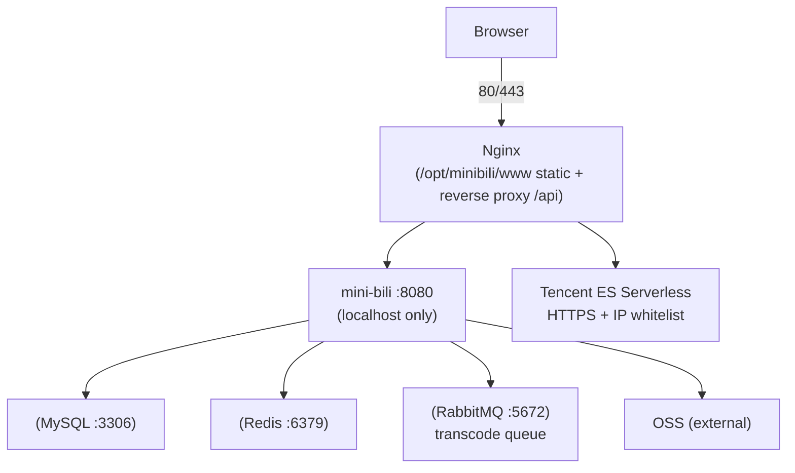

<p align="center">
  <a href="deploy/DEPLOY.md">
    
  </a>
  <strong></strong>
</p>

  </a>
  </a>
</p>

  </a>
</p>

# Minibili Production Deployment Guide (Alibaba Cloud CentOS 7)

Targeted at **personal site / interview demo / low traffic**. Default architecture:

- **Alibaba Cloud ECS (CentOS 7, ~2C/2G)**: Nginx + Go backend + MySQL + Redis + RabbitMQ + FFmpeg
- **Alibaba Cloud OSS**: Videos / covers / dynamic images
- **Tencent Cloud ES Serverless**: Search (pay-per-use, individual usage near zero; cross-cloud over public internet to ECS)

> **Do NOT run Elasticsearch cluster on a 2G app server.** CentOS 7 is EOL; secure SSH, change default passwords, only expose 80/443.

---

## 1. Architecture Overview



---

## 2. Resources & Cost Suggestions

| Component | Deployment | Notes |
|-----------|------------|-------|
| App ECS | Alibaba Cloud | 2G RAM is tight; **add 2G swap recommended**; avoid concurrent transcode |
| ES | Tencent Cloud Serverless | New user **50 CNY credit**; MB-level index costs < few CNY/month |
| OSS | Alibaba Cloud | Same region as ECS optimal; configure CORS if frontend hotlinks OSS |

Optional cost reduction: use Alibaba Cloud managed MySQL/Redis, ECS only runs Nginx + Go + RabbitMQ + FFmpeg.

---

## 3. Important: Do NOT Build Frontend on CentOS 7

The project frontend uses **Vite 6 + Vue 3**, requiring **Node.js 18+** (recommended **20 LTS**). CentOS 7's bundled glibc is too old; forcing new Node is prone to issues.

**Recommended approach (build on your Windows machine, server only hosts static files):**

**Windows (PowerShell):**
```powershell
cd D:\Minibili\cakecake-vue\bilibili-vue
npm install
copy .env.production.example .env.production
npm run build
```

**Linux / macOS:**
```bash
cd cakecake-vue/bilibili-vue
npm install
cp .env.production.example .env.production
npm run build
```

Upload the entire generated **`dist/`** directory to server at `/opt/minibili/www/`.

**Cross-platform (requires GNU Make):**
```bash
make build-frontend
```

If you must build on Linux: use **Node 20 official binary** (not system yum's node 6), or Docker `node:20-alpine` for build-only (still no need to permanently run Node on ECS).

---

## 4. Backend: Cross-Compile on Windows (Recommended)

CentOS 7 doesn't need Go installed -- only upload the Linux binary.

**Windows (PowerShell):**
```powershell
cd D:\Minibili
$env:GOPATH="C:\gopath-empty"
$env:GO111MODULE="on"
$env:GOOS="linux"
$env:GOARCH="amd64"
go build -ldflags="-s -w" -o mini-bili-linux .\cmd\mini-bili
```

**Linux / macOS:**
```bash
cd /path/to/minibili
GOPATH=/tmp/gopath-empty GO111MODULE=on GOOS=linux GOARCH=amd64   go build -ldflags="-s -w" -o mini-bili-linux ./cmd/mini-bili
```

**Cross-platform (requires GNU Make, recommended):**
```bash
make build-linux
```

Upload to server: `/opt/minibili/bin/mini-bili`, and `chmod +x`.

**CRITICAL: After cross-compiling, verify binary format before upload:**
```bash
file mini-bili-linux
# Must show: ELF 64-bit LSB executable, x86-64 ... for GNU/Linux
# If it shows PE32+, the cross-compilation failed -- see incident-20260725-502.md
```

---

## 5. Server Directory Layout

```bash
sudo mkdir -p /opt/minibili/{bin,www,configs,data/tmp,logs}
sudo chown -R "$USER:$USER" /opt/minibili
```

| Path | Content |
|------|---------|
| `/opt/minibili/bin/mini-bili` | Go binary |
| `/opt/minibili/.env` | Environment variables (DO NOT commit to Git) |
| `/opt/minibili/configs/` | `sensitive_words.txt`, `ip2region_v4.xdb` (download from [ip2region releases](https://github.com/lionsoul2014/ip2region), DO NOT commit to Git) |
| `/opt/minibili/data/tmp/` | Upload and transcode temp directory (writable) |
| `/opt/minibili/www/` | Frontend `dist/` extracted here |

Upload examples (modify with your IP):

```bash
scp mini-bili-linux user@your-ecs-ip:/opt/minibili/bin/mini-bili
scp -r cakecake-vue/bilibili-vue/dist/* user@your-ecs-ip:/opt/minibili/www/
scp -r configs user@your-ecs-ip:/opt/minibili/
scp deploy/env.production.example user@your-ecs-ip:/opt/minibili/.env
```

---

## 6. CentOS 7 Dependency Installation

### 6.1 Base Tools

```bash
sudo yum install -y epel-release
sudo yum install -y wget curl vim git
```

### 6.2 FFmpeg (for transcoding)

```bash
sudo yum install -y ffmpeg ffmpeg-devel
```

---

## 7. MySQL

```bash
sudo yum install -y mysql-server
sudo systemctl enable mysqld --now
mysql_secure_installation
```

---

## 8. Redis

```bash
sudo yum install -y redis
sudo systemctl enable redis --now
```

---

## 9. RabbitMQ

```bash
sudo yum install -y rabbitmq-server
sudo systemctl enable rabbitmq-server --now
```

---

## 10. Elasticsearch Configuration

### Option A: Tencent Cloud ES Serverless (consistent with DEPLOY architecture)

1. Enable **ES Serverless** in console (choose region close to users).
2. Create index namespace/instance, get **HTTPS access address** and credentials.
3. **Access Control**: Add **Alibaba Cloud ECS public IP** to whitelist.
4. In `.env`:

```env
ELASTICSEARCH_URL=https://your-instance-domain:9200
ELASTICSEARCH_USERNAME=elastic
ELASTICSEARCH_PASSWORD=your-password
```

### Option B: Bonsai / Other OpenSearch (Free Tier)

For personal demos with very low volume.

```env
ELASTICSEARCH_URL=https://xxxx.bonsaisearch.net
ELASTICSEARCH_USERNAME=your-username
ELASTICSEARCH_PASSWORD=your-password
```

---

## 11. systemd Service

```bash
sudo cp /path/to/Minibili/deploy/minibili.service /etc/systemd/system/minibili.service
sudo systemctl daemon-reload
sudo systemctl enable minibili --now
sudo systemctl status minibili
journalctl -u minibili -f
```

---

## 12. Alibaba Cloud Security Group & Firewall

| Port | Inbound | Notes |
|------|---------|-------|
| 22 | Your IP or key | SSH |
| 80 | 0.0.0.0/0 | HTTP |
| 443 | 0.0.0.0/0 | HTTPS (after cert config) |
| 8080 | **Closed** | localhost only |
| 3306 / 6379 / 5672 | **Closed** | localhost only |

```bash
sudo firewall-cmd --permanent --add-service=http --add-service=https
sudo firewall-cmd --reload
```

HTTPS: use `certbot` (requires domain) or Alibaba Cloud free certificate on Nginx.

---

## 13. OSS Notes

- `OSS_ENDPOINT`, `OSS_BUCKET`, `OSS_PUBLIC_URL_PREFIX` must match console settings.
- If browser directly reads OSS videos/covers, allow your site domain in Bucket **CORS** settings.
- Object keys after transcode: `videos/{id}.mp4`, `covers/{id}.jpg` etc. (see SPEC).

---

## 14. Go-Live Checklist

On **ECS locally**:

```bash
curl -s http://127.0.0.1:8080/api/v1/health
curl -sI http://127.0.0.1/
```

In browser (via domain or IP):

1. Open homepage, register/login
2. Upload a short video -> admin review pass -> playback + danmaku
3. Column post -> review -> read
4. Dynamic publish (no review needed)
5. Search page (requires ES connected)
6. Message Center, draft management

---

## 15. Common Issues

### Transcode failure / ffprobe not found
- Confirm `which ffprobe` matches `.env` `FFPROBE_PATH` (Air/SSH PATH may differ).
- Check `journalctl -u minibili` and item `fail_reason`.

### Upload 502 / endpoint unreachable
- `systemctl status minibili`, `nginx -t`
- Nginx reverse proxy `/api/` with `client_max_body_size` >= 520m.

### WebSocket danmaku/chat disconnect
- Nginx needs `proxy_http_version 1.1` and `Upgrade` headers (see `nginx-minibili.conf`).
- Confirm using same-origin `/api/v1/ws/...`, not direct :8080.

### OOM
- Add swap; avoid concurrent transcode; consider managed MySQL/Redis.

### Node errors on CentOS 7
- **Do NOT build frontend on server**; build locally with `npm run build`, upload `dist/` only.

---

## 16. Related Docs

- Functional spec: [SPEC.md](../SPEC.md)
- Engineering rules: [Rule.md](../Rule.md)
- Local development: [README.md](../README.md)
- Manual video ingestion: [docs/manual-video-ingest.md](../docs/manual-video-ingest.md)
- Optional CI deploy: [.github/workflows/deploy.yml](../.github/workflows/deploy.yml)
