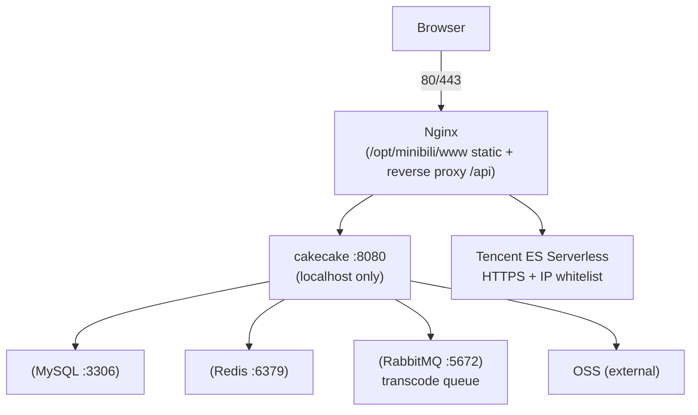

<p align="center">
  <a href="deploy/DEPLOY.md">
    
  </a>
  <strong></strong>
</p>

  </a>
  </a>
</p>

  </a>
</p>

# cakecake Production Deployment Guide (Alibaba Cloud CentOS 7)

Targeted at **personal site / interview demo / low traffic**. Default architecture:

- **Alibaba Cloud ECS (CentOS 7, ~2C/2G)**: Nginx + Go backend + MySQL + Redis + RabbitMQ + FFmpeg
- **Alibaba Cloud OSS**: Videos / covers / dynamic images
- **Tencent Cloud ES Serverless**: Search (pay-per-use, individual usage near zero; cross-cloud over public internet to ECS)

> **Do NOT run Elasticsearch cluster on a 2G app server.** CentOS 7 is EOL; secure SSH, change default passwords, only expose 80/443.

---

## 0. Local One-Command Experience (Docker Compose)

To see the project running in 30 seconds, skip the full production setup for now: [docker-compose.yml](../docker-compose.yml) orchestrates **MySQL / Redis / RabbitMQ / ES + backend + frontend** and seeds demo videos and danmaku automatically.

### Prerequisites

- Docker with Compose v2 (`docker compose version` works)
- Plan for ≥ 4GB RAM on the host (ES is memory-hungry; on low-RAM machines you can comment out the `elasticsearch` service — the search page shows "unavailable" and everything else keeps working)
- On Linux, satisfy the ES kernel parameter first: `sudo sysctl -w vm.max_map_count=262144` (persist it in `/etc/sysctl.conf`; Docker Desktop on macOS/Windows already satisfies it)

### Startup

```bash
cd <repo root>
cp .env.example .env          # optional; defaults work without it
docker compose up -d
```

The compose file pulls the published images from Docker Hub by default (`earthcake/cakecake-backend:latest` / `earthcake/cakecake-web:latest`) — no local build required; to build from source, use `docker compose -f docker-compose.yml -f docker-compose.dev.yml up -d --build` instead.

Open **[http://localhost:8888](http://localhost:8888)**. On first boot: GORM AutoMigrate creates the schema → `SEED_DEMO_DATA=true` writes demo users / videos / danmaku → ES is fully reindexed.

### Ports & Accounts

| Service | Address | Notes |
| --- | --- | --- |
| Frontend | http://localhost:8888 | Nginx serves the SPA and proxies `/api` + WebSocket |
| Backend API | http://localhost:8080 | Health check `GET /api/v1/health`; Swagger at `/swagger/` |
| MySQL / Redis / RabbitMQ / ES | `3306` / `6379` / `5672`·`15672` / `9200` | Bound to `127.0.0.1` by default |

**7 demo users are built in** (usernames are the video uploaders' nicknames): `暗猫の祝福`, `加载超时请稍后`, `Baka恶魔`, `三栗lili`, `Yeuoly`, `科学超电磁炮F`, `泛式大大` — all share password `demo123456` (overridable via `DEMO_USER_PASSWORD`); you can also register your own account. The admin console is `admin` / `change-me-admin` (set via `ADMIN_SEED_PASSWORD`, effective only on first init; admins have no password-change endpoint). All ports bind to the loopback interface by default; if 8888/8080 are already taken, override `WEB_PORT` / `BACKEND_PORT` in `.env` and run `docker compose up -d` again. For public deployment change the port mappings, default passwords, and configure a firewall.

### Optional Upgrades

- **AI assistant (DeepSeek Function Calling)**: put `DEEPSEEK_API_KEY` in `.env`, then `docker compose up -d backend`;
- **Web upload + async transcoding**: follow the four steps in "Enabling Web Upload" below. **Note: the published Docker Hub images have the frontend flag baked to `true`, so uploads cannot be enabled with the published images alone — you must rebuild the frontend locally.**
- **Stop / reset**: `docker compose down`; full reset (removes volumes) with `docker compose down -v`.

#### Enabling Web Upload (Alibaba Cloud OSS)

The default "demo mode" does not upload (frontend entry hidden, backend has no OSS). Enable it in four steps:

1. Put the Alibaba Cloud OSS credentials in `.env` (5 variables):

```bash
OSS_ACCESS_KEY_ID=xxx
OSS_ACCESS_KEY_SECRET=xxx
OSS_BUCKET=xxx
OSS_ENDPOINT=oss-cn-hangzhou.aliyuncs.com
OSS_PUBLIC_URL_PREFIX=https://xxx.oss-cn-hangzhou.aliyuncs.com
```

2. Turn on the frontend build-time flag in `.env`:

```bash
VITE_VIDEO_UPLOAD_DISABLED=false
```

3. Rebuild the frontend image and restart the backend (**key: the published image has the flag baked to `true`, so editing `.env` alone has no effect**):

```bash
docker compose -f docker-compose.yml -f docker-compose.dev.yml up -d --build web backend
```

4. Open http://localhost:8888 — the upload entry appears in the creator center; upload → RabbitMQ async transcoding → cover thumbnail generation all work.

### Differences from Production

Compose targets the **local one-command experience**: upload is disabled by default (matching the live demo), and secrets live only in the local `.env` (gitignored). The production deployment in the rest of this document does not use compose, and its secrets live only in `/opt/minibili/.env` on the server.

### CI Guard

`.github/workflows/compose-check.yml` triple-guards the stack: env-drift checks (`.env.example` ↔ compose), `docker compose config` validation, and a full-stack smoke test (real image builds, health checks, seed data). If code evolution breaks the one-command experience, CI fails loudly.

Image publishing is handled by `.github/workflows/docker-publish.yml`: on main merges / `v*` tags it builds and pushes to Docker Hub (`latest` + `sha-<first 12>`, plus `vX.Y.Z` on tag events).

---

## 1. Architecture Overview



---

## 2. Resources & Cost Suggestions

| Component | Deployment | Notes |
|-----------|------------|-------|
| App ECS | Alibaba Cloud | 2G RAM is tight; **add 2G swap recommended**; avoid concurrent transcode |
| ES | Tencent Cloud Serverless | New user **50 CNY credit**; MB-level index costs < few CNY/month |
| OSS | Alibaba Cloud | Same region as ECS optimal; configure CORS if frontend hotlinks OSS |

Optional cost reduction: use Alibaba Cloud managed MySQL/Redis, ECS only runs Nginx + Go + RabbitMQ + FFmpeg.

---

## 3. Important: Do NOT Build Frontend on CentOS 7

The project frontend uses **Vite 6 + Vue 3**, requiring **Node.js 18+** (recommended **20 LTS**). CentOS 7's bundled glibc is too old; forcing new Node is prone to issues.

**Recommended approach (build on your Windows machine, server only hosts static files):**

**Windows (PowerShell):**
```powershell
cd D:\cakecake\cakecake-vue\cakecake-web
npm install
copy .env.production.example .env.production
npm run build
```

**Linux / macOS:**
```bash
cd cakecake-vue/cakecake-web
npm install
cp .env.production.example .env.production
npm run build
```

Upload the entire generated **`dist/`** directory to server at `/opt/minibili/www/`.

**Cross-platform (requires GNU Make):**
```bash
make build-frontend
```

If you must build on Linux: use **Node 20 official binary** (not system yum's node 6), or Docker `node:20-alpine` for build-only (still no need to permanently run Node on ECS).

---

## 4. Backend: Cross-Compile on Windows (Recommended)

CentOS 7 doesn't need Go installed -- only upload the Linux binary.

**Windows (PowerShell):**
```powershell
cd D:\cakecake
$env:GOPATH="C:\gopath-empty"
$env:GO111MODULE="on"
$env:GOOS="linux"
$env:GOARCH="amd64"
go build -ldflags="-s -w" -o cakecake-linux .\cmd\cakecake
```

**Linux / macOS:**
```bash
cd /path/to/minibili
GOPATH=/tmp/gopath-empty GO111MODULE=on GOOS=linux GOARCH=amd64   go build -ldflags="-s -w" -o cakecake-linux ./cmd/cakecake
```

**Cross-platform (requires GNU Make, recommended):**
```bash
make build-linux
```

Upload to server: `/opt/minibili/bin/mini-bili`, and `chmod +x`.

**CRITICAL: After cross-compiling, verify binary format before upload:**
```bash
file cakecake-linux
# Must show: ELF 64-bit LSB executable, x86-64 ... for GNU/Linux
# If it shows PE32+, the cross-compilation failed -- see incident-20260725-502.md
```

---


---

## 5. Server Directory Layout

```bash
sudo mkdir -p /opt/minibili/{bin,www,configs,data/tmp,logs}
sudo chown -R "$USER:$USER" /opt/minibili
```

| Path | Content |
|------|---------|
| `/opt/minibili/bin/mini-bili` | Go binary |
| `/opt/minibili/.env` | Environment variables (DO NOT commit to Git) |
| `/opt/minibili/configs/` | `sensitive_words.txt`, `ip2region_v4.xdb` (download from [ip2region releases](https://github.com/lionsoul2014/ip2region), DO NOT commit to Git) |
| `/opt/minibili/data/tmp/` | Upload and transcode temp directory (writable) |
| `/opt/minibili/www/` | Frontend `dist/` extracted here |

Upload examples (modify with your IP):

```bash
scp cakecake-linux user@your-ecs-ip:/opt/minibili/bin/mini-bili
scp -r cakecake-vue/cakecake-web/dist/* user@your-ecs-ip:/opt/minibili/www/
scp -r configs user@your-ecs-ip:/opt/minibili/
scp deploy/env.production.example user@your-ecs-ip:/opt/minibili/.env
```

---

## 6. CentOS 7 Dependency Installation

### 6.1 Base Tools

```bash
sudo yum install -y epel-release
sudo yum install -y wget curl vim git
```

### 6.2 FFmpeg (for transcoding)

```bash
sudo yum install -y ffmpeg ffmpeg-devel
which ffprobe ffmpeg
```

If the `yum` version is too old, use a [static build](https://johnvansickle.com/ffmpeg/), extract it to `/usr/local/bin`, and set absolute paths in `.env`:

```env
FFPROBE_PATH=/usr/local/bin/ffprobe
FFMPEG_PATH=/usr/local/bin/ffmpeg
```

### 6.3 MySQL (5.7 / 8.0)

```bash
# Example: MariaDB 10.5 (MySQL-protocol compatible)
sudo yum install -y mariadb-server mariadb
sudo systemctl enable mariadb --now
sudo mysql_secure_installation
```

```sql
CREATE DATABASE minibili CHARACTER SET utf8mb4 COLLATE utf8mb4_unicode_ci;
CREATE USER 'minibili'@'localhost' IDENTIFIED BY 'strong-password';
GRANT ALL ON minibili.* TO 'minibili'@'localhost';
FLUSH PRIVILEGES;
```

DSN example:

```env
MYSQL_DSN=minibili:strong-password@tcp(127.0.0.1:3306)/minibili?charset=utf8mb4&parseTime=True&loc=Local
```

First deployment needs table initialization, choose one:

- **Dev / single machine**: start with `APP_ENV=development` and let GORM AutoMigrate create tables
- **Production**: apply the baseline migration with `goose -dir migrations mysql "DSN" up`, then start with `APP_ENV=production` (goose SQL migrations only)

### 6.4 Redis

```bash
sudo yum install -y redis
sudo systemctl enable redis --now
redis-cli ping   # PONG
```

### 6.5 RabbitMQ

```bash
sudo yum install -y rabbitmq-server
sudo systemctl enable rabbitmq-server --now
sudo rabbitmqctl status
```

Default `guest/guest` works locally; for production create a dedicated user and put it in `RABBITMQ_URL`.

### 6.6 Nginx

```bash
sudo yum install -y nginx
sudo systemctl enable nginx
```

Copy this repo's config:

```bash
sudo cp /path/to/cakecake/deploy/nginx-minibili.conf /etc/nginx/conf.d/minibili.conf
# Edit server_name, root path
sudo nginx -t && sudo systemctl reload nginx
```

### 6.7 2G Memory: enable swap

```bash
sudo fallocate -l 2G /swapfile
sudo chmod 600 /swapfile
sudo mkswap /swapfile
sudo swapon /swapfile
echo '/swapfile swap swap defaults 0 0' | sudo tee -a /etc/fstab
```

---

## 7. Environment Variables (.env)

Copy `deploy/env.production.example` from the repo to `/opt/minibili/.env` and edit each item.

**Must change for production:**

- `JWT_SECRET`: long random string
- `APP_ENV=production`
- `MYSQL_DSN`, `REDIS_*`, `RABBITMQ_URL`
- `OSS_*` (must match the Bucket region)
- `ADMIN_SEED_*`: only for first-time admin creation; change the admin password right after going live
- `ELASTICSEARCH_*`: search (see next section; can be empty)
- `VIDEO_UPLOAD_DISABLED=true`: **recommended on 2G instances**. Disables web video upload and transcoding while still allowing draft metadata; videos are transcoded locally + OSS + manual DB insert, see [docs/manual-video-ingest.md](../docs/manual-video-ingest.md)
- Frontend build uses the matching `VITE_VIDEO_UPLOAD_DISABLED=true` (see `.env.production.example`)

**Do NOT** expose `8080` publicly; `HTTP_ADDR=127.0.0.1:8080` is local-only, proxied by Nginx.

---

## 8. Search (Elasticsearch / OpenSearch)

### Option A: Tencent Cloud ES Serverless (consistent with DEPLOY architecture)

1. Enable **ES Serverless** in console (choose region close to users).
2. Create index namespace/instance, get **HTTPS access address** and credentials.
3. **Access Control**: Add **Alibaba Cloud ECS public IP** to whitelist.
4. In `.env`:

```env
ELASTICSEARCH_URL=https://your-instance-domain:9200
ELASTICSEARCH_USERNAME=elastic
ELASTICSEARCH_PASSWORD=your-password
```

### Option B: Bonsai / Other OpenSearch (Free Tier)

For personal demos with very low volume.

```env
ELASTICSEARCH_URL=https://xxxx.bonsaisearch.net
ELASTICSEARCH_USERNAME=your-username
ELASTICSEARCH_PASSWORD=your-password
```

### Indexing & Acceptance

- New videos/articles are indexed automatically after publish or review approval; historical data needs a full sync (admin endpoint or script, see SPEC).
- Open the search page in a browser; `/api/v1/search` in the Network tab should return results instead of `search_status=unavailable`.

---

## 9. systemd Service

```bash
sudo cp /path/to/cakecake/deploy/minibili.service /etc/systemd/system/minibili.service
sudo systemctl daemon-reload
sudo systemctl enable minibili --now
sudo systemctl status minibili
journalctl -u minibili -f
```

---

## 10. Alibaba Cloud Security Group & Firewall

| Port | Inbound | Notes |
|------|---------|-------|
| 22 | Your IP or key | SSH |
| 80 | 0.0.0.0/0 | HTTP |
| 443 | 0.0.0.0/0 | HTTPS (after cert config) |
| 8080 | **Closed** | localhost only |
| 3306 / 6379 / 5672 | **Closed** | localhost only |

```bash
sudo firewall-cmd --permanent --add-service=http --add-service=https
sudo firewall-cmd --reload
```

HTTPS: use `certbot` (requires domain) or Alibaba Cloud free certificate on Nginx.

---

## 11. OSS Notes

- `OSS_ENDPOINT`, `OSS_BUCKET`, `OSS_PUBLIC_URL_PREFIX` must match console settings.
- If browser directly reads OSS videos/covers, allow your site domain in Bucket **CORS** settings.
- Object keys after transcode: `videos/{id}.mp4`, `covers/{id}.jpg` etc. (see SPEC).

---

## 12. Go-Live Checklist

On **ECS locally**:

```bash
curl -s http://127.0.0.1:8080/api/v1/health
curl -sI http://127.0.0.1/
```

In browser (via domain or IP):

1. Open homepage, register/login
2. Upload a short video -> admin review pass -> playback + danmaku
3. Column post -> review -> read
4. Dynamic publish (no review needed)
5. Search page (requires ES connected)
6. Message Center, draft management

---

## 13. Common Issues

### Transcode failure / ffprobe not found
- Confirm `which ffprobe` matches `.env` `FFPROBE_PATH` (Air/SSH PATH may differ).
- Check `journalctl -u minibili` and item `fail_reason`.

### Upload 502 / endpoint unreachable
- `systemctl status minibili`, `nginx -t`
- Nginx reverse proxy `/api/` with `client_max_body_size` >= 520m.

### WebSocket danmaku/chat disconnect
- Nginx needs `proxy_http_version 1.1` and `Upgrade` headers (see `nginx-minibili.conf`).
- Confirm using same-origin `/api/v1/ws/...`, not direct :8080.

### OOM
- Add swap; avoid concurrent transcode; consider managed MySQL/Redis.

### Node errors on CentOS 7
- **Do NOT build frontend on server**; build locally with `npm run build`, upload `dist/` only.

---

## 14. Related Docs

- Functional spec: [SPEC.md](../SPEC.md)
- Engineering rules: [Rule.md](../Rule.md)
- Local development: [README.md](../README.md)
- Manual video ingestion: [docs/manual-video-ingest.md](../docs/manual-video-ingest.md)
- Optional CI deploy: [.github/workflows/deploy.yml](../.github/workflows/deploy.yml)

---

## DB Initialization

1. Create empty database:
   mysql -u root -p -e "CREATE DATABASE IF NOT EXISTS minibili CHARACTER SET utf8mb4 COLLATE utf8mb4_unicode_ci;"

2. Set APP_ENV=production in .env (DB_AUTO_MIGRATE defaults to false -> goose SQL only)

3. Start app: goose runs migrations/00001_baseline.sql, creates all 42+ tables automatically

4. Verify: mysql -u root -p minibili -e "SHOW TABLES;"

Note: MySQL 8.0+ required. Future schema changes go in migrations/ directory (see Skill S-016).
