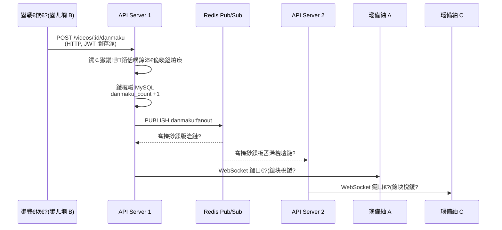
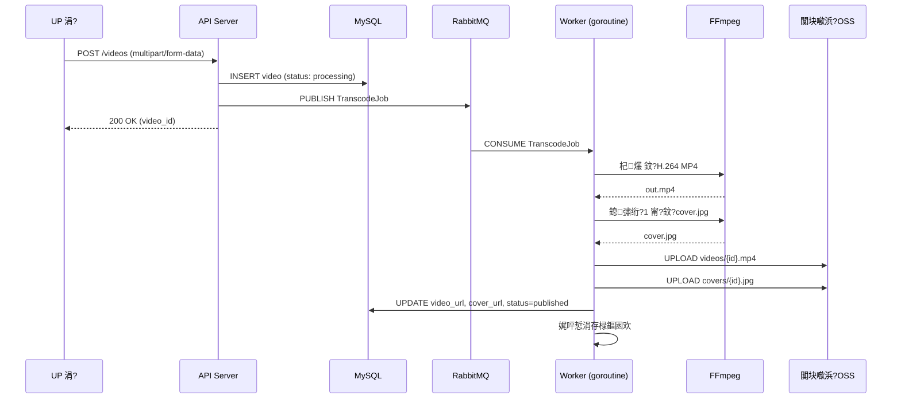

# Cakecake 绯荤粺鏋舵瀯

## 姒傝堪

Cakecake 鏄熀浜?Go + Vue 3 鍏ㄦ爤鏋勫缓鐨勪豢 B 绔欒棰戝垎浜ぞ鍖猴紝鑱氱劍瑙嗛鎶曠銆佸疄鏃跺脊骞曘€佸绾ц瘎璁恒€佸叏鏂囨悳绱€丄I 鍔╂墜绛夋牳蹇冮摼璺€傛湰鏂囨。闈㈠悜闈㈣瘯鍜屾妧鏈瘎瀹★紝姊崇悊绯荤粺鏋舵瀯銆佹牳蹇冩ā鍧楄璁°€佸叧閿喅绛栧強鏁版嵁娴佽浆銆?

```mermaid
graph TB
    Browser["娴忚鍣?]
    Nginx["Nginx (:443)"]

    Vue["Vue 3 SPA<br/>Vite 路 TypeScript"]
    Gin["Go API Server (Gin) :8080"]

    MySQL[("MySQL")]
    Redis[("Redis")]
    RMQ[("RabbitMQ")]
    OSS[("闃块噷浜?OSS")]
    ES[("Elasticsearch<br/>鍙€?)]
    DS["DeepSeek API"]

    Browser -->|闈欐€佽祫婧恷 Nginx
    RC["RuntimeConfig\n30绉?DB 杞"] -.-> Gin
    Gin --> RC
    RC --> MySQL
    Nginx -->|proxy API| Gin
    RL["Redis Token Bucket\nRate Limiter"] -.-> Gin
    Gin --> MySQL
    Gin --> Redis
    Gin --> RMQ
    Gin --> OSS
    Gin --> ES
    Gin -->|HTTP| DS
    RMQ -->|consume| Gin
```

---

## 椤圭洰缁撴瀯

```
Minibili/
鈹溾攢鈹€ cmd/mini-bili/main.go        # 鍏ュ彛锛氬姞杞介厤缃€佸垵濮嬪寲 DB銆佹敞鍐岃矾鐢?
鈹溾攢鈹€ internal/
鈹?  鈹溾攢鈹€ handler/                  # HTTP + WebSocket 澶勭悊鍣?
鈹?  鈹溾攢鈹€ service/                  # 涓氬姟閫昏緫灞?
鈹?  鈹溾攢鈹€ model/                    # GORM 鏁版嵁妯″瀷
鈹?  鈹溾攢鈹€ middleware/               # JWT 閴存潈銆佺鐞嗗憳閴存潈銆佸叏灞€闄愭祦
鈹?  鈹溾攢鈹€ worker/                   # RabbitMQ 娑堣垂鑰咃紙杞爜锛?
鈹?  鈹溾攢鈹€ ws/                       # WebSocket Hub锛堝脊骞曟埧闂淬€佺淇★級
鈹?  鈹溾攢鈹€ search/                   # Elasticsearch 瀹㈡埛绔笌鏌ヨ鏋勫缓
鈹?  鈹溾攢鈹€ storage/                  # 闃块噷浜?OSS 瀹㈡埛绔?
鈹?  鈹溾攢鈹€ ffmpeg/                   # FFmpeg 灏佽锛堣浆鐮併€佹埅甯э級
鈹?  鈹溾攢鈹€ aigateway/                # DeepSeek OpenAI 鍏煎瀹㈡埛绔?
鈹?  鈹溾攢鈹€ queue/                    # RabbitMQ 杩炴帴绠＄悊
鈹?  鈹溾攢鈹€ config/                   # 鐜鍙橀噺鍔犺浇涓庨厤缃粨鏋勪綋
鈹?  鈹溾攢鈹€ logger/                   # Zap 鏃ュ織鍒濆鍖?
鈹?  鈹溾攢鈹€ errcode/                  # 涓氬姟閿欒鐮?
鈹?  鈹斺攢鈹€ pkg/                      # 宸ュ叿鍖咃細JWT銆丅V 鍙枫€両P 瀹氫綅銆佹晱鎰熻瘝銆?
鈹?      鈹溾攢鈹€ jwttoken/             #   鐢ㄦ埛澶村儚銆佺瓑绾с€佺‖甯併€佺敤鎴峰悕鏍￠獙...
鈹?      鈹溾攢鈹€ bvid/
鈹?      鈹溾攢鈹€ sensitive/
鈹?      鈹斺攢鈹€ ...
鈹溾攢鈹€ configs/                      # sensitive_words.txt銆乮p2region_v4.xdb
鈹溾攢鈹€ deploy/                       # Nginx 閰嶇疆銆乻ystemd unit銆佺敓浜х幆澧冨彉閲忔ā鏉?
鈹溾攢鈹€ docs/                         # 鎴浘涓庢寚鍗?
鈹溾攢鈹€ cakecake-vue/bilibili-vue/    # Vue 3 + Vite + TypeScript 鍓嶇
鈹斺攢鈹€ go.mod                        # module minibili
```

---

## 鏍稿績妯″潡

### 1. 瀹炴椂寮瑰箷绯荤粺

寮瑰箷绯荤粺鏄暣涓」鐩妧鏈毦搴︽渶楂樼殑妯″潡銆傞€氳繃 WebSocket + Redis Pub/Sub 鏋舵瀯瀹炵幇绔埌绔欢杩熶綆浜?200ms銆?



**娴佺▼锛?*

1. 鍙戦€佽€呰皟鐢?`POST /api/v1/videos/:id/danmaku`锛圚TTP锛岄渶 JWT 閴存潈锛?
2. 鏈嶅姟绔牎楠屽唴瀹癸紙1~100 瀛楃锛夈€侀鑹诧紙`#XXXXXX`锛夈€佺被鍨嬶紙scroll/top/bottom锛夛紝妫€鏌?5 绉掑喎鍗达紙Redis `SETNX`锛夛紝鏁忔劅璇嶈繃婊?
3. 寮瑰箷鍐欏叆 MySQL锛岃棰?`danmaku_count` +1
4. 灏?JSON 杞借嵎鍙戝竷鍒?Redis 棰戦亾 `danmaku:fanout`
5. 姣忎釜鏈嶅姟鍓湰璁㈤槄璇ラ閬擄紝鏀跺埌娑堟伅鍚庤皟鐢?`Hub.BroadcastRaw(videoID, body)` 鍚戞湰鍦拌繛鎺ユ睜骞挎挱
6. `ws.Hub` 閬嶅巻鐩爣瑙嗛鎴块棿鐨勬墍鏈?WebSocket 杩炴帴锛岄€愭潯鍐欏叆 JSON 娑堟伅
7. 瑙備紬閫氳繃 `GET /api/v1/ws/danmaku?video_id=...` 寤虹珛 WebSocket 杩炴帴锛屽姞鍏ュ搴旀埧闂达紝瀹炴椂鎺ユ敹寮瑰箷

**鍏抽敭璁捐鍐崇瓥锛?*

| 鍐崇瓥                                                            | 鐞嗙敱                                                       |
| --------------------------------------------------------------- | ---------------------------------------------------------- |
| Redis Pub/Sub 鍋氬鍓湰骞挎挱                                      | 瑙ｈ€﹀箍鎾€昏緫锛屾柊鍓湰鑷姩鎺ユ敹娑堟伅锛屾棤闇€鍏变韩鍐呭瓨鍗冲彲姘村钩鎵╁睍 |
| 鎸夎棰戞埧闂村垎杩炴帴姹狅紙`map[uint64]map[*websocket.Conn]struct{}`锛?| O(1) 鎴块棿骞挎挱锛屾棤璺ㄦ埧闂存壂鎻忓紑閿€                            |
| SETNX 鍋氬喎鍗磋€岄潪鍏ㄥ眬闄愭祦涓棿浠?                                 | 鍐峰嵈绮掑害鏄?姣忕敤鎴锋瘡瑙嗛"锛屾瘮閫氱敤浠ょ墝妗舵洿绠€娲?              |
| 寮瑰箷涓嶅湪 Redis 涓寔涔呭寲                                         | 寮瑰箷鏄疄鏃舵暟鎹紝MySQL 鏄巻鍙插敮涓€鏁版嵁婧?                    |

---

### 2. 瑙嗛寮傛杞爜娴佹按绾?



**娴佺▼锛?*

1. UP 涓讳笂浼犲師濮嬭棰?+ 鍙€夎嚜瀹氫箟灏侀潰 鈫?`POST /api/v1/videos`
2. 鏈嶅姟绔啓鍏?MySQL锛坰tatus: `processing`锛夛紝鍘熷鏂囦欢瀛樺叆涓存椂鐩綍
3. 鎶曢€?`TranscodeJob{VideoID, RawPath, CoverPath}` 鍒?RabbitMQ `transcode` 闃熷垪
4. Worker 鍗忕▼娑堣垂浠诲姟锛欶Fmpeg 杞?H.264 MP4 鈫?鎴彇绗?1 甯т负灏侀潰 鈫?涓婁紶 OSS
5. 鎴愬姛锛氭洿鏂?`video_url`銆乣cover_url`锛宻tatus 鈫?`published`
6. 澶辫触锛氭渶澶氶噸璇?**3 娆?*锛屾寚鏁伴€€閬匡紙30s 鈫?60s 鈫?90s锛夈€傛案涔呮€уけ璐ユ爣璁?`failed` 骞惰褰曞彲璇诲師鍥狅紝鐬椂澶辫触閲嶆柊鍏ラ槦

**澶辫触鍒嗙被锛?*

| 绫诲瀷   | 妫€娴嬫柟寮?                                        | 澶勭悊                                       |
| ------ | ------------------------------------------------ | ------------------------------------------ |
| 姘镐箙鎬?| FFmpeg stderr 鍖归厤宸茬煡妯″紡锛堥潪娉曠紪鐮併€佹崯鍧忔枃浠讹級 | 鏍囪`failed`锛屽瓨鍌?`fail_reason`锛宎ck 娑堟伅 |
| 鐬椂鎬?| 瓒呮椂銆丱SS 缃戠粶閿欒銆佺鐩樻弧                       | 閲嶈瘯璁℃暟 +1锛岄噸鏂板叆闃?                     |
| 鑰楀敖   | `retry_count >= 3`                               | 鏍囪`failed`锛宎ck 娑堟伅                     |

---

### 3. 鍏ㄦ枃鎼滅储锛圗lasticsearch锛?

- **涓変釜绱㈠紩**锛歚videos`锛堟爣棰樸€佹弿杩般€佹爣绛俱€佸垎鍖猴級銆乣articles`锛堟爣棰樸€佹鏂囥€佸垎绫伙級銆乣users`锛堟樀绉般€佺敤鎴峰悕銆佺鍚嶏級
- **澶氬瓧娈垫潈閲?*锛氳棰?title^3, description^1.5锛涚敤鎴锋樀绉版敮鎸?wildcard `query_string` 妯＄硦鍖归厤
- **楂樹寒**锛氳繑鍥?`<em class="keyword">鍛戒腑璇?/em>` 鐗囨
- **鎺掑簭**锛氶粯璁わ紙鐩稿叧鎬э級銆佸彂甯冩棩鏈熴€佹挱鏀鹃噺銆佺偣璧炴暟
- **鍙€夐檷绾?*锛欵S 鏈厤缃椂鎼滅储椤垫彁绀?鎼滅储鏈嶅姟鏈氨缁?锛屼笉褰卞搷鍏朵粬鍔熻兘

---

### 4. 璇勮绯荤粺

- **2 绾у祵濂?*锛氭牴璇勮 鈫?瀛愯瘎璁?鈫?瀛欒瘎璁恒€侴ORM 閫氳繃 `Preload("Children.Children")` 鍗曟鏌ヨ缁勮璇勮鏍?
- **绾ц仈鍒犻櫎**锛氬垹闄ょ埗璇勮鏃堕€掑綊鍒犻櫎鎵€鏈夊悗浠ｏ紙搴旂敤灞傚疄鐜帮紝涓嶄緷璧栨暟鎹簱澶栭敭锛?
- **UP 涓荤鐞?*锛氳棰戜綔鑰呭彲鍒犻櫎浠绘剰璇勮锛涙櫘閫氱敤鎴蜂粎鍙垹闄よ嚜宸辩殑璇勮
- **鐐硅禐/韪?*锛歵oggle 妯″紡鈥斺€旀煡璇㈡槸鍚﹀瓨鍦ㄨ褰曪紝鎻掑叆鎴栧垹闄わ紝鍘熷瓙鏇存柊璁℃暟鍣?

---

### 5. 鐑悳绯荤粺

```mermaid
flowchart LR
    Q[鎼滅储鍏抽敭璇?br/>ZINCRBY] --> RS[("Redis Sorted Set<br/>hot:search")]
    RS --> T[Top N 鎸?score 闄嶅簭]
    T --> M[鍚堝苟寮曟搸]
    DB[(浜哄伐骞查 DB<br/>缃《 / 灞忚斀 /<br/>鑷畾涔夋爣棰?/ 瑙掓爣)] --> M
    M --> L[鏈€缁堟鍗?br/>鏈€澶?20 鏉
```

- **鑷姩**锛氱敤鎴锋悳绱㈣涓洪€氳繃 Redis ZINCRBY 绱鐑害
- **浜哄伐**锛氱鐞嗗悗鍙版敮鎸佺疆椤躲€佸睆钄姐€佽嚜瀹氫箟灞曠ず璇嶃€佽鏍囷紙"鐑?銆?鏂?锛?
- **鍚堝苟**锛氫汉宸ユ潯鐩紭鍏堝崰浣嶏紝鑷姩鏉＄洰濉厖鍓╀綑妲戒綅锛屽睆钄借瘝杩囨护

---

### 6. AI 鍔╂墜锛圖eepSeek锛?

- 灏佽 OpenAI 鍏煎瀹㈡埛绔紙`internal/aigateway/deepseek.go`锛?
- 鐢ㄦ埛鍙戣捣绉佷俊瀵硅瘽锛涚鐞嗗憳鍚庡彴閰嶇疆 Agent 瑙掕壊锛堝悕绉般€佸ご鍍忋€佺郴缁熸彁绀鸿瘝锛?
- 娑堟伅鎼哄甫瀵硅瘽鍘嗗彶浣滀负涓婁笅鏂囷紝Agent 鍥炲鎻掑叆鍚屼竴瀵硅瘽绾跨▼
- Temperature: 0.7锛岃秴鏃? 90s锛屾湭鍚敤娴佸紡锛堢淇″満鏅洿绠€鍗曞彲闈狅級

---

## 瀛樺偍绛栫暐

| 鏁版嵁绫诲瀷                                | 瀛樺偍          | 鐞嗙敱                           |
| --------------------------------------- | ------------- | ------------------------------ |
| 鐢ㄦ埛銆佽棰戝厓鏁版嵁銆佽瘎璁恒€侀€氱煡銆佽崏绋?     | MySQL         | 鍏崇郴瀹屾暣鎬с€佸鏉傛煡璇?          |
| 瑙嗛鏂囦欢銆佸皝闈€佸ご鍍?                   | 闃块噷浜?OSS    | 寮规€ф墿瀹广€丆DN 灏辩华             |
| 寮瑰箷骞挎挱銆佹挱鏀捐鏁般€佸喎鍗淬€丷efresh Token | Redis         | 浣庡欢杩熴€佹暟鎹彲涓㈠け             |
| 杞爜浠诲姟                                | RabbitMQ      | 鎸佷箙鍖栥€丄CK 纭銆佺簿纭竴娆℃姇閫?|
| 鎼滅储绱㈠紩                                | Elasticsearch | 鍊掓帓绱㈠紩銆佺浉鍏虫€ц瘎鍒?          |

---

## 鍏抽敭璁捐鍐崇瓥

| 鍐崇瓥                                                  | 鐞嗙敱                                                                                                                            |
| ----------------------------------------------------- | ------------------------------------------------------------------------------------------------------------------------------- |
| **v1 鐢ㄥ崟浣撹€岄潪寰湇鍔?*                               | 鍗曚汉寮€鍙戯紝蹇€熻凯浠ｃ€備唬鐮佹寜棰嗗煙鍒嗗眰锛坄handler/`銆乣service/`銆乣worker/`锛夛紝涓哄悗缁媶鍒嗕负 Kratos 寰湇鍔￠鐣欑┖闂?                    |
| **Redis Pub/Sub 鍋氬脊骞曞箍鎾腑缁э紝鑰岄潪 WebSocket 鐩村彂** | 瑙ｈ€﹀箍鎾笌 HTTP handler銆傚鍓湰璁㈤槄鍚屼竴 Redis 棰戦亾锛屾棤闇€鍏变韩鍐呭瓨鍗冲彲姘村钩鎵╁睍                                                    |
| **杞爜鐢?RabbitMQ 鑰岄潪 Redis List**                   | RabbitMQ 鎻愪緵娑堟伅鎸佷箙鍖栥€佹秷璐圭‘璁ゃ€佹淇￠槦鍒椻€斺€旇棰戝鐞嗕笉鍙帴鍙楁暟鎹涪澶?                                                          |
| **GORM AutoMigrate 鑰岄潪 SQL 杩佺Щ鏂囦欢**                | 鍗曚汉椤圭洰绠€鍖栨搷浣滐紝琛ㄧ粨鏋勯€氳繃 Go struct 澹版槑锛屽惎鍔ㄦ椂鑷姩寤鸿〃                                                                     |
| **ES 鍙€夎€岄潪寮哄埗渚濊禆**                               | 闄嶄綆涓婃墜闂ㄦ锛屾湭閰嶇疆鏃舵悳绱㈤〉浼橀泤闄嶇骇                                                                                            |
| **Redis 浠ょ墝妗跺仛鍏ㄥ眬闄愭祦**                            | 淇濇姢鍒楄〃銆佹悳绱€佺┖闂寸瓑鍏紑鎺ュ彛涓嶅彈绐佸彂/鐖櫕鎵撳灝锛涙寜 IP 缁村害闄愭祦锛汱ua 鑴氭湰淇濊瘉浠ょ墝妗跺師瀛愭€э紱妗跺閲忔敮鎸佺煭鏃剁獊鍙戯紝閫熺巼闄愬埗绋虫€?QPS |
| **bcrypt + 鍙?Token JWT**                             | 琛屼笟鏍囧噯璁よ瘉鏂规锛孉ccess/Refresh 鍙?Token + Redis 绠＄悊 Refresh Token 杞浆                                                       |

---

## 绔埌绔暟鎹祦锛氳棰戞姇绋?

```
1. POST /api/v1/videos (multipart/form-data)
   鈹溾攢鈹€ JWT 涓棿浠舵牎楠?Token
   鈹溾攢鈹€ Handler 鏍￠獙鏂囦欢鏍煎紡 (MP4/AVI/MKV/...)
   鈹溾攢鈹€ 鍘熷鏂囦欢瀛樺叆 TEMP_UPLOAD_DIR
   鈹溾攢鈹€ 鍐欏叆 Video 璁板綍 (status: "processing")
   鈹斺攢鈹€ 鎶曢€?TranscodeJob 鍒?RabbitMQ

2. Worker 娑堣垂 TranscodeJob
   鈹溾攢鈹€ FFmpeg: 鍘熷鏂囦欢 鈫?H.264 MP4 (out.mp4)
   鈹溾攢鈹€ FFmpeg: out.mp4 绗?1 甯?鈫?cover.jpg锛堟棤鑷畾涔夊皝闈㈡椂锛?
   鈹溾攢鈹€ OSS.UploadFile("videos/{id}.mp4", out.mp4)
   鈹溾攢鈹€ OSS.UploadFile("covers/{id}.jpg", cover.jpg)
   鈹溾攢鈹€ DB: UPDATE video SET video_url, cover_url, status
   鈹斺攢鈹€ 娓呯悊涓存椂鏂囦欢

3. 瀹㈡埛绔疆璇?GET /videos/:id 鈫?瑙傚療鐘舵€佸彉鍖?
   processing 鈫?published锛堟垨 failed + fail_reason锛?
```

---

## 娴嬭瘯绛栫暐

| 灞傜骇                                    | 鑼冨洿                      | 绀轰緥                                                |
| --------------------------------------- | ------------------------- | --------------------------------------------------- |
| `internal/pkg/*`                        | 鍗曞厓娴嬭瘯锛堣〃椹卞姩锛?       | 鐢ㄦ埛鍚嶆牎楠屻€丅V 鍙风紪瑙ｇ爜銆佸ご鍍忚矾寰勭敓鎴?              |
| `internal/handler/*`                    | 鍗曞厓娴嬭瘯锛圫QLite 鍐呭瓨搴擄級 | 鐧诲綍娉ㄥ唽娴佺▼銆佽棰戣崏绋?CRUD銆佸脊骞曞彂甯冦€佽瘎璁虹骇鑱斿垹闄?|
| `internal/handler/*` (integration 鏍囩) | 榛戠洅娴嬭瘯锛堣繛鐪熷疄鏈嶅姟锛?   | 鍋ュ悍妫€鏌ャ€佽棰戝垎鍖哄垪琛?                             |
| E2E                                     | 鎵嬪姩                      | 鐧诲綍 鈫?鎶曠 鈫?瑙傜湅寮瑰箷 鈫?鎼滅储                       |

```bash
go test ./... -count=1
go test -tags=integration ./internal/handler/... -count=1
```


