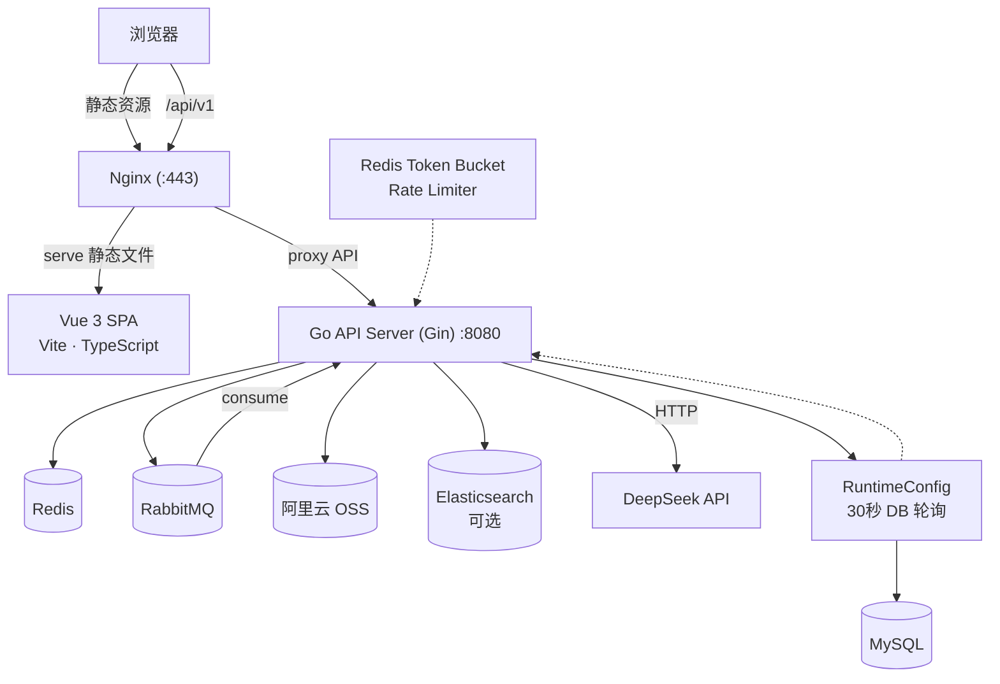
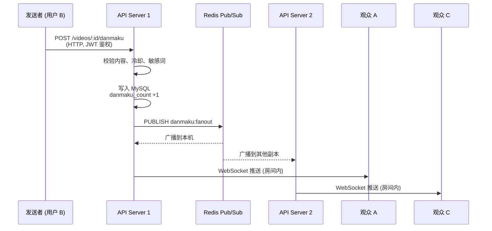
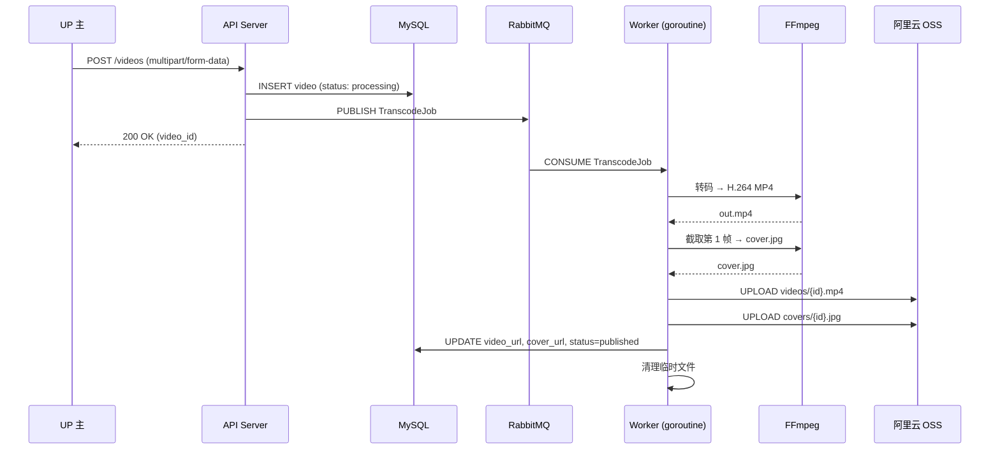
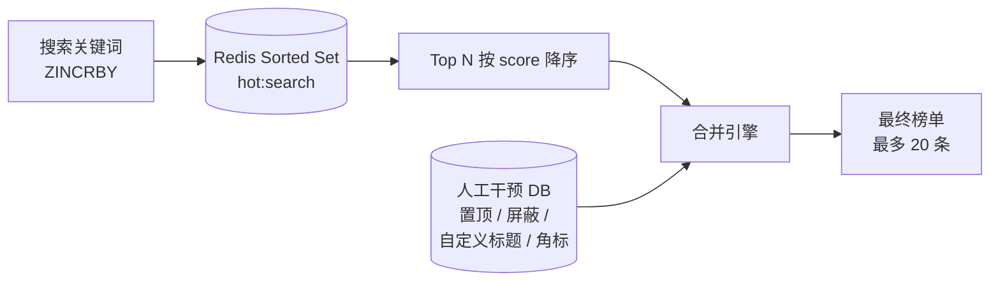

# Cakecake 系统架构

## 概述

Cakecake 是基于 Go + Vue 3 全栈构建的仿 B 站视频分享社区，聚焦视频投稿、实时弹幕、多级评论、全文搜索、AI 助手等核心链路。本文档面向面试和技术评审，梳理系统架构、核心模块设计、关键决策及数据流转。



---

## 项目结构

```
Minibili/
├── cmd/mini-bili/main.go        # 入口：加载配置、初始化 DB、注册路由
├── internal/
│   ├── handler/                  # HTTP + WebSocket 处理器
│   ├── service/                  # 业务逻辑层
│   ├── model/                    # GORM 数据模型
│   ├── middleware/               # JWT 鉴权、管理员鉴权、全局限流
│   ├── worker/                   # RabbitMQ 消费者（转码）
│   ├── ws/                       # WebSocket Hub（弹幕房间、私信）
│   ├── search/                   # Elasticsearch 客户端与查询构建
│   ├── storage/                  # 阿里云 OSS 客户端
│   ├── ffmpeg/                   # FFmpeg 封装（转码、截帧）
│   ├── aigateway/                # DeepSeek OpenAI 兼容客户端
│   ├── queue/                    # RabbitMQ 连接管理
│   ├── config/                   # 环境变量加载与配置结构体
│   ├── logger/                   # Zap 日志初始化
│   ├── errcode/                  # 业务错误码
│   └── pkg/                      # 工具包：JWT、BV 号、IP 定位、敏感词、
│       ├── jwttoken/             #   用户头像、等级、硬币、用户名校验...
│       ├── bvid/
│       ├── sensitive/
│       └── ...
├── configs/                      # sensitive_words.txt、ip2region_v4.xdb
├── deploy/                       # Nginx 配置、systemd unit、生产环境变量模板
├── docs/                         # 截图与指南
├── cakecake-vue/bilibili-vue/    # Vue 3 + Vite + TypeScript 前端
└── go.mod                        # module minibili
```

---

## 核心模块

### 1. 实时弹幕系统

弹幕系统是整个项目技术难度最高的模块。通过 WebSocket + Redis Pub/Sub 架构实现端到端延迟低于 200ms。



**流程：**

1. 发送者调用 `POST /api/v1/videos/:id/danmaku`（HTTP，需 JWT 鉴权）
2. 服务端校验内容（1~100 字符）、颜色（`#XXXXXX`）、类型（scroll/top/bottom），检查 5 秒冷却（Redis `SETNX`），敏感词过滤
3. 弹幕写入 MySQL，视频 `danmaku_count` +1
4. 将 JSON 载荷发布到 Redis 频道 `danmaku:fanout`
5. 每个服务副本订阅该频道，收到消息后调用 `Hub.BroadcastRaw(videoID, body)` 向本地连接池广播
6. `ws.Hub` 遍历目标视频房间的所有 WebSocket 连接，逐条写入 JSON 消息
7. 观众通过 `GET /api/v1/ws/danmaku?video_id=...` 建立 WebSocket 连接，加入对应房间，实时接收弹幕

**关键设计决策：**

| 决策                                                            | 理由                                                       |
| --------------------------------------------------------------- | ---------------------------------------------------------- |
| Redis Pub/Sub 做多副本广播                                      | 解耦广播逻辑，新副本自动接收消息，无需共享内存即可水平扩展 |
| 按视频房间分连接池（`map[uint64]map[*websocket.Conn]struct{}`） | O(1) 房间广播，无跨房间扫描开销                            |
| SETNX 做冷却而非全局限流中间件                                  | 冷却粒度是"每用户每视频"，比通用令牌桶更简洁               |
| 弹幕不在 Redis 中持久化                                         | 弹幕是实时数据，MySQL 是历史唯一数据源                     |

---

### 2. 视频异步转码流水线



**流程：**

1. UP 主上传原始视频 + 可选自定义封面 → `POST /api/v1/videos`
2. 服务端写入 MySQL（status: `processing`），原始文件存入临时目录
3. 投递 `TranscodeJob{VideoID, RawPath, CoverPath}` 到 RabbitMQ `transcode` 队列
4. Worker 协程消费任务：FFmpeg 转 H.264 MP4 → 截取第 1 帧为封面 → 上传 OSS
5. 成功：更新 `video_url`、`cover_url`，status → `published`
6. 失败：最多重试 **3 次**，指数退避（30s → 60s → 90s）。永久性失败标记 `failed` 并记录可读原因，瞬时失败重新入队

**失败分类：**

| 类型   | 检测方式                                         | 处理                                       |
| ------ | ------------------------------------------------ | ------------------------------------------ |
| 永久性 | FFmpeg stderr 匹配已知模式（非法编码、损坏文件） | 标记`failed`，存储 `fail_reason`，ack 消息 |
| 瞬时性 | 超时、OSS 网络错误、磁盘满                       | 重试计数 +1，重新入队                      |
| 耗尽   | `retry_count >= 3`                               | 标记`failed`，ack 消息                     |

---

### 3. 全文搜索（Elasticsearch）

- **三个索引**：`videos`（标题、描述、标签、分区）、`articles`（标题、正文、分类）、`users`（昵称、用户名、签名）
- **多字段权重**：视频 title^3, description^1.5；用户昵称支持 wildcard `query_string` 模糊匹配
- **高亮**：返回 `<em class="keyword">命中词</em>` 片段
- **排序**：默认（相关性）、发布日期、播放量、点赞数
- **可选降级**：ES 未配置时搜索页提示"搜索服务未就绪"，不影响其他功能

---

### 4. 评论系统

- **2 级嵌套**：根评论 → 子评论 → 孙评论。GORM 通过 `Preload("Children.Children")` 单次查询组装评论树
- **级联删除**：删除父评论时递归删除所有后代（应用层实现，不依赖数据库外键）
- **UP 主管理**：视频作者可删除任意评论；普通用户仅可删除自己的评论
- **点赞/踩**：toggle 模式——查询是否存在记录，插入或删除，原子更新计数器

---

### 5. 热搜系统



- **自动**：用户搜索行为通过 Redis ZINCRBY 累计热度
- **人工**：管理后台支持置顶、屏蔽、自定义展示词、角标（"热"、"新"）
- **合并**：人工条目优先占位，自动条目填充剩余槽位，屏蔽词过滤

---

### 6. AI 助手（DeepSeek）

- 封装 OpenAI 兼容客户端（`internal/aigateway/deepseek.go`）
- 用户发起私信对话；管理员后台配置 Agent 角色（名称、头像、系统提示词）
- 消息携带对话历史作为上下文，Agent 回复插入同一对话线程
- Temperature: 0.7，超时: 90s，未启用流式（私信场景更简单可靠）

---

## 存储策略

| 数据类型                                | 存储          | 理由                           |
| --------------------------------------- | ------------- | ------------------------------ |
| 用户、视频元数据、评论、通知、草稿      | MySQL         | 关系完整性、复杂查询           |
| 视频文件、封面、头像                    | 阿里云 OSS    | 弹性扩容、CDN 就绪             |
| 弹幕广播、播放计数、冷却、Refresh Token | Redis         | 低延迟、数据可丢失             |
| 转码任务                                | RabbitMQ      | 持久化、ACK 确认、精确一次投递 |
| 搜索索引                                | Elasticsearch | 倒排索引、相关性评分           |

---

## 关键设计决策

| 决策                                                  | 理由                                                                                                                            |
| ----------------------------------------------------- | ------------------------------------------------------------------------------------------------------------------------------- |
| **v1 用单体而非微服务**                               | 单人开发，快速迭代。代码按领域分层（`handler/`、`service/`、`worker/`），为后续拆分为 Kratos 微服务预留空间                     |
| **Redis Pub/Sub 做弹幕广播中继，而非 WebSocket 直发** | 解耦广播与 HTTP handler。多副本订阅同一 Redis 频道，无需共享内存即可水平扩展                                                    |
| **转码用 RabbitMQ 而非 Redis List**                   | RabbitMQ 提供消息持久化、消费确认、死信队列——视频处理不可接受数据丢失                                                           |
| **GORM AutoMigrate 而非 SQL 迁移文件**                | 单人项目简化操作，表结构通过 Go struct 声明，启动时自动建表                                                                     |
| **ES 可选而非强制依赖**                               | 降低上手门槛，未配置时搜索页优雅降级                                                                                            |
| **Redis 令牌桶做全局限流**                            | 保护列表、搜索、空间等公开接口不受突发/爬虫打垮；按 IP 维度限流；Lua 脚本保证令牌桶原子性；桶容量支持短时突发，速率限制稳态 QPS |
| **bcrypt + 双 Token JWT**                             | 行业标准认证方案，Access/Refresh 双 Token + Redis 管理 Refresh Token 轮转                                                       |

---

## 端到端数据流：视频投稿

```
1. POST /api/v1/videos (multipart/form-data)
   ├── JWT 中间件校验 Token
   ├── Handler 校验文件格式 (MP4/AVI/MKV/...)
   ├── 原始文件存入 TEMP_UPLOAD_DIR
   ├── 写入 Video 记录 (status: "processing")
   └── 投递 TranscodeJob 到 RabbitMQ

2. Worker 消费 TranscodeJob
   ├── FFmpeg: 原始文件 → H.264 MP4 (out.mp4)
   ├── FFmpeg: out.mp4 第 1 帧 → cover.jpg（无自定义封面时）
   ├── OSS.UploadFile("videos/{id}.mp4", out.mp4)
   ├── OSS.UploadFile("covers/{id}.jpg", cover.jpg)
   ├── DB: UPDATE video SET video_url, cover_url, status
   └── 清理临时文件

3. 客户端轮询 GET /videos/:id → 观察状态变化
   processing → published（或 failed + fail_reason）
```

---

## 测试策略

| 层级                                    | 范围                      | 示例                                                |
| --------------------------------------- | ------------------------- | --------------------------------------------------- |
| `internal/pkg/*`                        | 单元测试（表驱动）        | 用户名校验、BV 号编解码、头像路径生成               |
| `internal/handler/*`                    | 单元测试（SQLite 内存库） | 登录注册流程、视频草稿 CRUD、弹幕发布、评论级联删除 |
| `internal/handler/*` (integration 标签) | 黑盒测试（连真实服务）    | 健康检查、视频分区列表                              |
| E2E                                     | 手动                      | 登录 → 投稿 → 观看弹幕 → 搜索                       |

```bash
go test ./... -count=1
go test -tags=integration ./internal/handler/... -count=1
```
