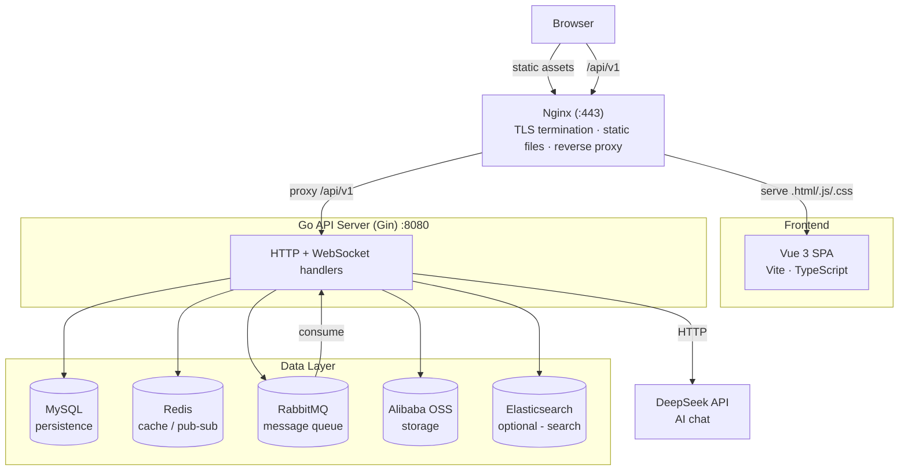
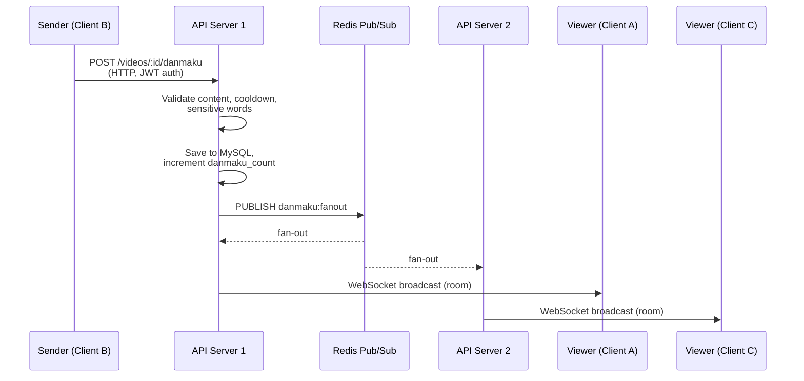
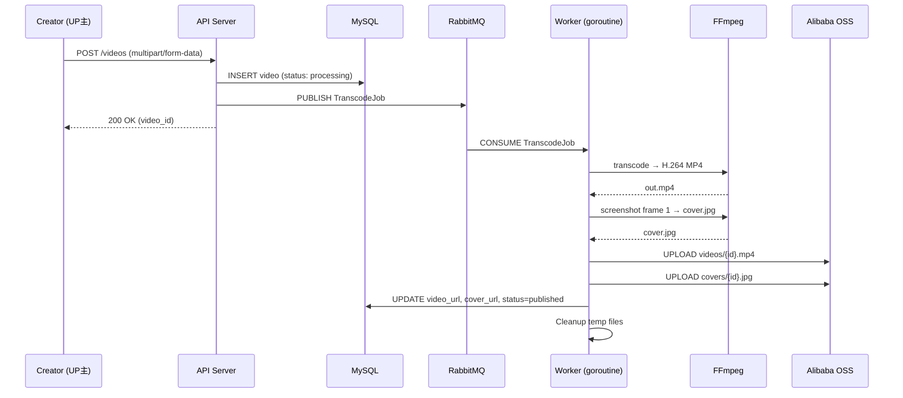
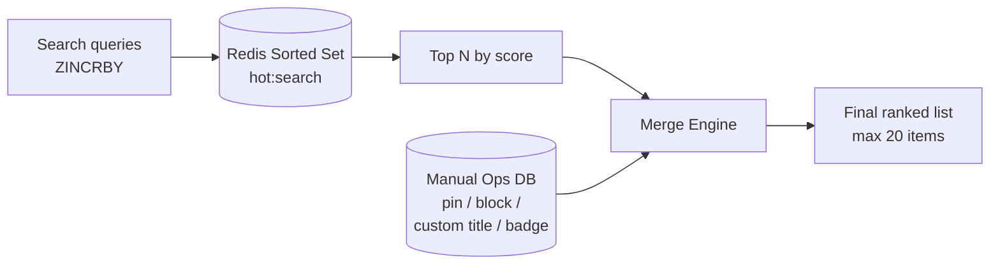

# Cakecake Architecture

## Overview

Cakecake is a full-stack video-sharing platform built with Go and Vue 3, designed as a learning project that faithfully replicates Bilibili's core user-facing features. It serves as both a technical showcase and a hands-on study of real-world backend patterns — real-time messaging, async job processing, full-text search, and production deployment.



---

## Directory Layout

```
Minibili/
├── cmd/mini-bili/main.go        # Entrypoint: wires config, DB, routes
├── internal/
│   ├── handler/                  # HTTP + WebSocket handlers (Gin routes)
│   ├── service/                  # Business logic layer
│   ├── model/                    # GORM models
│   ├── middleware/               # JWT auth, admin auth
│   ├── worker/                   # RabbitMQ consumers (transcode)
│   ├── ws/                       # WebSocket hub (danmaku rooms, chat)
│   ├── search/                   # Elasticsearch client, query builders
│   ├── storage/                  # Alibaba Cloud OSS client
│   ├── ffmpeg/                   # FFmpeg wrapper (transcode, screenshots)
│   ├── aigateway/                # DeepSeek OpenAI-compatible client
│   ├── queue/                    # RabbitMQ connection management
│   ├── config/                   # Env loading, config struct
│   ├── logger/                   # Zap logger setup
│   ├── errcode/                  # Business error codes
│   └── pkg/                      # Utilities: JWT, BV id, IP location,
│       ├── jwttoken/             #   sensitive words, markdown, avatar...
│       ├── bvid/
│       ├── sensitive/
│       └── ...
├── configs/                      # sensitive_words.txt, ip2region_v4.xdb
├── deploy/                       # Nginx conf, systemd unit, env template
├── docs/                         # Images, guides
├── cakecake-vue/bilibili-vue/    # Vue 3 + Vite + TypeScript frontend
└── go.mod                        # module minibili
```

---

## Core Modules

### 1. Real-time Danmaku System

The danmaku (bullet comment) system is the most technically challenging module. It achieves sub-200ms end-to-end latency through a WebSocket + Redis Pub/Sub architecture.



**Flow:**

1. Sender calls `POST /api/v1/videos/:id/danmaku` (HTTP, JWT auth)
2. Server validates content (length 1-100, color `#XXXXXX`, type scroll/top/bottom), checks 5-second cooldown (Redis `SETNX`), runs sensitive-word filter
3. Danmaku saved to MySQL, video `danmaku_count` incremented
4. Payload published to Redis channel `danmaku:fanout`
5. Every server replica subscribes to that channel and calls `Hub.BroadcastRaw(videoID, body)`
6. `ws.Hub` iterates all WebSocket connections in the target video room and writes the JSON message
7. Viewers connect via `GET /api/v1/ws/danmaku?video_id=...` — upgraded to WebSocket, joined into room, receive broadcasts in real-time

**Key design decisions:**

| Decision | Rationale |
|----------|-----------|
| Redis Pub/Sub for fan-out | Enables horizontal scaling — new replicas auto-receive broadcasts without shared state |
| Per-video room map (`map[uint64]map[*websocket.Conn]struct{}`) | O(1) broadcast per room, no cross-room scanning |
| SETNX cooldown over rate-limiter middleware | Cooldown is per-video-per-user, simpler than a generic token bucket |
| No message persistence in Redis | Danmaku is ephemeral; MySQL is the source of truth for history |

---

### 2. Async Video Transcode Pipeline



**Flow:**

1. Creator uploads raw video + optional custom cover via `POST /api/v1/videos`
2. Server saves metadata (status: `processing`) to MySQL, stores raw file in temp dir
3. Server publishes `TranscodeJob{VideoID, RawPath, CoverPath}` to RabbitMQ `transcode` queue
4. Worker goroutine consumes the job, calls `ffmpeg` to transcode to H.264 MP4, takes a screenshot at frame 1, uploads both to OSS
5. On success: updates `video_url`, `cover_url`, sets status to `published`
6. On failure: retries up to **3 times** with exponential backoff (30s, 60s, 90s). Permanent failures detected and marked `failed` with human-readable reason. Transient failures re-queued.

**Failure classification:**

| Type | Detection | Action |
|------|-----------|--------|
| Permanent | FFmpeg stderr contains known patterns (invalid codec, corrupt container) | Mark `failed`, store `fail_reason`, ack message |
| Transient | Timeout, OSS network error, disk full | Re-queue with incremented `retry_count` |
| Exhausted | `retry_count >= 3` | Mark `failed`, ack message |

---

### 3. Full-text Search (Elasticsearch)

- **Three indices**: `videos` (title, description, tags, zone_id), `articles` (title, body, category), `users` (nickname, username, sign)
- **Multi-match with weights**: title^3, description^1.5 for video; wildcard `query_string` for partial nickname matching
- **Highlight**: returns `<em class="keyword">hit</em>` fragments for title and excerpt
- **Sort support**: default (relevance), pubdate, play_count, like count
- **Optional**: degrades gracefully when ES is not configured — search page shows "not available" prompt

---

### 4. Comment System

- **2-level nesting**: root comment → child → grandchild. GORM preloads via `Preload("Children.Children")` for single-query tree assembly
- **Cascade delete**: deleting a parent recursively removes all descendants (enforced in handler, not via DB constraint)
- **Creator moderation**: video owner can delete any comment; regular users can only delete their own
- **Like/dislike**: toggle pattern — single-row existence check, insert or delete, atomic counter update

---

### 5. Hot Search



- **Auto**: search queries increment Redis sorted set scores
- **Manual**: admin dashboard supports pin, block, custom display title, badge (`hot`, `new`), time window (`start_at` / `end_at`)
- **Merge**: manual items take priority, auto items fill remaining slots, blocked keywords filtered

---

### 6. AI Assistant (DeepSeek)

- OpenAI-compatible client in `internal/aigateway/deepseek.go`
- Users start DM conversations; admin configures agent profiles (name, avatar, system prompt)
- Messages carry conversation history as context, agent replies inserted into the same thread
- Temperature: 0.7, timeout: 90s, streaming: disabled (simpler for DM use case)

---

## Storage Strategy

| Data type | Storage | Rationale |
|-----------|---------|-----------|
| User, video, comments, notifications, drafts | MySQL | Relational integrity, complex queries |
| Video files, covers, avatars | Alibaba Cloud OSS | Scalable blob storage, CDN-ready |
| Danmaku fan-out, play counts, cooldowns, Refresh Tokens | Redis | Low-latency ephemeral data |
| Transcode jobs | RabbitMQ | Persistent, ack-based, exactly-once delivery |
| Search indices | Elasticsearch | Inverted index, relevance scoring |

---

## Key Design Decisions

| Decision | Why |
|----------|-----|
| **Monolith over microservices (v1)** | Single developer, faster iteration. Code is organized by domain (`handler/`, `service/`, `worker/`) to enable future split into Kratos microservices. |
| **Redis Pub/Sub over direct WebSocket fan-out** | Decouples broadcast from the HTTP handler. Multiple replicas subscribe to the same Redis channel, enabling horizontal scaling without shared memory. |
| **RabbitMQ over Redis List for transcode** | RabbitMQ provides message persistence, consumer acknowledgments, and dead-lettering — critical for video processing where data loss is unacceptable. |
| **GORM AutoMigrate over raw SQL migrations** | Simpler for a solo project. Tables are declared as Go structs, migrations run on startup. |
| **ES optional, not mandatory** | Reduces onboarding friction. The search page degrades gracefully when ES is not configured. |
| **bcrypt + dual-token JWT** | Industry standard for auth. Access/Refresh token pattern with Redis-managed refresh token rotation. |

---

## Data Flow: Video Upload (End-to-End)

```
1. POST /api/v1/videos (multipart/form-data)
   ├── JWT middleware validates token
   ├── Handler validates file format (MP4/AVI/MKV/...)
   ├── Saves raw file to TEMP_UPLOAD_DIR
   ├── Inserts Video row (status: "processing")
   └── Publishes TranscodeJob to RabbitMQ

2. Worker consumes TranscodeJob
   ├── FFmpeg: raw → H.264 MP4 (out.mp4)
   ├── FFmpeg: out.mp4 frame 1 → cover.jpg (if no custom cover)
   ├── OSS.UploadFile("videos/{id}.mp4", out.mp4)
   ├── OSS.UploadFile("covers/{id}.jpg", cover.jpg)
   ├── DB: UPDATE video SET video_url, cover_url, status
   └── Cleanup: remove temp files

3. Client polls GET /videos/:id → sees status transition
   processing → published (or failed with fail_reason)
```

---

## Testing Strategy

| Layer | Scope | Example |
|-------|-------|---------|
| `internal/pkg/*` | Unit tests (table-driven) | Username validation, BV id encoding, avatar path generation |
| `internal/handler/*` | Unit tests (SQLite in-memory) | Auth flow, video draft CRUD |
| `internal/handler/*` (integration tag) | Black-box against live server | Health check, video zone listing |
| E2E | Manual | Login → upload → view danmaku → search |

```bash
go test ./... -count=1
go test -tags=integration ./internal/handler/... -count=1
```