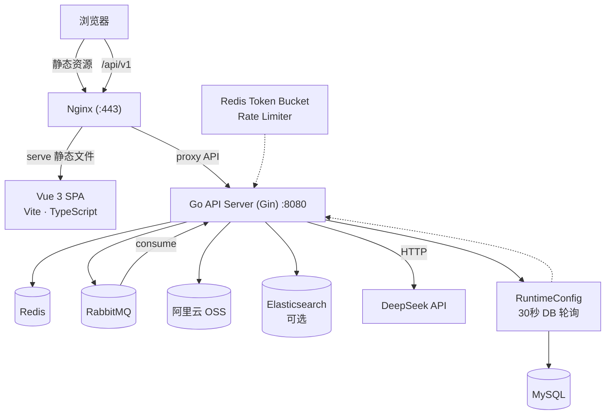
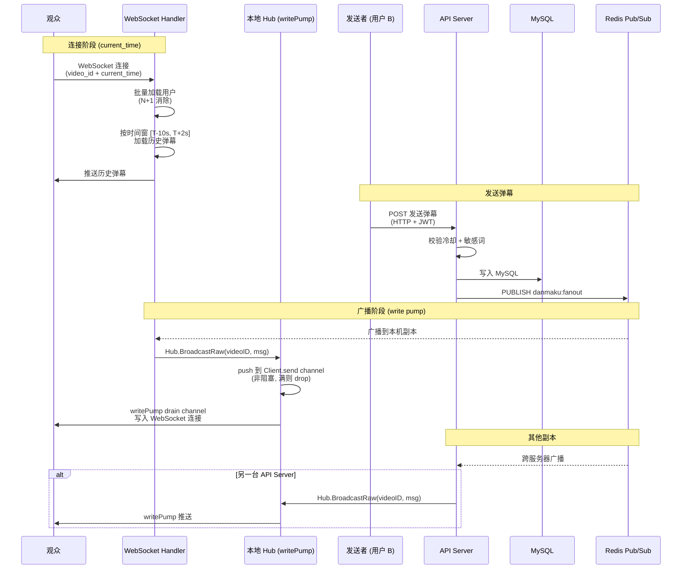
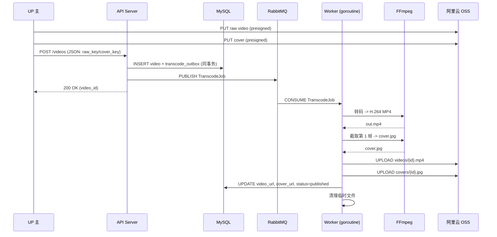
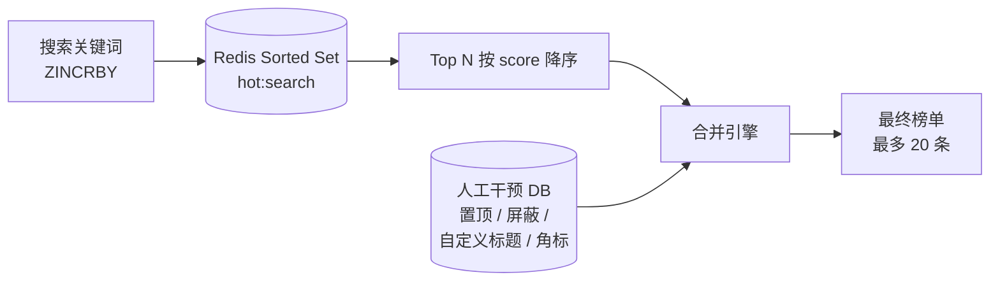
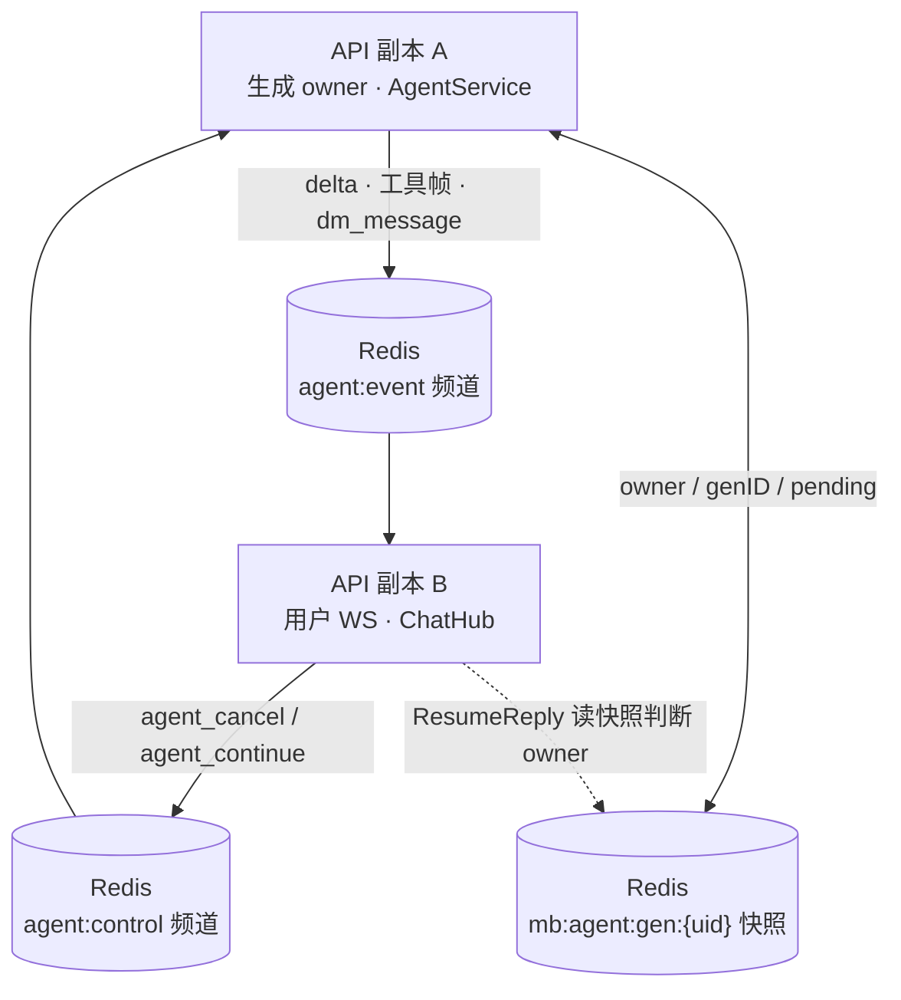
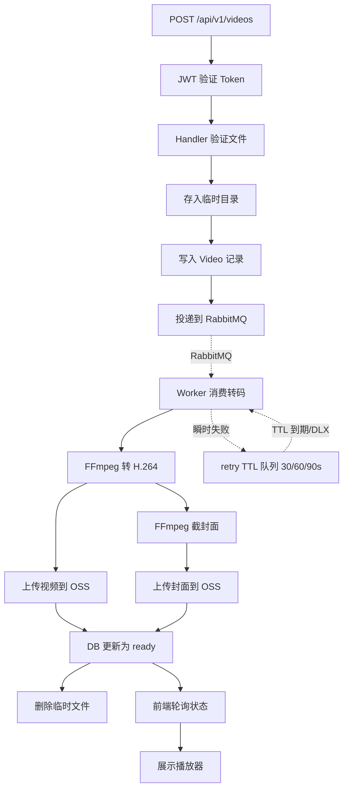

<p align="center">
  <strong></strong>
  <a href="ARCHITECTURE_EN.md">
    
  </a>
</p>

# Cakecake 系统架构

## 概述

Cakecake 是基于 Go + Vue 3 全栈构建的仿 B 站视频分享社区，聚焦视频投稿、实时弹幕、多级评论、全文搜索、AI 助手等核心链路。本文档面向面试和技术评审，梳理系统架构、核心模块设计、关键决策及数据流转。


```mermaid
graph TB
    Browser["浏览器"]
    Nginx["Nginx (:443)"]

    Vue["Vue 3 SPA<br/>Vite · TypeScript"]
    Gin["Go API Server (Gin) :8080"]

    MySQL[("MySQL")]
    Redis[("Redis")]
    RMQ[("RabbitMQ")]
    OSS[("阿里云 OSS")]
    ES[("Elasticsearch<br/>可选")]
    DS["DeepSeek API"]

    Browser -->|静态资源| Nginx
    Browser -->|/api/v1| Nginx
    Nginx -->|serve 静态文件| Vue
    Nginx -->|proxy API| Gin
    RL["Redis Token Bucket\nRate Limiter"] -.-> Gin
    RC["RuntimeConfig\n30秒 DB 轮询"] -.-> Gin
    Gin --> RC
    RC --> MySQL
    Gin --> Redis
    Gin --> RMQ
    Gin --> OSS
    Gin --> ES
    Gin -->|HTTP| DS
    RMQ -->|consume| Gin
```

---

## 项目结构

```
cakecake/
├── cmd/cakecake/main.go        # 入口：加载配置、初始化 DB、注册路由
├── internal/
│   ├── handler/                  # HTTP + WebSocket 处理器
│   ├── service/                  # 业务逻辑层
│   ├── model/                    # GORM 数据模型
│   ├── middleware/               # JWT 鉴权、管理员鉴权、全局限流
│   ├── worker/                   # RabbitMQ 消费者（转码）
│   ├── ws/                       # WebSocket Hub（弹幕房间、私信）
│   ├── search/                   # Elasticsearch 客户端与查询构建
│   ├── storage/                  # 阿里云 OSS 客户端
│   ├── ffmpeg/                   # FFmpeg 封装（转码、截帧）
│   ├── aigateway/                # DeepSeek OpenAI 兼容客户端
│   ├── queue/                    # RabbitMQ 连接管理
│   ├── config/                   # 环境变量加载与配置结构体
│   ├── logger/                   # Zap 日志初始化
│   ├── errcode/                  # 业务错误码
│   └── pkg/                      # 工具包：JWT、BV 号、IP 定位、敏感词、头像、等级、硬币、用户名校验...
├── configs/                      # sensitive_words.txt、ip2region_v4.xdb
├── deploy/                       # Nginx 配置、systemd unit、生产环境变量模板
├── docs/                         # 截图与指南
├── cakecake-vue/cakecake-web/    # Vue 3 + Vite + TypeScript 前端
└── go.mod                        # module cakecake
```

---

## 核心模块

### 1. 实时弹幕系统

弹幕系统是整个项目技术难度最高的模块。通过 WebSocket + Redis Pub/Sub 架构实现端到端延迟低于 200ms。


```mermaid
sequenceDiagram
    participant V as 观众
    participant WS as WebSocket Handler
    participant H as 本地 Hub (writePump)
    participant S as 发送者 (用户 B)
    participant API as API Server
    participant DB as MySQL
    participant R as Redis Pub/Sub

    Note over V,WS: 连接阶段 (current_time)
    V->>WS: WebSocket 连接<br/>(video_id + current_time)
    WS->>WS: 批量加载用户<br/>(N+1 消除)
    WS->>WS: 按时间窗 [T-10s, T+2s]<br/>加载历史弹幕
    WS->>V: 推送历史弹幕

    Note over S,R: 发送弹幕
    S->>API: POST 发送弹幕<br/>(HTTP + JWT)
    API->>API: 校验冷却 + 敏感词
    API->>DB: 写入 MySQL
    API->>R: PUBLISH danmaku:fanout

    Note over R,WS: 广播阶段 (write pump)
    R-->>WS: 广播到本机副本
    WS->>H: Hub.BroadcastRaw(videoID, msg)
    H->>H: push 到 Client.send channel<br/>(非阻塞, 满则 drop)
    H->>V: writePump drain channel<br/>写入 WebSocket 连接

    Note over R,API: 其他副本
    R-->>API: 跨服务器广播
    alt 另一台 API Server
        API->>H: Hub.BroadcastRaw(videoID, msg)
        H->>V: writePump 推送
    end
```

**流程：**

1. 发送者调用 `POST /api/v1/videos/:id/danmaku`（HTTP，需 JWT 鉴权）
2. 服务端校验内容（1~100 字符）、颜色（`#XXXXXX`）、类型（scroll/top/bottom），检查 5 秒冷却（Redis `SETNX`），敏感词过滤
3. 弹幕写入 MySQL，视频 `danmaku_count` +1
4. 将 JSON 载荷发布到 Redis 频道 `danmaku:fanout`
5. 每个服务副本订阅该频道，收到消息后调用 `Hub.BroadcastRaw(videoID, body)` 向本地连接池广播
6. `Hub.BroadcastRaw` 将 JSON 载荷 push 到每个 `Client.send` channel（非阻塞，channel 满则 drop 该慢连接），`writePump` goroutine 异步 drain channel 写入 WebSocket 连接
7. 观众通过 `GET /api/v1/ws/danmaku?video_id=...&current_time=T` 建立 WebSocket 连接，传入当前播放时间则按 `[T-10s, T+2s]` 范围加载历史弹幕，不传则加载最新 200 条

**关键设计决策：**

| 决策                                                            | 理由                                                       |
| --------------------------------------------------------------- | ---------------------------------------------------------- |
| Redis Pub/Sub 做多副本广播                                      | 解耦广播逻辑，新副本自动接收消息，无需共享内存即可水平扩展 |
| 按视频房间分连接池（`map[uint64]map[*websocket.Conn]struct{}`） | O(1) 房间广播，无跨房间扫描开销                            |
| SETNX 做冷却而非全局限流中间件                                  | 冷却粒度是"每用户每视频"，比通用令牌桶更简洁               |
| 弹幕不在 Redis 中持久化                                         | 弹幕是实时数据，MySQL 是历史唯一数据源                     |

---

### 2. 视频异步转码流水线


```mermaid
sequenceDiagram
    participant C as UP 主
    participant API as API Server
    participant DB as MySQL
    participant RMQ as RabbitMQ
    participant W as Worker (goroutine)
    participant FF as FFmpeg
    participant OSS as 阿里云 OSS

    C->>OSS: PUT raw video (presigned)
    C->>OSS: PUT cover (presigned)
    C->>API: POST /videos (JSON: raw_key/cover_key)
    API->>DB: INSERT video + transcode_outbox (同事务)
    API->>RMQ: PUBLISH TranscodeJob
    API-->>C: 200 OK (video_id)

    RMQ->>W: CONSUME TranscodeJob
    W->>FF: 转码 -> H.264 MP4
    FF-->>W: out.mp4
    W->>FF: 截取第 1 帧 -> cover.jpg
    FF-->>W: cover.jpg
    W->>OSS: UPLOAD videos/{id}.mp4
    W->>OSS: UPLOAD covers/{id}.jpg
    W->>DB: UPDATE video_url, cover_url, status=published
    W->>W: 清理临时文件
```

**流程：**

1. 上传只有一条用户链路：`POST /api/v1/videos/upload-ticket` 签发 presigned PUT URL，浏览器把原始视频（可选封面）**直传 OSS**，再以 JSON 提交元数据 + `raw_key/cover_key`——大文件字节不经过 API 服务器带宽。**发布页在用户选完视频文件后立即开始后台直传**（填表单与上传并行），点“立即投稿”时只做校验 + 原子入队，感知延迟趋近于零
2. 服务端**只做便宜的 HEAD 校验**（对象归属 `uploads/{uid}/` 命名空间 + `Exists` + 大小上限 500 MB，不下载原文件），时长采用前端提交的提示值（仅用于播放器展示，钳制到 30 分钟），写入 MySQL 并在**同一事务**写入 `transcode_outbox`（Outbox 模式），由 relay confirm 发布 `TranscodeJob{VideoID, JobID, TraceID, RawKey, CoverKey}`——提交接口不再阻塞在 OSS 全量下载上
3. 草稿/换源复用同一套直传：草稿票签发 `drafts/{uid}/{uuid}/...` 键，保存草稿只写元数据 + 对象键，发布草稿时再次校验对象并**原子提交**「outbox 行 + status=processing」；草稿预览用短时 presigned GET，不公开私有对象
4. Worker 按 `TRANSCODE_CONCURRENCY`（默认 1，生产建议按核数 2-4）起 N 个消费者并行处理：按 RawKey 从 OSS 下载源文件 → **先 ffprobe 复核真实时长（15s 超时；≤30 分钟，超限或文件不可读直接永久失败并给出可读原因；同时回写 `duration_sec`）** → FFmpeg 转 H.264 MP4（带 `TRANSCODE_TIMEOUT` 超时，默认 10m，挂死进程会被杀掉）→ 截取第 1 帧为封面 → 上传 OSS
5. 成功：更新 `video_url`、`cover_url`，status → `published`（或审核模式 `pending_review`）
6. 失败：瞬时失败将 `RetryCount+1` 的 job **confirm 发布**到 `retry_30s/60s/90s` 延迟队列，TTL 到期由 RabbitMQ DLX 自动投回主队列，最多重试 3 次；永久性失败标记 `failed` 并记录可读原因
7. 成功路径的 DB 写入失败不吞掉：`db.Updates` / 发布状态失败同样进入重试，源文件保留，OSS 覆盖写幂等，最终要么成功要么进死信可重放
8. 主消费者与死信消费者一样在 channel 断线后 **3s 退避自动重连**；RabbitMQ 连接断开后 `Client` **自动重建连接 + 队列 + confirm**（broker 重启无需重启进程）
9. 死信消费者先写 `processed_at` 再 Ack（标记失败会重投）；retention 只把到期死信标记 `archived_at` 归档，不物理删除审计行
10. 用户上传/草稿/换源全部走 presigned 直传（服务端 multipart 已从视频链路移除）；提交只做归属/大小/存在性 HEAD 校验，**不下载原文件**；时长校验统一由 worker 在下载后执行
11. **消息去重**：job 带稳定 `job_id`，worker 处理前插入 `(job_id, retry_count)` 去重行——at-least-once 重复投递直接跳过，合法 retry 不受影响
12. **状态机 + 审计**：状态变更先过 `ValidateTranscodeStatusTransition`，成功路径与 `PublishVideo` 用条件更新（`WHERE status = 当前状态`）防并发覆盖（如 admin reject 与 worker 完成竞态），`transcode_events` 记录 from/to/reason
13. **trace 贯穿**：`X-Trace-Id` 从上传请求透传到 outbox payload → `TranscodeJob.TraceID`，worker/死信日志按 `trace_id` 关联整条链路
14. **死信自动闭环**：后台任务按原因自动重放瞬时失败（`auto_retry_count` + 指数退避 + 审计事件），永久失败只走人工重放；`TRANSCODE_MAX_QUEUE` 背压：主队列超限时上传返回 503

所有发布（上传入队、重试调度、死信、管理后台重放）都走 **publisher confirm + mandatory**：入队成功是 broker 确认过的可判定结果，不可路由消息会触发 basic.return 报错。

**可观测性（SLO）：** `cakecake_transcode_jobs_total{result=...}`（成功/永久失败）、`duration_seconds`（耗时直方图）、`retries_scheduled_total`、`queue_depth{queue=...}`（管理 API 每 15s 采集）；Grafana 面板展示成功率、P95 耗时、队列深度、死信/重试，Alertmanager 对积压、失败率、慢任务告警。

**一致性与幂等：**

- Outbox 本地消息表保证「video 行 + 待发 job」原子提交，relay confirm 发布成功才标 sent，失败指数退避（指数饱和防溢出）；
- `(job_id, retry_count)` 复合去重键防重复转码；终态守卫兜底已完成任务；
- 状态机校验 + 条件更新防「陈旧 worker 覆盖并发审核结果」。
- 死信自动重试（仅瞬时原因、重新生成 JobID、每行上限 3 次、1m/2m/4m 退避封顶 15m）与人工重放并存，均写审计；按 video 生命周期总次数封顶（3 次），失败重试产生的新死信行不会无限循环；
- 背压：`TRANSCODE_MAX_QUEUE` 超过阈值时直传/草稿发布返回 503（管理 API 故障时放行）。

**源文件存储与重放：**

- OSS 模式下源文件/封面存对象：直传提交流 `uploads/{uid}/{uuid}/...`，草稿阶段存 `drafts/{uid}/{uuid}/...`，转码输出存 `videos/{id}.mp4` / `covers/{id}.jpg`；job 只携带对象 key；
- 草稿对象属于私有命名空间，预览经 presigned GET（307）短时授权；封面在保存草稿时用服务端 `CopyObject` 复制到公开 `covers/{id}.{ext}` 并记录 URL；
- 选文件即传会产生“未发布”的孤儿对象（用户放弃/换文件/改存草稿，或上传中途取消——ticket 未上传不产生对象，但**部分上传会残留**）：应用内 `StartOrphanObjectCleanup` 后台任务默认每 1h 扫描一次 `uploads/`、`drafts/` 前缀，只删除**超过 24h 且 DB 无任何引用**的对象（草稿键、`direct_upload_claims`、outbox payload、死信 payload 均视为引用，在途/未提交上传受宽限期保护），删除计数上报 Prometheus；OSS 生命周期规则降级为可选兜底（若配置，时间应大于应用内保留期，且它不会检查 DB 引用）；前端换文件/改存草稿时用 token 作废旧上传；
- 遗留本地路径（`RawPath`）仅兼容迁移前的旧草稿/旧死信，新写入不再产生；
- Worker 每次消费把对象下载到本地临时文件再转码，成功后或永久失败后删除源对象；重试/死信路径保留对象作为补偿输入；
- 死信重放前用 `Exists` 校验 OSS 对象仍在（旧本地路径死信仍走 `os.Stat` 兼容），跨实例、容器重建、磁盘清理后重放不再依赖单机路径；
- 本地 `RawPath` 模式仅用于 OSS 未配置的兼容/演示场景。

**失败分类：**

| 类型   | 检测方式                                         | 处理                                       |
| ------ | ------------------------------------------------ | ------------------------------------------ |
| 永久性 | FFmpeg stderr 匹配已知模式（非法编码、损坏文件） | 标记`failed`，存储 `fail_reason`，ack 消息 |
| 瞬时性 | ffmpeg 超时/挂死、源文件下载失败、OSS 网络错误、磁盘满、DB 写入失败 | 重试计数 +1，confirm 发布到 retry TTL 队列（30/60/90s），DLX 到期回主队列 |
| 耗尽   | `retry_count >= 3`                               | 发布显式死信队列 + 写 `transcode_dead_letters` 审计表 + 标记`failed`，可管理后台重放 |

---

### 3. 全文搜索（Elasticsearch）

- **三个索引**：`videos`（标题、描述、标签、分区）、`articles`（标题、正文、分类）、`users`（昵称、用户名、签名）
- **多字段权重**：视频 title^3, description^1.5；用户昵称支持 wildcard `query_string` 模糊匹配
- **高亮**：返回 `<em class="keyword">命中词</em>` 片段
- **排序**：默认（相关性）、发布日期、播放量、点赞数
- **可选降级**：ES 未配置时搜索页提示"搜索服务未就绪"，不影响其他功能

---

### 4. 评论系统

- **2 级嵌套**：根评论 → 子评论 → 孙评论。GORM 通过 `Preload("Children.Children")` 单次查询组装评论树
- **级联删除**：删除父评论时递归删除所有后代（应用层实现，不依赖数据库外键）
- **UP 主管理**：视频作者可删除任意评论；普通用户仅可删除自己的评论
- **点赞/踩**：toggle 模式——查询是否存在记录，插入或删除，原子更新计数器

---

### 5. 热搜系统


```mermaid
flowchart LR
    Q[搜索关键词<br/>ZINCRBY] --> RS[("Redis Sorted Set<br/>hot:search")]
    RS --> T[Top N 按 score 降序]
    T --> M[合并引擎]
    DB[(人工干预 DB<br/>置顶 / 屏蔽 /<br/>自定义标题 / 角标)] --> M
    M --> L[最终榜单<br/>最多 20 条]
```

- **自动**：用户搜索行为通过 Redis ZINCRBY 累计热度
- **人工**：管理后台支持置顶、屏蔽、自定义展示词、角标（"热"、"新"）
- **合并**：人工条目优先占位，自动条目填充剩余槽位，屏蔽词过滤

---

### 6. AI 助手（DeepSeek）

- OpenAI 兼容客户端（`internal/aigateway/deepseek.go`），默认模型 `deepseek-v4-flash`
- 用户与 Agent 角色私信对话；**流式打字机** + 停止/继续/重新生成 + 追问建议 + 工具调用（站内搜索/详情/榜单）
- 结果卡片由模型在回复末尾声明（`【展示】工具名#ID`），后端精确落卡，不再用正则从回复文本猜
- 生成状态与编排整体收在 `internal/service/agent`（handler 只转发 WS/HTTP），详见 [ai-gateway.md](ai-gateway.md)

#### 6.1 多实例状态外置（水平扩展）

生成状态（暂停/缓冲/代次）与 WS 连接都是进程内资源。多副本部署时，用户的 WS 可能连到副本 A、生成却跑在副本 B，因此事件面与控制面外置到 Redis：


```mermaid
graph TB
    A["API 副本 A<br/>生成 owner · AgentService"]
    B["API 副本 B<br/>用户 WS · ChatHub"]
    EV[("Redis<br/>agent:event 频道")]
    CT[("Redis<br/>agent:control 频道")]
    SNAP[("Redis<br/>mb:agent:gen:{uid} 快照")]

    A -->|delta · 工具帧 · dm_message| EV
    EV --> B
    B -->|agent_cancel / agent_continue| CT
    CT --> A
    A <-->|owner / genID / pending| SNAP
    B -.->|ResumeReply 读快照判断 owner| SNAP
```

- **事件面**：delta/工具帧/建议/dm 消息发布到 `agent:event`，每个副本的订阅器写入本地 `ChatHub`——用户 WS 落在哪个副本都能收到。
- **控制面**：暂停/继续/取代发布到 `agent:control`，只有快照 owner 生效（`from` 字段忽略自我广播）；快照带 genID 守卫，旧代次不会误删新快照。
- **性能**：热路径缓冲/回放仍在 owner 内存；owner 宕机时暂停完成的回复可从快照 pending 恢复。

---

## 存储策略

| 数据类型                                | 存储          | 理由                           |
| --------------------------------------- | ------------- | ------------------------------ |
| 用户、视频元数据、评论、通知、草稿      | MySQL         | 关系完整性、复杂查询           |
| 视频文件、封面、头像                    | 阿里云 OSS    | 弹性扩容、CDN 就绪             |
| 弹幕广播、播放计数、冷却、Refresh Token | Redis         | 低延迟、数据可丢失             |
| 转码任务                                | RabbitMQ      | 持久化、手动 Ack、publisher confirm、TTL/DLX 延迟重试（at-least-once + 幂等守卫） |
| 搜索索引                                | Elasticsearch | 倒排索引、相关性评分           |

---

## 关键设计决策

| 决策                                                  | 理由                                                                                                                            |
| ----------------------------------------------------- | ------------------------------------------------------------------------------------------------------------------------------- |
| **v1 用单体而非微服务**                               | 单人开发，快速迭代。代码按领域分层（`handler/`、`service/`、`worker/`），为后续拆分为 Kratos 微服务预留空间                     |
| **Redis Pub/Sub 做弹幕广播中继，而非 WebSocket 直发** | 解耦广播与 HTTP handler。多副本订阅同一 Redis 频道，无需共享内存即可水平扩展                                                    |
| **AI 事件/控制走 Redis Pub/Sub + 生成快照（owner/genID 守卫）** | 多副本下 WS 与生成解耦：事件扇出到用户所在副本，暂停/继续路由到 owner；热路径缓冲留在 owner 内存保证性能                     |
| **转码用 RabbitMQ 而非 Redis List**                   | RabbitMQ 提供消息持久化、消费确认、publisher confirm、TTL/DLX 延迟重试与死信——视频处理不可接受数据丢失，延迟重试不能靠业务层 sleep                                                           |
| **GORM 版本化迁移 + goose SQL 迁移**                   | 开发环境 GORM 版本化迁移启动时自动建表；生产环境 APP_ENV=production 默认走 goose SQL 迁移（按序执行 `migrations/` 下全部 `.sql`），支持 up/down 回滚 |      |
| **ES 可选而非强制依赖**                               | 降低上手门槛，未配置时搜索页优雅降级                                                                                            |
| **Redis 令牌桶做全局限流**                            | 保护列表、搜索、空间等公开接口不受突发/爬虫打垮；按 IP 维度限流；Lua 脚本保证令牌桶原子性；桶容量支持短时突发，速率限制稳态 QPS |
| **bcrypt + 双 Token JWT**                             | 行业标准认证方案，Access/Refresh 双 Token + Redis 管理 Refresh Token 轮转                                                       |

---

## 端到端数据流：视频投稿


```mermaid
flowchart TB
    A["POST /api/v1/videos"]
    B["JWT 验证 Token"]
    C["Handler 验证文件"]
    D["存入临时目录"]
    E["写入 Video 记录"]
    F["投递到 RabbitMQ"]

    G["Worker 消费转码"]
    H["FFmpeg 转 H.264"]
    I["FFmpeg 截封面"]
    J["上传视频到 OSS"]
    K["上传封面到 OSS"]
    R["retry TTL 队列 30/60/90s"]

    L["DB 更新为 ready"]
    M["删除临时文件"]
    N["前端轮询状态"]
    P["展示播放器"]

    A --> B --> C --> D --> E --> F
    F -.->|RabbitMQ| G
    G --> H
    H --> J
    H --> I --> K
    G -.->|瞬时失败| R
    R -.->|TTL 到期/DLX| G
    J --> L
    K --> L
    L --> M
    L --> N --> P
```

---

## 测试策略

| 层级                                    | 范围                      | 示例                                                |
| --------------------------------------- | ------------------------- | --------------------------------------------------- |
| `internal/pkg/*`                        | 单元测试（表驱动）        | 用户名校验、BV 号编解码、头像路径生成               |
| `internal/handler/*`                    | 单元测试（SQLite 内存库） | 登录注册流程、视频草稿 CRUD、弹幕发布、评论级联删除 |
| `internal/handler/*` (integration 标签) | 黑盒测试（连真实服务）    | 健康检查、视频分区列表                              |
| E2E                                     | 手动                      | 登录 → 投稿 → 观看弹幕 → 搜索                       |

```bash
go test ./... -count=1
go test -tags=integration ./internal/handler/... -count=1
```
