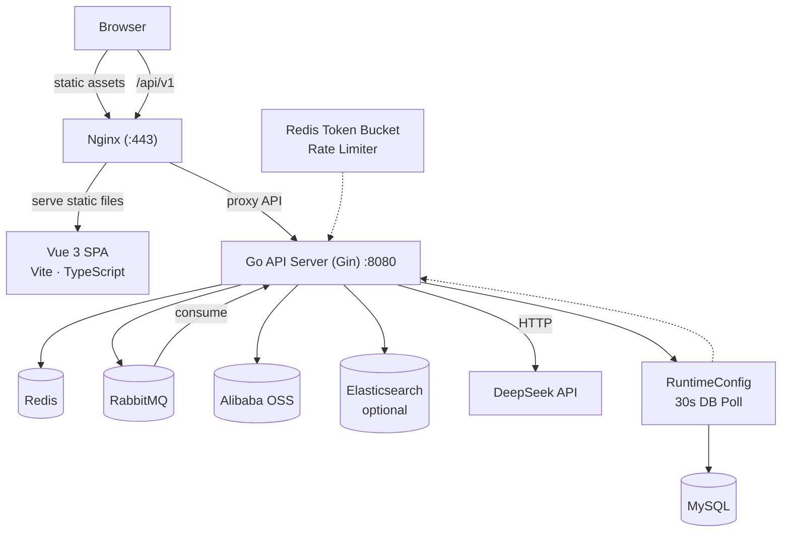
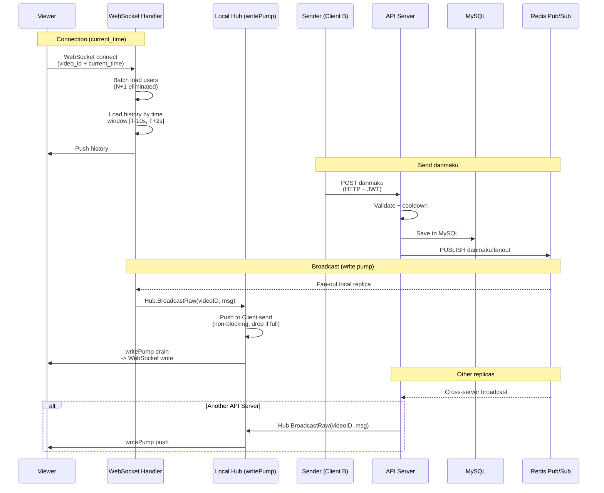
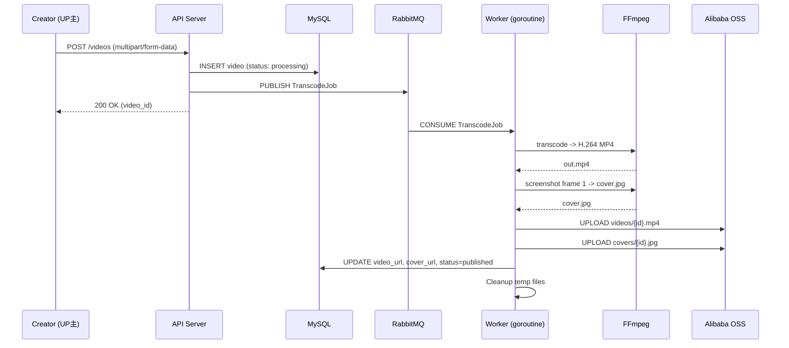
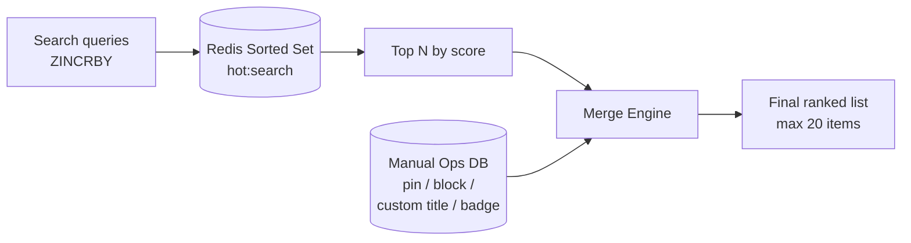
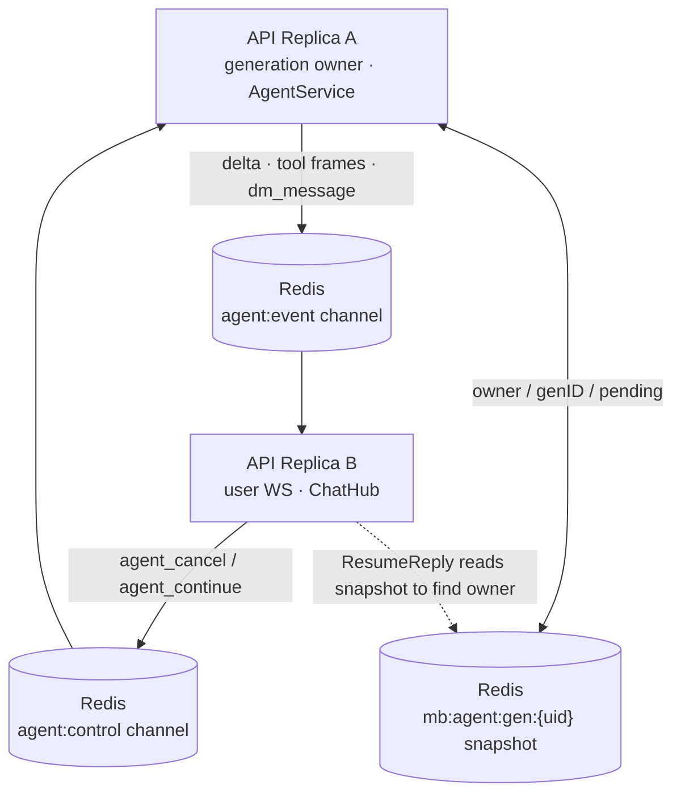
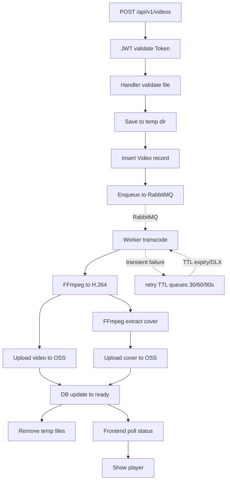

<p align="center">
  <a href="ARCHITECTURE.md">
    
  </a>
  <strong></strong>
</p>

# Cakecake Architecture

## Overview

Cakecake is a full-stack video-sharing platform built with Go and Vue 3, designed as a learning project that faithfully replicates Bilibili's core user-facing features. It serves as both a technical showcase and a hands-on study of real-world backend patterns — real-time messaging, async job processing, full-text search, and production deployment.



---

## Directory Layout

```
cakecake/
├── cmd/cakecake/main.go        # Entrypoint: wires config, DB, routes
├── internal/
│   ├── handler/                  # HTTP + WebSocket handlers (Gin routes)
│   ├── service/                  # Business logic layer
│   ├── model/                    # GORM models
│   ├── middleware/               # JWT / admin auth, rate limiter
│   ├── worker/                   # RabbitMQ consumer (transcode)
│   ├── ws/                       # WebSocket Hub (danmaku rooms, DMs)
│   ├── search/                   # Elasticsearch client & query builder
│   ├── storage/                  # Alibaba Cloud OSS client
│   ├── ffmpeg/                   # FFmpeg wrapper (transcode, thumbnail)
│   ├── aigateway/                # DeepSeek OpenAI-compatible client
│   ├── queue/                    # RabbitMQ connection manager
│   ├── config/                   # Env-var loading & config struct
│   ├── logger/                   # Zap logger init
│   ├── errcode/                  # Business error codes
│   └── pkg/                      # Utilities: JWT, BV, IP, sensitive-words, avatar, level, coin...
├── configs/                      # sensitive_words.txt, ip2region_v4.xdb
├── deploy/                       # Nginx config, systemd unit, env template
├── docs/                         # Screenshots and guides
├── cakecake-vue/cakecake-web/    # Vue 3 + Vite + TypeScript frontend
└── go.mod                        # module cakecake
```

---

## Core Modules

### 1. Real-time Danmaku System

The danmaku (bullet comment) system is the most technically challenging module. It achieves sub-200ms end-to-end latency through a WebSocket + Redis Pub/Sub architecture.



**Flow:**

1. Sender calls `POST /api/v1/videos/:id/danmaku` (HTTP, JWT auth)
2. Server validates content (length 1-100, color `#XXXXXX`, type scroll/top/bottom), checks 5-second cooldown (Redis `SETNX`), runs sensitive-word filter
3. Danmaku saved to MySQL, video `danmaku_count` incremented
4. Payload published to Redis channel `danmaku:fanout`
5. Every server replica subscribes to that channel and calls `Hub.BroadcastRaw(videoID, body)`
6. `Hub.BroadcastRaw` pushes the JSON payload to each `Client.send` channel (non-blocking, drops slow clients); `writePump` goroutine asynchronously drains the channel and writes to the WebSocket connection
7. Viewers connect via `GET /api/v1/ws/danmaku?video_id=...&current_time=T` — when `current_time` is provided, only danmaku within `[T-10s, T+2s]` range are loaded; otherwise the latest 200 are returned

**Key design decisions:**

| Decision                                                       | Rationale                                                                              |
| -------------------------------------------------------------- | -------------------------------------------------------------------------------------- |
| Redis Pub/Sub for fan-out                                      | Enables horizontal scaling — new replicas auto-receive broadcasts without shared state |
| Per-video room map (`map[uint64]map[*websocket.Conn]struct{}`) | O(1) broadcast per room, no cross-room scanning                                        |
| SETNX cooldown over rate-limiter middleware                    | Cooldown is per-video-per-user, simpler than a generic token bucket                    |
| No message persistence in Redis                                | Danmaku is ephemeral; MySQL is the source of truth for history                         |

---

### 2. Async Video Transcode Pipeline



**Flow:**

1. Creator uploads raw video + optional custom cover via `POST /api/v1/videos`
2. Server saves metadata (status: `processing`) to MySQL, stores raw file in temp dir
3. With OSS configured, the raw media is first uploaded to `raws/{videoID}/source.ext` and the job carries `RawKey/CoverKey`; the legacy local `RawPath/CoverPath` is only a fallback
4. Worker goroutine downloads the source from OSS by key, runs `ffmpeg` to transcode to H.264 MP4 (bounded by `TRANSCODE_TIMEOUT`, default 10m, so a hung process is killed), takes a screenshot at frame 1, and uploads both to OSS
5. On success: updates `video_url`, `cover_url`, sets status to `published` (or `pending_review` in review mode)
6. On failure: transient failures are **confirm-published** with `RetryCount+1` to `retry_30s/60s/90s` delayed queues; RabbitMQ dead-letters them back to the main queue after the TTL expires (max 3 retries). Permanent failures are marked `failed` with a human-readable reason.
7. DB write failures on the success path are not swallowed: a failed `db.Updates` / publish-state update goes through the same retry path, raw media is kept, and OSS overwrite is idempotent — the job either completes or lands in a requeueable dead letter.
8. The main consumer reconnects with a 3s backoff after channel loss, like the dead-letter consumer; the dead-letter consumer marks `processed_at` **before** acking (a failed mark redelivers); retention archives expired dead letters via `archived_at` instead of physically deleting audit rows.

Every publish (upload enqueue, retry scheduling, dead-lettering, admin requeue) uses **publisher confirm + mandatory**: a successful enqueue is a broker-confirmed, decidable result, and unroutable messages trigger a basic.return error.

**Durable source storage & replay:**

- With OSS, raw media and user covers live as objects (`raws/{videoID}/source.ext`, `raws/{videoID}/cover.ext`); the job carries only object keys.
- The worker downloads each object to a local temp file per attempt, then deletes the object on success or permanent failure; retry/dead-letter paths keep it as the compensation input.
- Requeue verifies the object with `Exists` before publishing (legacy local-path dead letters still use `os.Stat`), so replay works across instances, container rebuilds, and disk cleanup.
- The local `RawPath` mode is only a compatibility/fallback when OSS is not configured.

**Failure classification:**

| Type      | Detection                                                                | Action                                         |
| --------- | ------------------------------------------------------------------------ | ---------------------------------------------- |
| Permanent | FFmpeg stderr contains known patterns (invalid codec, corrupt container) | Mark`failed`, store `fail_reason`, ack message |
| Transient | ffmpeg timeout/hang, source download failure, OSS network error, disk full, DB write failure | Increment `retry_count`, confirm-publish to a retry TTL queue (30/60/90s); DLX returns it to the main queue |
| Exhausted | `retry_count >= 3`                                                       | Publish to explicit dead-letter queue + write `transcode_dead_letters` audit row + mark `failed`; admin can requeue |

---

### 3. Full-text Search (Elasticsearch)

- **Three indices**: `videos` (title, description, tags, zone_id), `articles` (title, body, category), `users` (nickname, username, sign)
- **Multi-match with weights**: title^3, description^1.5 for video; wildcard `query_string` for partial nickname matching
- **Highlight**: returns `<em class="keyword">hit</em>` fragments for title and excerpt
- **Sort support**: default (relevance), pubdate, play_count, like count
- **Optional**: degrades gracefully when ES is not configured — search page shows "not available" prompt

---

### 4. Comment System

- **2-level nesting**: root comment → child → grandchild. GORM preloads via `Preload("Children.Children")` for single-query tree assembly
- **Cascade delete**: deleting a parent recursively removes all descendants (enforced in handler, not via DB constraint)
- **Creator moderation**: video owner can delete any comment; regular users can only delete their own
- **Like/dislike**: toggle pattern — single-row existence check, insert or delete, atomic counter update

---

### 5. Hot Search



- **Auto**: search queries increment Redis sorted set scores
- **Manual**: admin dashboard supports pin, block, custom display title, badge (`hot`, `new`, `rec`)
- **Merge**: manual items take priority, auto items fill remaining slots, blocked keywords filtered

---

### 6. AI Assistant (DeepSeek)

- OpenAI-compatible client in `internal/aigateway/deepseek.go`, default model `deepseek-v4-flash`
- Users chat with agent profiles via DM; **streaming typewriter** + pause/continue/regenerate + follow-up suggestions + tool calls (site search / detail / trending)
- Result cards are declared by the model at the end of the reply (`【展示】tool#ID`); the backend persists exactly those instead of guessing from the reply text
- Generation state and orchestration live in `internal/service/agent` (the handler only forwards WS/HTTP); see [ai-gateway_EN.md](ai-gateway_EN.md)

#### 6.1 Multi-Instance State Externalization (Horizontal Scaling)

Generation state (pause/buffer/generation id) and WebSocket connections are per-process resources. With multiple replicas, the user's WS may land on replica A while the generation runs on replica B — so the event plane and the control plane are externalized to Redis:



- **Event plane**: deltas/tool frames/suggestions/dm messages are published to `agent:event`; every replica's subscriber writes them to its local `ChatHub`, so the user receives them no matter which replica holds the WS.
- **Control plane**: pause/continue/supersede are published to `agent:control` and only the snapshot owner applies them (`from` ignores self-published controls); snapshots are genID-guarded so a stale generation cannot clear a newer one.
- **Performance**: the hot-path buffer/replay stays in the owner's memory; if the owner dies, a paused-completed reply can still be recovered from the snapshot's pending field.

---

## Storage Strategy

| Data type                                               | Storage           | Rationale                                    |
| ------------------------------------------------------- | ----------------- | -------------------------------------------- |
| User, video, comments, notifications, drafts            | MySQL             | Relational integrity, complex queries        |
| Video files, covers, avatars                            | Alibaba Cloud OSS | Scalable blob storage, CDN-ready             |
| Danmaku fan-out, play counts, cooldowns, Refresh Tokens | Redis             | Low-latency ephemeral data                   |
| Transcode jobs                                          | RabbitMQ          | Persistent, manual ack, publisher confirm, TTL/DLX delayed retry (at-least-once + idempotency guard) |
| Search indices                                          | Elasticsearch     | Inverted index, relevance scoring            |

---

## Key Design Decisions

| Decision                                        | Why                                                                                                                                                   |
| ----------------------------------------------- | ----------------------------------------------------------------------------------------------------------------------------------------------------- |
| **Monolith over microservices (v1)**            | Single developer, faster iteration. Code is organized by domain (`handler/`, `service/`, `worker/`) to enable future split into Kratos microservices. |
| **Redis Pub/Sub over direct WebSocket fan-out** | Decouples broadcast from the HTTP handler. Multiple replicas subscribe to the same Redis channel, enabling horizontal scaling without shared memory.  |
| **AI events/controls via Redis Pub/Sub + generation snapshot (owner/genID-guarded)** | Decouples WS from generation under multiple replicas: events fan out to the replica holding the user's WS, pause/resume route to the owner; the hot-path buffer stays in the owner's memory for performance. |
| **RabbitMQ over Redis List for transcode**      | RabbitMQ provides message persistence, consumer acknowledgments, publisher confirm, TTL/DLX delayed retry, and dead-lettering — video processing cannot tolerate data loss, and delayed retry must not rely on worker sleep.  |
| **GORM AutoMigrate + goose versioned migrations** | Dev: GORM AutoMigrate (V1-V19). Prod (APP_ENV=production): goose SQL migrations (V20+) with up/down rollback. |                                                    |
| **ES optional, not mandatory**                  | Reduces onboarding friction. The search page degrades gracefully when ES is not configured.                                                           |
| **bcrypt + dual-token JWT**                     | Industry standard for auth. Access/Refresh token pattern with Redis-managed refresh token rotation.                                                   |

---

## Data Flow: Video Upload (End-to-End)



---

## Testing Strategy

| Layer                                     | Scope                              | Examples                                                            |
| ----------------------------------------- | ---------------------------------- | ------------------------------------------------------------------- |
| `internal/pkg/*`                          | Unit tests (table-driven)          | Username validation, BV ID encode/decode, avatar path generation     |
| `internal/handler/*`                      | Unit tests (SQLite in-memory)      | Login/register flow, video draft CRUD, danmaku posting, cascading comment deletion |
| `internal/handler/*` (integration tag)    | Black-box tests (real services)    | Health check, video zone list                                       |
| E2E                                       | Manual                             | Login → upload → watch with danmaku → search                        |

```bash
go test ./... -count=1
go test -tags=integration ./internal/handler/... -count=1
```
