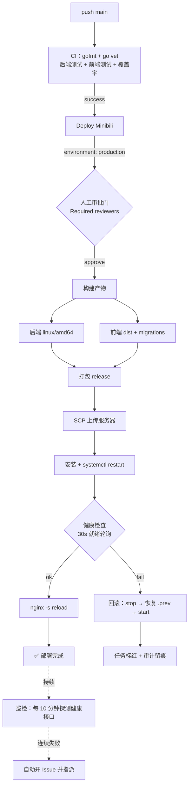

# cakecake 企业级部署流水线

**最后更新**：2026-08-02

本文记录 cakecake 从“手动 scp 发布”升级为“CI 门禁 → 人工审批 → 自动部署 → 健康检查 → 自动回滚 → 巡检告警”的完整流水线设计与实践，供复盘与面试讲述。

---

## 一、总体架构

---

## 二、设计决策

| 决策 | 选择 | 理由 |
|------|------|------|
| 测试门禁 | push 后自动跑 CI（gofmt / go vet / 后端测试 / 前端测试 / 覆盖率） | 测试不过不进入发布，从源头拦截回归 |
| 人工审批门 | `environment: production` + Required reviewers | 发布是高风险动作，必须有人为确认，防误发、防机器自动上线 |
| 精确版本 | checkout `workflow_run.head_sha` | 部署的代码与 CI 验证过的提交严格一致，杜绝“测了 A 发了 B” |
| 自动回滚 | 健康检查失败 → `stop` → 恢复 `.prev` 二进制与 migrations → `start` | 快速恢复线上，回滚必须覆盖全部共享状态 |
| 巡检告警 | 每 10 分钟探测 `https://chengzisoft.top/api/v1/health`，失败自动开 Issue | 覆盖“部署后运行期故障”，不只看发布瞬间 |
| 本地脚本并存 | `scripts/deploy.sh`（测试+构建+确认+部署） | 支持未提交的工作区改动，日常迭代与正式发版分流 |
| 文档同步门禁 | 提交前强制 `check_en_sync.py --check-sync` + 链接检查 | 防止文档漂移与失效链接，工程资产可持续 |

---

## 三、关键实现要点

1. **部署环境（服务器）**
   - 目录 `/opt/minibili/{bin,www,configs,data,logs}`，systemd 单元 `minibili.service`；
   - 二进制与 `migrations/` 目录部署前做 `.prev` 对称备份，回滚对称恢复；
   - 宝塔面板 nginx 用 `nginx -s reload`（不走 systemd）。
2. **健康检查**：每 2 秒轮询、最多 30 秒、就绪即停；不假设固定启动时间（ES 连接可能耗时数秒）。
3. **回滚**：先 `systemctl stop` 再替换文件，避免 `Text file busy`；回滚后重新健康检查。
4. **告警**：定时工作流 + `actions/github-script` 打开/关闭告警 Issue（带 `alert` 标签、指派仓库 owner）。
5. **密钥**：部署密钥独立生成、存入 GitHub Secrets、仅密钥认证登录（`PasswordAuthentication no`）。

---

## 四、可量化结果与已知边界

**结果**：从手动发布升级为全自动流水线；部署全程有审计记录（谁、何时、哪个 SHA、结果）；回滚机制在真实事故中被触发并验证有效；巡检告警覆盖部署后运行期。

**已知边界（诚实说明）**：
- 重启式发布：切换有 1~3 秒中断，非蓝绿/零停机；
- 单环境：无 staging/预发环境，生产即首站；
- 巡检目前是“健康探测 + Issue 告警”；监控采用「本地 Prometheus/Grafana + 云服务器只暴露 `/metrics`」方案，部署细节见 [monitoring.md](./monitoring.md)；
- 安全组对公网开放 22 端口（仅密钥），更严格方案是自托管 runner 或 OSS 中转发布。

---

## 五、后续改进方向

- 增加 staging 环境与自动冒烟测试，生产发布前先预发验证；
- 蓝绿/金丝雀发布，实现零停机切换；
- 将「本地监控抓云上 `/metrics`」的通道接入告警值班路由（webhook），并逐步替代轮询式健康探测；
- GitHub Actions 迁移到自托管 runner，收敛 SSH 暴露面；
- 发布指标（MTTR、回滚次数、部署成功率）自动化统计并展示。

---

## 六、关联文档

- 操作步骤：[deploy/DEPLOY.md](../deploy/DEPLOY.md)
- 事故复盘：[incident-20260801-deploy-false-fail](../incident-20260801-deploy-false-fail.md)、[incident-20260801-goose-collation](../incident-20260801-goose-collation.md)、[incident-20260802-gh-actions-ssh](../incident-20260802-gh-actions-ssh.md)
- 架构总览：[ARCHITECTURE.md](./ARCHITECTURE.md)
