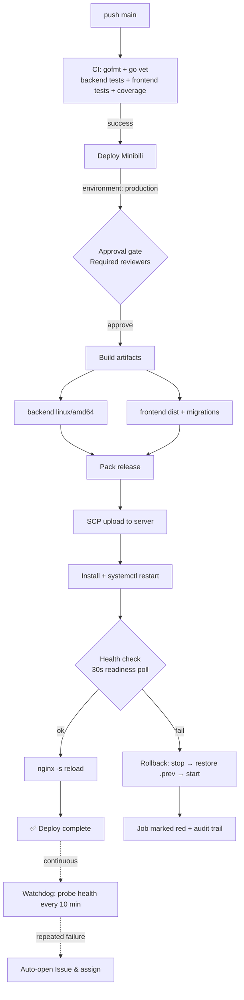

# cakecake Enterprise Deployment Pipeline

**Last Updated**: 2026-08-02

This document records how cakecake evolved from manual scp releases to a full pipeline: CI gate → human approval → auto deploy → health check → auto rollback → monitoring alerts. Written for review and interview storytelling.

---

## 1. Architecture Overview

---

## 2. Design Decisions

| Decision | Choice | Rationale |
|----------|--------|-----------|
| Test gate | CI runs on push (gofmt / go vet / backend tests / frontend tests / coverage) | No release without passing tests; stop regressions at the source |
| Approval gate | `environment: production` + Required reviewers | Releases are high-risk; a human confirmation prevents accidental or fully-automated deploys |
| Exact version | checkout `workflow_run.head_sha` | Deploy exactly what CI verified — never "tested A, shipped B" |
| Auto rollback | On health-check failure: `stop` → restore `.prev` binary & migrations → `start` | Fast recovery; rollback must cover all shared state |
| Watchdog | Probe `https://chengzisoft.top/api/v1/health` every 10 min; auto-open Issue on failure | Covers post-deploy runtime failures, not just the release instant |
| Local script alongside | `scripts/deploy.sh` (tests + build + confirm + deploy) | Supports uncommitted workspace changes; daily iteration vs formal releases are separated |
| Doc sync gate | Pre-commit `check_en_sync.py --check-sync` + link check | Prevents doc drift and broken links; engineering assets stay maintainable |

---

## 3. Key Implementation Points

1. **Server layout**: `/opt/minibili/{bin,www,configs,data,logs}`, systemd unit `minibili.service`;
2. **Symmetric `.prev` backups** for the binary and the `migrations/` directory before install; rollback restores both;
3. **Health check**: poll every 2s, up to 30s, stop when ready; never assume a fixed startup time (ES connection can take seconds);
4. **Rollback**: `systemctl stop` before replacing files to avoid `Text file busy`; re-run health check after rollback;
5. **Alerting**: scheduled workflow + `actions/github-script` to open/close alert Issues (label `alert`, assigned to repo owner);
6. **Keys**: a dedicated deploy key stored in GitHub Secrets; key-only login (`PasswordAuthentication no`).

---

## 4. Measurable Results & Known Limits

**Results**: upgraded from manual releases to a fully automated pipeline; every deploy has an audit trail (who, when, which SHA, outcome); the rollback mechanism was exercised by real incidents and proven effective; watchdog covers post-deploy runtime failures.

**Known limits (honest)**:
- Restart-style releases: 1~3s interruption during switchover; not blue-green/zero-downtime;
- Single environment: no staging/pre-prod; production is the first stop;
- Monitoring is health-probe + Issue alerting; no metrics stack (Prometheus/Grafana) or alert escalation yet;
- Security group exposes port 22 to the public internet (key-only); stricter options are a self-hosted runner or OSS relay deployment.

---

## 5. Future Improvements

- Add a staging environment with automated smoke tests before production;
- Blue-green / canary releases for zero-downtime switchover;
- Prometheus metrics + Grafana alerting to replace polling-based health probes;
- Migrate to a self-hosted runner to shrink the SSH exposure;
- Automate release metrics (MTTR, rollback count, deploy success rate) dashboards.

---

## 6. Related Documents

- Operations guide: [deploy/DEPLOY.md](../deploy/DEPLOY.md)
- Incident reviews: [incident-20260801-deploy-false-fail](../incident-20260801-deploy-false-fail.md), [incident-20260801-goose-collation](../incident-20260801-goose-collation.md), [incident-20260802-gh-actions-ssh](../incident-20260802-gh-actions-ssh.md)
- Architecture overview: [ARCHITECTURE.md](./ARCHITECTURE.md)
