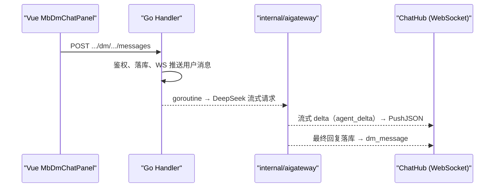
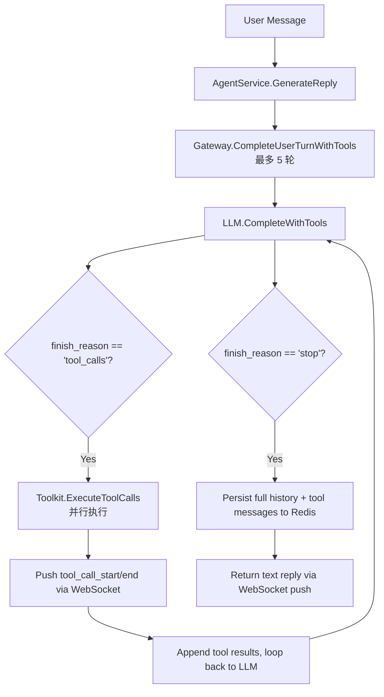

<p align="center">
  <strong></strong>
  <a href="docs/ai-gateway_EN.md">
    
  </a>
</p>

# cakecake AI 网关（消息中心助手）

## 功能

- 每位登录用户在「我的消息」中自动拥有与 **cakecake AI** 的固定会话（`kind=agent`）。
- 用户消息走现有 `POST /api/v1/dm/conversations/:id/messages`；服务端**流式**调用 **DeepSeek**，文本 delta 经 **WebSocket**（`/api/v1/ws/chat`）实时推送，最终回复落库后推送完整消息；支持暂停 / 继续 / 重新生成。
- 短期上下文保存在 **Redis**（`mb:agent:hist:{conversationId}`），日配额 `mb:agent:quota:{userId}:{date}`。

## 架构



## 运营后台配置

登录运营中心 → **AI 角色**（`/admin/agent`）：

- **多角色卡片**：每个角色独立名称、头像、人设、欢迎语库
- **欢迎语库**：可配置多句，用户**首次**与该角色建立会话时**随机**抽取一句
- 每个启用角色在消息中心对应**独立会话**（不同系统账号）
- 最多 12 个角色；停用后不再为新用户创建会话，已有会话保留

## 环境变量

| 变量 | 说明 |
|------|------|
| `DEEPSEEK_API_KEY` | DeepSeek API Key（必填才启用回复） |
| `DEEPSEEK_BASE_URL` | 默认 `https://api.deepseek.com` |
| `DEEPSEEK_MODEL` | DeepSeek 模型名，默认 `deepseek-v4-flash` |
| `AGENT_BOT_USERNAME` | 系统账号用户名，默认 `minibili_ai` |
| `AGENT_MAX_HISTORY` | Redis 上下文轮数上限 |
| `AGENT_HISTORY_TTL` | Redis 上下文过期时间（Go duration，默认 `720h` 即 30 天） |
| `AGENT_DAILY_QUOTA` | 每用户每日调用次数 |

## 面试可强调点

1. **网关职责**：鉴权、敏感词、配额、超时、模型适配，与业务 API 解耦。
2. **复用 IM**：同一套 DM 表、分页、WS，降低前端成本。
3. **异步流式回复**：用户请求快速返回，LLM 在后台 goroutine 流式生成，delta 实时推送，最终回复落库。
4. **可观测**：`trace_id` 贯穿后端日志与前端；流式首 token 延迟已可观测（Prometheus 指标为扩展位）。

## 相关代码

- `internal/aigateway/` — DeepSeek 客户端、流式编排与 Redis 上下文
- `internal/service/agent/agent.go` — 编排、暂停/继续状态机、配额、落库
- `internal/handler/agent_direct_message.go` — resume/regenerate、异步建议
- `internal/handler/direct_message_ws.go` — WS 控制帧
- `internal/data/agent_seed.go` — 系统用户与会话初始化
## Tool Use / Function Calling

### 架构



### 新增 WebSocket 协议

**tool_call_start** — 开始执行某个工具
```json
{
  "type": "tool_call_start",
  "body": {
    "trace_id": "a1b2c3d4",
    "span_id": "a1b2c3d4-t0",
    "parent_span_id": "a1b2c3d4",
    "tool_name": "search_videos",
    "arguments": { "keyword": "golang" },
    "started_at": "2026-07-23T10:00:00Z"
  }
}
```

**tool_call_end** — 工具执行完成
```json
{
  "type": "tool_call_end",
  "body": {
    "trace_id": "a1b2c3d4",
    "span_id": "a1b2c3d4-t0",
    "tool_name": "search_videos",
    "duration_ms": 42,
    "result_summary": "found 3 results"
  }
}
```

**tool_result_data** — 工具返回的结构化结果数据（用于前端渲染卡片）
```json
{
  "type": "tool_result_data",
  "body": {
    "trace_id": "a1b2c3d4",
    "span_id": "a1b2c3d4-t0",
    "tool_name": "search_videos",
    "items": [
      {
        "id": 1,
        "title": "某科学的超电磁炮",
        "author": "earthcake",
        "plays": 32,
        "cover": "https://...",
        "duration": "5:24"
      }
    ]
  }
}
```

前端在收到 `tool_call_start` / `tool_call_end` 后，会收到对应的 `tool_result_data`。前端将 `items` 数组渲染为视频卡片、评论卡片或弹幕列表。

### 已定义工具

| Tool | 参数 | 说明 |
|------|------|------|
| `search_videos` | `keyword`(必填), `page`, `page_size` | 关键词搜索视频，优先走 ES，回退 DB LIKE |
| `get_video_detail` | `video_id`(必填) | 视频详情 + UP 主信息 + 标签 |
| `get_trending` | `limit` | 热门视频排行榜（按播放量） |
| `get_video_comments` | `video_id`(必填), `page`, `page_size` | 视频评论列表 |
| `get_video_danmaku` | `video_id`(必填), `limit` | 视频弹幕样本 |

### Admin 开关

每个工具可通过 RuntimeConfig 独立启用/禁用，key 格式：`tool_{name}_enabled`，默认 true。

| key | 说明 |
|-----|------|
| `tool_search_videos_enabled` | 搜索视频 |
| `tool_get_video_detail_enabled` | 视频详情 |
| `tool_get_trending_enabled` | 排行榜 |
| `tool_get_video_comments_enabled` | 评论 |
| `tool_get_video_danmaku_enabled` | 弹幕 |

### 面试可强调的点

1. **Tool Schema 设计**：每个 tool 的 description 写详细，parameters 标注 required，帮助模型准确选择
2. **多轮编排**：5 轮上限 + 超限降级，防止死循环
3. **并行执行**：同轮 tool_calls 用 goroutine 并行执行，提升响应速度
4. **防滥用三层**：配额检查 → 敏感词入参/出参过滤 → 每工具独立 RuntimeConfig 开关
5. **trace_id 贯穿**：同一 trace_id 既写 Zap 日志又推前端，后端调试和前端展示共用同一链路 ID

---

## 流式 / 暂停 / 继续 / 重新生成：开发踩坑与关键技术点

> 这一节记录了 AI 助手从「非流式完整回复」演进到「流式打字机 + 停止/继续 + 重新生成 + 追问建议」过程中踩过的坑，按「现象 → 为什么难 → 怎么修」重写，方便快速读懂。

### 先说人话：这一整块在解决什么问题

AI 回复不是一次到位的，而是一小段一小段（delta）流过来的。产品上我们要做到三件事：

1. **打字机效果**：边生成边显示；
2. **停止 ≠ 取消**：用户点"停止"只是不再展示新内容，后台模型其实还在跑；点"继续"把停住期间的内容按打字机节奏补放出来；
3. **重新生成**：对同一句提问重新问一次模型，原地替换旧回复，而不是另起一个气泡。

难在哪：流是异步的（后台在跑、前端在收）、用户可能并发操作（连点停止/继续）、网络会断线重连。三个因素一叠加，就冒出一堆"看起来正常、细看露馅"的 bug。下面按主题讲清楚。

### 术语表（先记住这几个词）

| 术语 | 大白话 |
|------|--------|
| delta | 模型流式返回的一小段文字 |
| 暂停（pause） | 停止展示新内容，但后台 LLM 继续跑，新 delta 先放进缓冲区 |
| 缓冲区（buffer） | 暂停期间积压的 delta；点继续时按打字机节奏回放 |
| 继续（resume） | 先回放缓冲区内容，再恢复实时推送 |
| 重新生成（regenerate） | 对同一句提问重新请求模型，原地替换旧回复 |
| genID | 生成代次编号；每次重新生成 +1，用来识别并丢弃"过期"的旧流 |
| 版本气泡 | 前端把同一句提问的多轮回复合并成一个气泡，用 `‹ n / n ›` 切换 |

### 1. 流式 delta 推送目标：DM 会话的 `UserLow/UserHigh` 陷阱

**现象**：最终消息能收到，但打字机一个字都不动；调试发现 `agent_delta` 全推给了 bot（无人连接）。

**为什么难**：DM 会话把双方 ID 按大小排序存在 `user_low/user_high` 两个字段里。bot 的 ID 可能比用户小（如 bot=14、用户=18），此时 `conv.UserLow` 是 **bot** 而不是用户，不能想当然。

**怎么修**：新增 `humanPeerForConversation(conv, botUserID)`，显式算出"非 bot 的那一方"作为推送目标，并配单元测试锁死。

### 2. 全局回调 vs 按调用回调（多用户并发串号）

**现象**：A 用户看到的回复里混进了 B 用户的内容。

**为什么难**：Gateway 早期只有单一字段 `OnTextDelta`，每次生成前覆盖。两个用户并发生成时，后设置的闭包覆盖前者，A 的 token 被推给了 B。

**怎么修**：`CompleteUserTurnStream` / `CompleteUserTurnWithToolsStream` / `ContinueTurnStream` 全部改为接收 **per-call** 的 `onDelta func(string)`，每次调用持有自己的闭包（含自己的 `humanID`），彻底消除跨用户串号。

### 3. 暂停/继续状态机（最容易乱序露馅的部分）

**设计目标**：点击"停止"后 **LLM 流继续在后台跑**，delta 进入缓冲；点击"继续"= 按打字机节奏回放缓冲 + 恢复实时推送。

核心状态：

| 字段 | 含义 |
|------|------|
| `paused` | 是否暂停（暂停时 delta 进缓冲，不推送） |
| `buffer []string` | 暂停期间的 delta 片段 |
| `dropped` | 被更新的生成取代，丢弃后续 delta |
| `genID` | 生成代次，防止旧 goroutine 清掉新状态 |
| `pauseSeq` | 停止序号，每次暂停 +1 |
| `resuming` | 回放中标志，保证并发 continue 串行 |

踩过的三个坑：

- **回放前先解除暂停**：回放缓冲与实时 delta 并发写 WS，文字乱序插进代码块。修：回放期间保持 `paused=true`，缓冲排空后才解除。
- **两次 continue 并发回放**：第二个回放在第一个没播完时就解除暂停，乱序复现。修：`resuming` 标志让并发 resume 等待，只有「回放期间没有新暂停（`pauseSeq` 未变）且缓冲为空」才解除暂停。
- **回放途中点停止被覆盖**：回放结束时的「解除暂停」会把刚点的停止冲掉，表现为停止失效、一口气生成完。修：**每推送一个片段前检查 `pauseSeq`**，发现新停止立即中断回放，剩余片段留在缓冲等下次继续。

### 4. 防重复落库：不要用 substring 匹配草稿

**现象**：回复已经落库后，用户再点"继续"，又生成了一条重复回复。

**为什么难**：曾用"最新 assistant 内容 contains 流式草稿"判断是否已落库，两个致命问题：

1. 持久化前经过 `normalizeMarkdownFences` / `dedupeConsecutiveLines` / trim，而草稿是原始流，两者根本对不上；
2. `ListMessages` 返回的是 DESC（新的在前），旧代码却从数组尾部往前遍历并「遇到第一条 assistant 就返回」，比对的其实是窗口里最旧的消息。

**怎么修**：`latestUserTurnHasAssistantReply` —— 只判断"该轮用户消息之后是否已有 assistant 行"，**不比较文本**；配合每用户 `agentRunLock` 串行化 resume 的决策与落库，双 continue 也只落一条。

### 5. 追问建议异步生成（消除结尾死等）

**现象**：回复文本流完后，消息迟迟不落库，体验是"等了好久最后才生成"。

**为什么难**：回复完成后又**同步**调了一次 LLM 生成"追问 chips"（最长 15s），把落库堵住了。

**怎么修**：回复先落库 + 推送（suggestions 为空），后台 goroutine 生成建议后：

1. `UpdateMessageSuggestions(messageID, sugg)` 更新行；
2. 通过 WS 推送新事件 `agent_suggestions {message_id, suggestions}`；
3. 前端按 `message_id` 更新已有消息的 suggestions，chips 后补出现。

实测：流式结束到消息落库从 5~15s 降到约 100ms。

### 6. Markdown 围栏归一化

**现象**：停止/继续的接缝处，模型经常多吐 ````go`、多余开栅栏或重复行，前端 markdown 渲染变乱。

**怎么修**：落库前统一处理：

- `normalizeMarkdownFences`：栅栏统一三个反引号、去掉接缝处多余开栅栏、末尾未闭合自动补 ` ``` `；
- `dedupeConsecutiveLines`：去掉完全相同的连续行；
- `plainTextPreview`：会话列表预览剥掉 markdown。

⚠️ 测试流式顺序时，必须把「客户端收到的原始 delta 拼接」与「落库文本」做**相同的归一化**后再比较，否则会因围栏差异误报乱序。

### 7. 前端状态机：重新生成原地改写

连续的 assistant 行会被前端合并成「版本气泡」（`versions` + `‹ n / n ›` 切换器）。

重新生成流程：`_agentRegenerating=true` → 原地清空旧内容 → 新流在同一个气泡里打字。

踩过的两个坑：

- **停止时清掉 `_agentRegenerating`**：渲染逻辑以为原地改写结束，旧版本内容弹回 + 多出一个 `agent-draft` 气泡（露馅）。修：stop/continue 期间**保留**原地改写标记，直到收到最终 `dm_message` 才清除。
- **重新生成时未清旧版本的工具数据**：上一轮的 `search_videos` 卡片/状态露出来。修：原地改写时同时清空 `toolActivities` / `toolResultData` / `suggestions`。

### 8. 滚动与 UX

- 每个 delta 都 `scrollToBottom` 会抢用户滚动。修：`onChatScroll` 维护 `_userScrolledUp`，只有贴底时才自动滚动。
- 重新生成点击后跳转到用户提问行（用户明确要求），跳转动画结束后（约 700ms）恢复自动跟随打字；用户手动上滑仍然优先。
- 停止/继续保持原地改写后，滚动不会跳到新气泡。

### 9. WS 控制帧不能丢

WS 断线重连期间点击「停止/继续」，如果 `sendWsControl` 发现连接未开就直接 return，控制帧会静默丢失 → 后端一直流到结束，看起来「停止无效、一口气生成完」。

修：控制帧先入 `_pendingWsControls` 队列，`onopen` 后补发。

### 10. 端到端验证方法

这些坑用单测/接口测试覆盖不到，必须**真实浏览器 + 真实模型**复现：

- **浏览器点击流**（puppeteer + Chromium）：发送 → 停止 → 继续 → 重新生成，断言 DB 行数、DOM 无 `agent-draft` 重复行、旧内容不弹回、滚动位置正确。
- **裸 WS 竞态**：同一连接连发两个 `agent_continue`，断言只落一条 assistant。
- **流式顺序断言**：客户端收到的全部 delta 拼接后，与落库内容做相同归一化再比对（拼接要包含回放前已收帧，曾因漏开头误报）。
- **停止响应**：停止后最多允许 2~3 个已在途片段（网络延迟），不能继续吐整段。

### 协议补充

| 事件 | 方向 | 说明 |
|------|------|------|
| `agent_delta` | 服务端 → 前端 | 流式文本片段 `{content}` |
| `agent_suggestions` | 服务端 → 前端 | 异步追问建议 `{message_id, suggestions}` |
| `agent_cancel` | 前端 → 服务端 | 暂停（缓冲，不取消后台 LLM） |
| `agent_continue` | 前端 → 服务端 | 回放缓冲并恢复实时流 |
| `agent_regenerate` | 前端 → 服务端 | 重新生成该轮回复（新版本） |

### 核心不变量

- 每条用户消息（regenerate 除外）最终只落一条 assistant；regenerate 每次新增一个版本。
- 流式推送顺序 == 落库文本顺序；暂停/继续不得乱序。
- 停止响应时间 ≈ 一个在途片段；回放中再点停止立即生效。
- 所有控制帧必须送达（断线重连补发），不允许静默丢弃。

### 相关代码

- `internal/aigateway/gateway.go` — per-call delta、流式工具编排
- `internal/service/agent/agent.go` — 暂停/继续状态机、markdown 归一化
- `internal/handler/agent_direct_message.go` — resume/regenerate、异步建议
- `cakecake-vue/cakecake-web/src/components/cakecake/MbDmChatPanel.vue` — 前端状态机、滚动、控制帧队列
