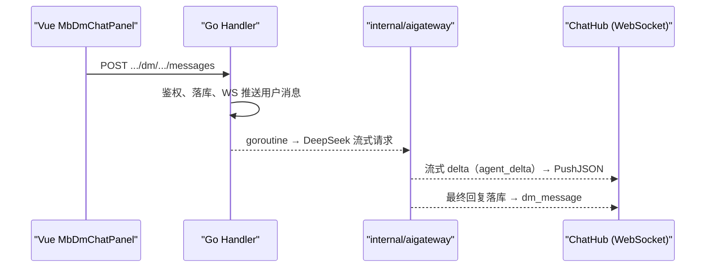
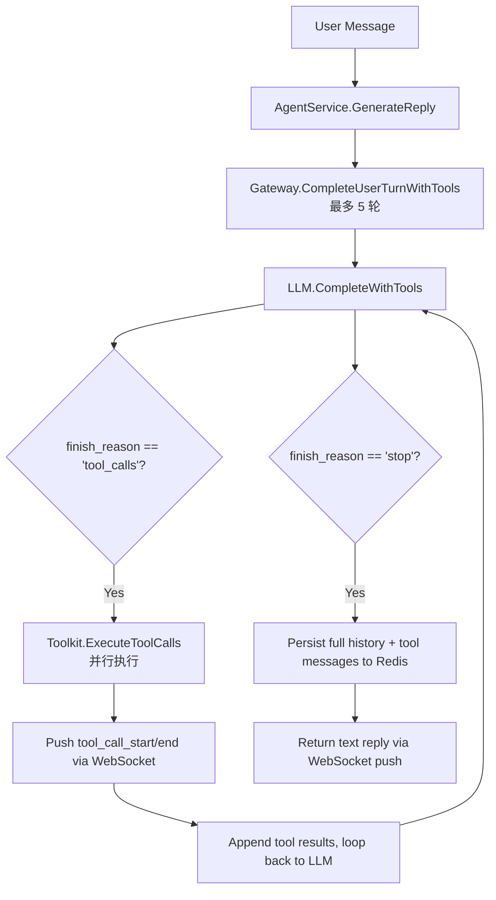

<p align="center">
  <strong></strong>
  <a href="docs/ai-gateway_EN.md">
    
  </a>
</p>

# cakecake AI 网关（消息中心助手）

## 功能

- 每位登录用户在「我的消息」中自动拥有与 **cakecake AI** 的固定会话（`kind=agent`）。
- 用户消息走现有 `POST /api/v1/dm/conversations/:id/messages`；服务端**流式**调用 **DeepSeek**，文本 delta 经 **WebSocket**（`/api/v1/ws/chat`）实时推送，最终回复落库后推送完整消息；支持暂停 / 继续 / 重新生成。
- 短期上下文保存在 **Redis**（`mb:agent:hist:{conversationId}`），日配额 `mb:agent:quota:{userId}:{date}`。

## 架构



## 运营后台配置

登录运营中心 → **AI 角色**（`/admin/agent`）：

- **多角色卡片**：每个角色独立名称、头像、人设、欢迎语库
- **欢迎语库**：可配置多句，用户**首次**与该角色建立会话时**随机**抽取一句
- 每个启用角色在消息中心对应**独立会话**（不同系统账号）
- 最多 12 个角色；停用后不再为新用户创建会话，已有会话保留

## 环境变量

| 变量 | 说明 |
|------|------|
| `DEEPSEEK_API_KEY` | DeepSeek API Key（必填才启用回复） |
| `DEEPSEEK_BASE_URL` | 默认 `https://api.deepseek.com` |
| `DEEPSEEK_MODEL` | DeepSeek 模型名，默认 `deepseek-v4-flash` |
| `AGENT_BOT_USERNAME` | 系统账号用户名，默认 `minibili_ai` |
| `AGENT_MAX_HISTORY` | Redis 上下文轮数上限 |
| `AGENT_HISTORY_TTL` | Redis 上下文过期时间（Go duration，默认 `720h` 即 30 天） |
| `AGENT_DAILY_QUOTA` | 每用户每日调用次数 |

## 面试可强调点

1. **网关职责**：鉴权、敏感词、配额、超时、模型适配，与业务 API 解耦。
2. **复用 IM**：同一套 DM 表、分页、WS，降低前端成本。
3. **异步流式回复**：用户请求快速返回，LLM 在后台 goroutine 流式生成，delta 实时推送，最终回复落库。
4. **可观测**：`trace_id` 贯穿后端日志与前端；流式首 token 延迟已可观测（Prometheus 指标为扩展位）。

## 相关代码

- `internal/aigateway/` — DeepSeek 客户端、流式编排与 Redis 上下文
- `internal/service/agent/agent.go` — 编排、暂停/继续状态机、配额、落库
- `internal/service/agent/agent_orchestrate.go` — 编排（run/resume/regenerate、落库、异步建议）
- `internal/handler/agent_direct_message.go` — 只转发 WS/HTTP 触发与事件推送适配
- `internal/handler/direct_message_ws.go` — WS 控制帧
- `internal/data/agent_seed.go` — 系统用户与会话初始化
## Tool Use / Function Calling

### 架构



### 新增 WebSocket 协议

**tool_call_start** — 开始执行某个工具
```json
{
  "type": "tool_call_start",
  "body": {
    "trace_id": "a1b2c3d4",
    "span_id": "a1b2c3d4-t0",
    "parent_span_id": "a1b2c3d4",
    "tool_name": "search_videos",
    "arguments": { "keyword": "golang" },
    "started_at": "2026-07-23T10:00:00Z"
  }
}
```

**tool_call_end** — 工具执行完成
```json
{
  "type": "tool_call_end",
  "body": {
    "trace_id": "a1b2c3d4",
    "span_id": "a1b2c3d4-t0",
    "tool_name": "search_videos",
    "duration_ms": 42,
    "result_summary": "found 3 results"
  }
}
```

**tool_result_data** — 工具返回的结构化结果数据（用于前端渲染卡片）
```json
{
  "type": "tool_result_data",
  "body": {
    "trace_id": "a1b2c3d4",
    "span_id": "a1b2c3d4-t0",
    "tool_name": "search_videos",
    "items": [
      {
        "id": 1,
        "title": "某科学的超电磁炮",
        "author": "earthcake",
        "plays": 32,
        "cover": "https://...",
        "duration": "5:24"
      }
    ]
  }
}
```

前端在收到 `tool_call_start` / `tool_call_end` 后，会收到对应的 `tool_result_data`。前端将 `items` 数组渲染为视频卡片、评论卡片或弹幕列表。

### 已定义工具

| Tool | 参数 | 说明 |
|------|------|------|
| `search_videos` | `keyword`(必填), `page`, `page_size` | 关键词搜索视频，优先走 ES，回退 DB LIKE |
| `get_video_detail` | `video_id`(必填) | 视频详情 + UP 主信息 + 标签 |
| `get_trending` | `limit` | 热门视频排行榜（按播放量） |
| `get_video_comments` | `video_id`(必填), `page`, `page_size` | 视频评论列表 |
| `get_video_danmaku` | `video_id`(必填), `limit` | 视频弹幕样本 |

### Admin 开关

每个工具可通过 RuntimeConfig 独立启用/禁用，key 格式：`tool_{name}_enabled`，默认 true。

| key | 说明 |
|-----|------|
| `tool_search_videos_enabled` | 搜索视频 |
| `tool_get_video_detail_enabled` | 视频详情 |
| `tool_get_trending_enabled` | 排行榜 |
| `tool_get_video_comments_enabled` | 评论 |
| `tool_get_video_danmaku_enabled` | 弹幕 |

### 面试可强调的点

1. **Tool Schema 设计**：每个 tool 的 description 写详细，parameters 标注 required，帮助模型准确选择
2. **多轮编排**：5 轮上限 + 超限降级，防止死循环
3. **并行执行**：同轮 tool_calls 用 goroutine 并行执行，提升响应速度
4. **防滥用三层**：配额检查 → 敏感词入参/出参过滤 → 每工具独立 RuntimeConfig 开关
5. **trace_id 贯穿**：同一 trace_id 既写 Zap 日志又推前端，后端调试和前端展示共用同一链路 ID

---

## 流式 / 暂停 / 继续 / 重新生成：开发踩坑与关键技术点

> 这条链路出现过的疑难 bug（重复消息、停止失效、代码块被拆、卡片漏/重、重新生成答非所问、欢迎语重新生成卡死、布局漂移）本质都不是"某个函数写错"，而是**代码结构太乱**：同一份状态散落多层、靠启发式猜测代替明确决策、渲染逻辑带副作用。逐条修症状只会越修越多；真正有效的是把职责收拢，让每一层只有单一事实来源。下表是沉淀下来的结构原则。

### 先说人话：这一整块在解决什么问题

AI 回复不是一次到位的，而是一小段一小段（delta）流过来的。产品上我们要做到三件事：

1. **打字机效果**：边生成边显示；
2. **停止 ≠ 取消**：用户点"停止"只是不再展示新内容，后台模型其实还在跑；点"继续"把停住期间的内容按打字机节奏补放出来；
3. **重新生成**：对同一句提问重新问一次模型，原地替换旧回复，而不是另起一个气泡。

难在哪：流是异步的（后台在跑、前端在收）、用户可能并发操作（连点停止/继续）、网络会断线重连。三个因素一叠加，就冒出一堆"看起来正常、细看露馅"的 bug。下面按主题讲清楚。

### 术语表（先记住这几个词）

| 术语 | 大白话 |
|------|--------|
| delta | 模型流式返回的一小段文字 |
| 暂停（pause） | 停止展示新内容，但后台 LLM 继续跑，新 delta 先放进缓冲区 |
| 缓冲区（buffer） | 暂停期间积压的 delta；点继续时按打字机节奏回放 |
| 继续（resume） | 先回放缓冲区内容，再恢复实时推送 |
| 重新生成（regenerate） | 对同一句提问重新请求模型，原地替换旧回复 |
| genID | 生成代次编号；每次重新生成 +1，用来识别并丢弃"过期"的旧流 |
| 版本气泡 | 前端把同一句提问的多轮回复合并成一个气泡，用 `‹ n / n ›` 切换 |

### 结构原则（乱在哪 → 怎么收敛 → 防住什么）

| # | 曾经的乱法 | 现在的结构 | 防住的 bug |
|---|-----------|-----------|-----------|
| 1 | 生成状态拆成 handler 的 cancel 注册表 + service 的 genStates 两套，同步靠人肉维护 | 状态机整体收进 `AgentService`，handler 只转发 WS/HTTP，通过 `DmReader`/`ReplyPusher` 两个端口取数/推送 | 重复消息、停止失效、旧代次复活 |
| 2 | 草稿同时存在前端 `_agentDraftContent`、WS `partial`、服务端 buffer 三份 | 草稿只在服务器；`agent_continue` 不再回传 partial，`agent_continue_mode {buffer|reprompt}` 告知前端模式 | 停止/继续接缝露馅、代码块被拆 |
| 3 | 并发 continue 用 `time.Sleep` 自旋等锁；supersede 后回放仍继续推旧 delta | `sync.Cond` 条件唤醒；回放每推一段前检查 dropped，被取代立即丢弃剩余缓冲 | 停止无效、旧流漏到 UI |
| 4 | 卡片展示靠正则从回复文本猜（数字子串误匹配、整轮"没关系/没搜到"误杀） | 模型在回复末尾声明 `【展示】工具名#ID`，后端精确落卡；无声明才退回标题匹配；前端渲染前再去重兜底 | 无关视频混入、推荐卡片漏/重 |
| 5 | 重新生成取"最近提问"从列表尾部找（列表新的在前，结果取到最旧一条）；无用户消息时静默返回 | 从头部找最新 user；无 user 时重新生成欢迎语；前端 120s 超时兜底 | 重新生成答非所问、欢迎语重新生成卡死 |
| 6 | 版本合并逻辑写在 computed 里带副作用；消息操作区被塞进 flex row | 合并改为纯函数 `buildVersionGroups`；操作区/卡片是 row 的兄弟节点；前端状态收敛进 reactive composable | 版本错乱 NaN/2、操作区布局漂移 |
| 7 | re-prompt 拼接用"空白归一化最长重叠"猜接缝 | 非流式取完整续写 → 确定性规则拼缝 → 只推用户没见过的尾部 | 拼接处重复行、围栏错乱 |
| 8 | 回复完成后同步生成追问 chips，把落库堵住 5~15s | 先落库推送，后台生成 `agent_suggestions` 后补 | 结尾死等 |
| 9 | 推送目标默认取 `conv.UserLow`；delta 回调用全局字段 | 显式 `humanPeerForConversation`；`onDelta` 改为 per-call 闭包 | 打字机不显示、多用户串号 |

每条原则都配单测；涉及真实模型/浏览器交互的（连点停止/继续/重新生成、追问、重新生成欢迎语、榜单卡片数量），用 puppeteer + 真实模型做端到端验证。

### 协议补充

| 事件 | 方向 | 说明 |
|------|------|------|
| `agent_delta` | 服务端 → 前端 | 流式文本片段 `{content}` |
| `agent_suggestions` | 服务端 → 前端 | 异步追问建议 `{message_id, suggestions}` |
| `agent_cancel` | 前端 → 服务端 | 暂停（缓冲，不取消后台 LLM） |
| `agent_continue` | 前端 → 服务端 | 回放缓冲并恢复实时流（**不携带 partial**） |
| `agent_regenerate` | 前端 → 服务端 | 重新生成该轮回复（新版本） |
| `agent_continue_mode` | 服务端 → 前端 | 继续模式：`buffer`（无缝回放）或 `reprompt`（兜底重提示） |

### 核心不变量

- 每条用户消息（regenerate 除外）最终只落一条 assistant；regenerate 每次新增一个版本。
- 流式推送顺序 == 落库文本顺序；暂停/继续不得乱序。
- 停止响应时间 ≈ 一个在途片段；回放中再点停止立即生效。
- 所有控制帧必须送达（断线重连补发），不允许静默丢弃。

### 相关代码

- `internal/aigateway/gateway.go` — per-call delta、流式工具编排
- `internal/service/agent/agent.go` — 暂停/继续状态机、markdown 归一化
- `internal/service/agent/agent_orchestrate.go` — 编排（run/resume/regenerate、落库、异步建议）
- `internal/handler/agent_direct_message.go` — 只转发 WS/HTTP 触发与事件推送适配
- `cakecake-vue/cakecake-web/src/composables/useAgentStreaming.js` — 前端流式状态机（reactive composable）
- `cakecake-vue/cakecake-web/src/components/cakecake/MbDmMessageItem.vue` — 消息气泡/操作区/结果卡片渲染
