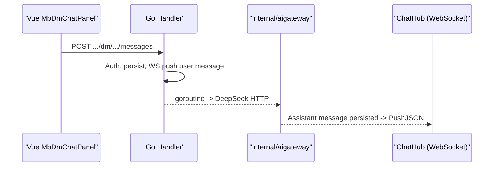
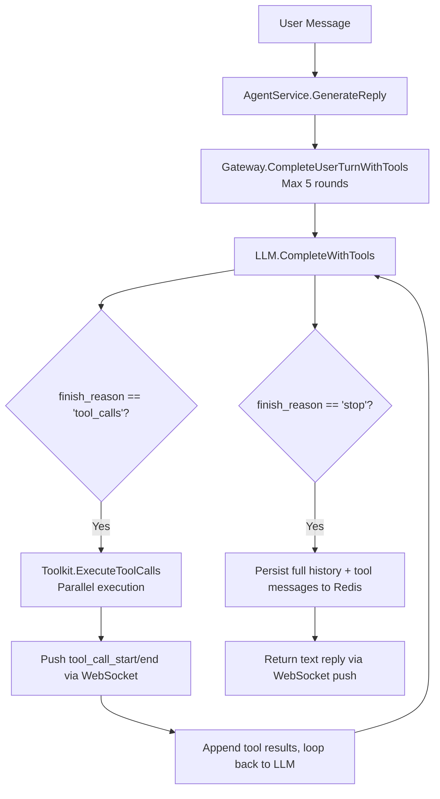

<p align="center">
  <a href="docs/ai-gateway.md">
    
  </a>
  <strong></strong>
</p>

  </a>
  </a>
</p>

  </a>
</p>

# cakecake AI Gateway (Message Center Assistant)

## Features

- Every logged-in user automatically gets a fixed **cakecake AI** conversation (`kind=agent`) in "My Messages."
- User messages go through existing `POST /api/v1/dm/conversations/:id/messages`; server asynchronously calls **DeepSeek**, assistant reply is persisted then pushed via **WebSocket** (`/api/v1/ws/chat`).
- Short-term context stored in **Redis** (`mb:agent:hist:{conversationId}`), daily quota `mb:agent:quota:{userId}:{date}`.

## Architecture



## Admin Configuration

Login to admin panel -> **AI Roles** (`/admin/agent`):

- **Multi-role cards**: Each role has independent name, avatar, persona, welcome message.
- **Welcome message pool**: Multiple welcome messages configurable; when user **first** establishes conversation with a role, **randomly** selects one.
- Each enabled role corresponds to a **separate conversation** (different system account).
- Max 12 roles; after disabling, new users won't get conversations but existing ones are preserved.

## Environment Variables

| Variable | Description |
|----------|-------------|
| `DEEPSEEK_API_KEY` | DeepSeek API Key (required for replies) |
| `DEEPSEEK_BASE_URL` | Default `https://api.deepseek.com` |
| `DEEPSEEK_MODEL` | Default `deepseek-chat` |
| `AGENT_BOT_USERNAME` | System account username, default `minibili_ai` |
| `AGENT_MAX_HISTORY` | Redis context round limit |
| `AGENT_HISTORY_TTL` | Redis context expiry (Go duration, default `720h` = 30 days) |
| `AGENT_DAILY_QUOTA` | Per-user daily call limit |

## Interview Highlights

1. **Gateway responsibilities**: Auth, sensitive words, quotas, timeouts, model adaptation -- decoupled from business APIs.
2. **Reuses IM**: Same DM tables, pagination, WS -- reducing frontend costs.
3. **Async replies**: User requests return quickly; LLM runs in background goroutine, results pushed.
4. **Observability extensions**: `trace_id`, Prometheus, streaming first-token latency (currently non-streaming full reply).

## Related Code

- `internal/aigateway/` -- DeepSeek client & Redis context
- `internal/service/agent.go` -- Orchestration, quotas, persistence
- `internal/handler/dm.go` -- Agent conversation branch
- `internal/data/agent_seed.go` -- System user & conversation initialization

## Tool Use / Function Calling

### Architecture



### New WebSocket Protocol

**tool_call_start** -- Begin executing a tool:
```json
{
  "type": "tool_call_start",
  "body": {
    "trace_id": "a1b2c3d4",
    "span_id": "a1b2c3d4-t0",
    "parent_span_id": "a1b2c3d4",
    "tool_name": "search_videos",
    "arguments": { "keyword": "golang" },
    "started_at": "2026-07-23T10:00:00Z"
  }
}
```

**tool_call_end** -- Tool execution complete:
```json
{
  "type": "tool_call_end",
  "body": {
    "trace_id": "a1b2c3d4",
    "span_id": "a1b2c3d4-t0",
    "tool_name": "search_videos",
    "duration_ms": 42,
    "result_summary": "found 3 results"
  }
}
```

**tool_result_data** -- Structured results for frontend card rendering:
```json
{
  "type": "tool_result_data",
  "body": {
    "trace_id": "a1b2c3d4",
    "span_id": "a1b2c3d4-t0",
    "tool_name": "search_videos",
    "items": [
      { "id": 1, "title": "Super Electromagnetic Cannon", "author": "earthcake", "plays": 32, "cover": "https://...", "duration": "5:24" }
    ]
  }
}
```

### Defined Tools

| Tool | Parameters | Description |
|------|------------|-------------|
| `search_videos` | `keyword`(required), `page`, `page_size` | Keyword search, ES primary, DB LIKE fallback |
| `get_video_detail` | `video_id`(required) | Video detail + uploader info + tags |
| `get_trending` | `limit` | Hot video leaderboard (by play count) |
| `get_video_comments` | `video_id`(required), `page`, `page_size` | Video comment list |
| `get_video_danmaku` | `video_id`(required), `limit` | Video danmaku samples |

### Admin Toggles

Each tool can be independently enabled/disabled via RuntimeConfig, key format: `tool_{name}_enabled`, default `true`.

| Key | Description |
|-----|-------------|
| `tool_search_videos_enabled` | Search videos |
| `tool_get_video_detail_enabled` | Video detail |
| `tool_get_trending_enabled` | Leaderboard |
| `tool_get_video_comments_enabled` | Comments |
| `tool_get_video_danmaku_enabled` | Danmaku |

### Interview Highlights

1. **Tool Schema Design**: Each tool's description is detailed, parameters marked required, helping the model select accurately.
2. **Multi-round Orchestration**: 5-round cap + degradation on overflow, preventing dead loops.
3. **Parallel Execution**: Same-round tool_calls execute in goroutines, improving response speed.
4. **Three-layer Anti-abuse**: Quota check -> sensitive word input/output filter -> per-tool RuntimeConfig toggle.
5. **trace_id??**: Same trace_id in both Zap logs and frontend push, shared debugging chain.

---

## Streaming / Pause / Continue / Regenerate: Pitfalls & Key Technical Points

> This section records the pitfalls encountered while evolving the assistant from a non-streaming full reply into a streaming typewriter with pause/continue, regenerate, and follow-up suggestions.

### 1. Delta Push Target: the DM `UserLow/UserHigh` Trap

DM conversations store both participant IDs sorted as `(min, max)` in `user_low/user_high`. When the bot ID (e.g. 14) is smaller than the user ID (e.g. 18), `conv.UserLow` is the **bot**, not the user.

We once used `conv.UserLow` as the streaming push target: `dm_message` used the correct `humanID`, so the final message arrived, but every `agent_delta` was pushed to the bot (no connection) — the frontend received zero streaming text and only the final message.

Fix: `humanPeerForConversation(conv, botUserID)` explicitly returns the non-bot participant, covered by a unit test.

### 2. Global Callback vs Per-Call Callback (Cross-User Mixup)

The gateway initially exposed a single `OnTextDelta` field overwritten before each generation. When two users generated concurrently, the later closure replaced the earlier one, and user A's tokens could be pushed to user B.

Fix: `CompleteUserTurnStream` / `CompleteUserTurnWithToolsStream` / `ContinueTurnStream` now accept a **per-call** `onDelta func(string)`; every call holds its own closure (with its own `humanID`), eliminating cross-user mixups.

### 3. Pause/Resume State Machine (The Most Leak-Prone Part)

Design goal: clicking “stop” keeps the LLM stream running in the background and buffers deltas; clicking “continue” replays the buffer at typewriter pace and then resumes live deltas.

Core state:

| Field | Meaning |
|-------|---------|
| `paused` | Paused (deltas go to the buffer, not pushed) |
| `buffer []string` | Deltas buffered while paused |
| `dropped` | Superseded by a newer generation; discard later deltas |
| `genID` | Generation id; an old goroutine can never clear newer state |
| `pauseSeq` | Stop sequence, incremented on every pause |
| `resuming` | Replay-in-progress flag; serializes concurrent continues |

Three pitfalls hit:

- **Unpausing before replay**: buffered replay and live deltas wrote concurrently, scrambling text into code blocks. Fix: stay `paused` during replay; unpause only after the buffer is drained.
- **Two concurrent continues**: the second replay unpaused before the first finished, recreating the interleave. Fix: the `resuming` flag makes concurrent resumes wait; unpause only when no new pause happened during replay (`pauseSeq` unchanged) and the buffer is empty.
- **A stop during replay was overridden**: the replay's final “unpause” wiped out the just-clicked stop, making stop ineffective. Fix: check `pauseSeq` **before pushing every fragment**; on a new stop, interrupt the replay immediately and keep the remainder buffered for the next continue.

### 4. Avoiding Duplicate Rows: Never Substring-Match the Draft

We used to check whether the latest assistant content "contains" the streamed draft. Two fatal flaws:

1. Persisted content is normalized (`normalizeMarkdownFences` / `dedupeConsecutiveLines` / trim) while the draft is the raw stream — they do not match;
2. `ListMessages` returns DESC (newest first), but the old code iterated from the tail and returned on the first assistant found — effectively comparing against the **oldest** message in the window.

Result: when the reply was already persisted and the user clicked continue late, the model was re-prompted and a second row was created.

Fix: `latestUserTurnHasAssistantReply` — only check whether an assistant row exists after the latest user message, with no text comparison; combined with a per-user `agentRunLock` that serializes the resume decision and persistence, so even a double continue persists exactly one row.

### 5. Async Follow-Up Suggestions (Eliminating the End Dead-Wait)

After the reply text finished streaming, a synchronous second LLM call generated suggestion chips (up to 15s), delaying the final message — the UI appeared to “finish much later”.

Fix: persist and push the reply immediately (empty suggestions), then in a background goroutine:

1. `UpdateMessageSuggestions(messageID, sugg)` updates the row;
2. Push a new WS event `agent_suggestions {message_id, suggestions}`;
3. The frontend updates the existing message's suggestions by `message_id`; chips appear later.

Measured: the gap from stream end to persisted row dropped from 5–15s to ~100ms.

### 6. Markdown Fence Normalization

At stop/continue seams the model often emits extra ````go`, duplicate open fences, or repeated lines. Before persistence:

- `normalizeMarkdownFences`: unify fences to three backticks, drop seam artifacts (language-tagged fence while already inside a block), append a closing fence if unclosed;
- `dedupeConsecutiveLines`: remove exact consecutive duplicate lines;
- `plainTextPreview`: strip markdown for conversation-list previews.

⚠️ When asserting stream order, normalize both the client-side delta concatenation and the persisted text with the **same** normalization; otherwise fence differences cause false failures.

### 7. Frontend State Machine: In-Place Regenerate

Consecutive assistant rows are merged into a “version bubble” (`versions` + `‹ n / n ›` switcher).

Regenerate flow: `_agentRegenerating=true` → clear the old content in place → the new stream types into the same bubble.

Two pitfalls:

- **Clearing `_agentRegenerating` on stop**: the renderer assumed the in-place rewrite ended, the old version flashed back, and a duplicate `agent-draft` bubble appeared. Fix: keep the in-place flag through stop/continue until the final `dm_message` arrives.
- **Not clearing the old version's tool data**: the previous turn's `search_videos` cards/status leaked into the regenerating bubble. Fix: when rewriting in place, also clear `toolActivities` / `toolResultData` / `suggestions`.

### 8. Scrolling & UX

- Scrolling to the bottom on every delta hijacked the user's manual scroll. Fix: `onChatScroll` maintains `_userScrolledUp`; auto-scroll only runs when the view is near the bottom.
- Clicking regenerate jumps to the user's question row (explicit requirement); ~700ms after the jump animation, auto-follow resumes. Manual up-scroll always wins.
- Keeping the in-place rewrite during stop/continue prevents scroll jumps to a new bubble.

### 9. Never Drop WS Control Frames

If `sendWsControl` returns early while the WS is reconnecting, stop/continue frames are silently lost — the backend streams to completion (“stop doesn't work, it all generates at once”).

Fix: queue control frames in `_pendingWsControls` and flush them in `onopen`.

### 10. End-to-End Verification

These bugs cannot be covered by unit/API tests; they require a **real browser + real model**:

- **Browser click flow** (puppeteer + Chromium): send → stop → continue → regenerate; assert DB row count, no duplicate `agent-draft` row in the DOM, old content never flashes back, and scroll position.
- **Raw WS race**: send two `agent_continue` frames back-to-back and assert exactly one assistant row.
- **Stream-order assertion**: concatenate all deltas received by the client and compare with the persisted text under the same normalization (include frames received before the polling loop; we once mis-reported by skipping the head).
- **Stop responsiveness**: at most 2–3 in-flight fragments after stop (network latency); the stream must not keep emitting whole chunks.

### Protocol Additions

| Event | Direction | Description |
|-------|-----------|-------------|
| `agent_delta` | server → client | Streaming text fragment `{content}` |
| `agent_suggestions` | server → client | Async follow-up chips `{message_id, suggestions}` |
| `agent_cancel` | client → server | Pause (buffer; background LLM keeps running) |
| `agent_continue` | client → server | Replay buffer and resume live stream |
| `agent_regenerate` | client → server | Regenerate the turn (new version) |

### Core Invariants

- Each user message (except regenerate) ends with exactly one assistant row; regenerate adds one version per click.
- Streaming order == persisted text order; pause/continue must never reorder.
- Stop latency ≈ one in-flight fragment; a stop during replay takes effect immediately.
- Control frames must always be delivered (reconnect flush), never silently dropped.

### Related Code

- `internal/aigateway/gateway.go` — per-call deltas, streaming tool orchestration
- `internal/service/agent/agent.go` — pause/resume state machine, markdown normalization
- `internal/handler/agent_direct_message.go` — resume/regenerate, async suggestions
- `cakecake-vue/cakecake-web/src/components/cakecake/MbDmChatPanel.vue` — frontend state machine, scrolling, control-frame queue
