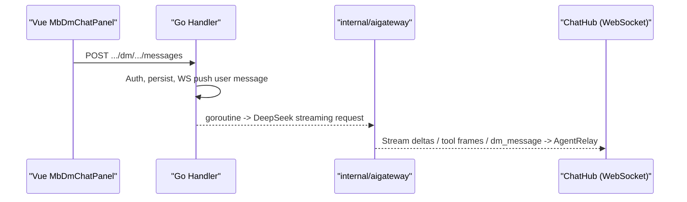
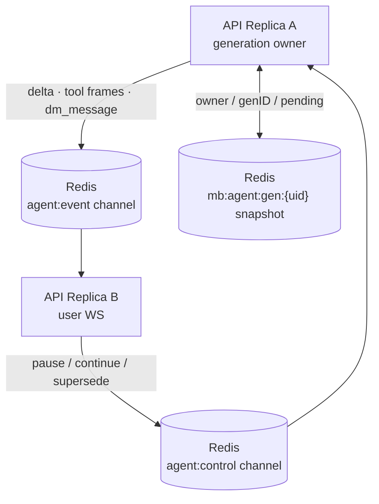
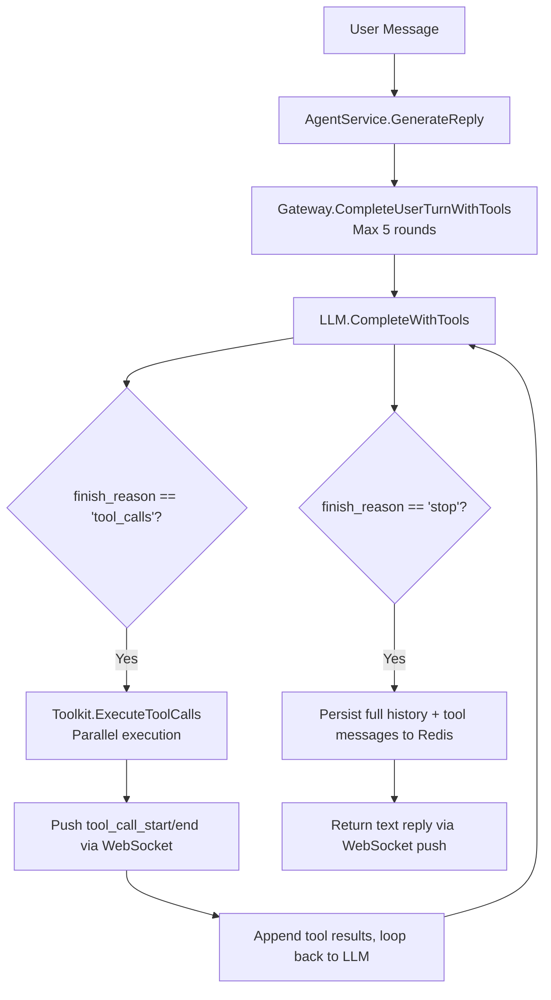

<p align="center">
  <a href="ai-gateway.md">
    
  </a>
  <strong></strong>
</p>

# cakecake AI Gateway (Message Center Assistant)

## Features

- Every logged-in user automatically gets a fixed **cakecake AI** conversation (`kind=agent`) in "My Messages."
- User messages go through existing `POST /api/v1/dm/conversations/:id/messages`; server **streams** **DeepSeek**, text deltas are pushed in real time via **WebSocket** (`/api/v1/ws/chat`), and the final reply is persisted then pushed as a full message; supports pause / continue / regenerate.
- Short-term context stored in **Redis** (`mb:agent:hist:{conversationId}`), daily quota `mb:agent:quota:{userId}:{date}`.

## Architecture



In single-instance mode `AgentRelay` writes directly to the local `ChatHub`; under multiple replicas events are fanned out through Redis `agent:event` to the replica holding the user's WS, and control frames are routed through `agent:control` to the generation owner:



All three Redis entities live in the same Redis instance but belong to three different planes:

- **`agent:event` — message plane: where messages go.** It carries the whole real-time event stream the user's WS receives: streaming deltas, tool frames (start/end/result), continue mode, suggestions, and the final `dm_message`/`dm_conversation`. The generation owner publishes to the channel; every replica subscribes and writes to its local `ChatHub`, so the user receives everything no matter which replica holds their WS.
- **`agent:control` — control plane: who executes the command.** It only carries pause / continue / supersede. The replica holding the user's WS publishes the command (triggered by the frontend's stop/continue); the channel routes it to the generation owner, which may run on another replica. The `from` field makes the publisher ignore its own echoed control.
- **`mb:agent:gen:{uid}` — state plane: who is running, where it is.** It is a compact cross-instance snapshot (TTL 24h): owner, genID, running/paused, pause_seq, conv_id, and the paused-completed reply not yet persisted (pending). Any replica reads it to decide "am I the owner"; if the owner dies, the pending reply can still be recovered.

One-line memory: **event = where messages go; control = who executes the command; snapshot = who is running and where it is.**

Deployment topology and rationale: [ARCHITECTURE_EN.md](ARCHITECTURE_EN.md#61-multi-instance-state-externalization-horizontal-scaling).

## Admin Configuration

Login to admin panel -> **AI Roles** (`/admin/agent`):

- **Multi-role cards**: Each role has independent name, avatar, persona, welcome message.
- **Welcome message pool**: Multiple welcome messages configurable; when user **first** establishes conversation with a role, **randomly** selects one.
- Each enabled role corresponds to a **separate conversation** (different system account).
- Max 12 roles; after disabling, new users won't get conversations but existing ones are preserved.

## Environment Variables

| Variable | Description |
|----------|-------------|
| `DEEPSEEK_API_KEY` | DeepSeek API Key (required for replies) |
| `DEEPSEEK_BASE_URL` | Default `https://api.deepseek.com` |
| `DEEPSEEK_MODEL` | DeepSeek model name, default `deepseek-v4-flash` |
| `AGENT_BOT_USERNAME` | System account username, default `minibili_ai` |
| `AGENT_MAX_HISTORY` | Redis context round limit |
| `AGENT_HISTORY_TTL` | Redis context expiry (Go duration, default `720h` = 30 days) |
| `AGENT_DAILY_QUOTA` | Per-user daily call limit |

## Interview Highlights

1. **Gateway responsibilities**: Auth, sensitive words, quotas, timeouts, model adaptation -- decoupled from business APIs.
2. **Reuses IM**: Same DM tables, pagination, WS -- reducing frontend costs.
3. **Async streaming replies**: User requests return quickly; LLM streams in a background goroutine, deltas are pushed in real time, final reply persisted.
4. **Observability**: `trace_id` spans backend logs and frontend; `GET /metrics` exposes Prometheus metrics: first-token latency, token usage and per-user/per-day estimated cost, tool call count/duration/failure rate, LLM request error rate, and pause/continue/regenerate counters.

## Prometheus Metrics (GET /metrics)

| Metric | Meaning |
| --- | --- |
| `cakecake_llm_requests_total{status}` | LLM request success/failure count |
| `cakecake_llm_first_token_seconds` | Streaming first-token latency histogram |
| `cakecake_llm_tokens_total{type}` | prompt / completion token usage |
| `cakecake_llm_cost_usd_total{user,date}` | Estimated cost per user/day (in-memory counter, reset on restart) |
| `cakecake_agent_tool_calls_total{tool,status}` | Tool call count and failure rate |
| `cakecake_agent_tool_call_seconds{tool}` | Tool call duration |
| `cakecake_agent_controls_total{type}` | pause / continue / regenerate counters |

> The full stack (Prometheus + Alertmanager + Grafana dashboard) and security baseline live in [monitoring_EN.md](./monitoring_EN.md); protect `/metrics` with `METRICS_TOKEN` in production.

## Related Code

- `internal/aigateway/` -- DeepSeek client, streaming orchestration & Redis context
- `internal/service/agent/agent.go` -- Orchestration, pause/continue state machine, quotas, persistence
- `internal/service/agent/agent_orchestrate.go` -- orchestration (run/resume/regenerate, persistence, async suggestions)
- `internal/handler/agent_direct_message.go` -- forwarding only (WS/HTTP triggers + push adapter)
- `internal/handler/direct_message_ws.go` -- WS control frames
- `internal/data/agent_seed.go` -- System user & conversation initialization

## Tool Use / Function Calling

### Architecture



### New WebSocket Protocol

**tool_call_start** -- Begin executing a tool:
```json
{
  "type": "tool_call_start",
  "body": {
    "trace_id": "a1b2c3d4",
    "span_id": "a1b2c3d4-t0",
    "parent_span_id": "a1b2c3d4",
    "tool_name": "search_videos",
    "arguments": { "keyword": "golang" },
    "started_at": "2026-07-23T10:00:00Z"
  }
}
```

**tool_call_end** -- Tool execution complete:
```json
{
  "type": "tool_call_end",
  "body": {
    "trace_id": "a1b2c3d4",
    "span_id": "a1b2c3d4-t0",
    "tool_name": "search_videos",
    "duration_ms": 42,
    "result_summary": "found 3 results"
  }
}
```

**tool_result_data** -- Structured results for frontend card rendering:
```json
{
  "type": "tool_result_data",
  "body": {
    "trace_id": "a1b2c3d4",
    "span_id": "a1b2c3d4-t0",
    "tool_name": "search_videos",
    "items": [
      { "id": 1, "title": "Super Electromagnetic Cannon", "author": "earthcake", "plays": 32, "cover": "https://...", "duration": "5:24" }
    ]
  }
}
```

### Defined Tools

| Tool | Parameters | Description |
|------|------------|-------------|
| `search_videos` | `keyword`(required), `page`, `page_size` | Keyword search, ES primary, DB LIKE fallback |
| `get_video_detail` | `video_id`(required) | Video detail + uploader info + tags |
| `get_trending` | `limit` | Hot video leaderboard (by play count) |
| `get_video_comments` | `video_id`(required), `page`, `page_size` | Video comment list |
| `get_video_danmaku` | `video_id`(required), `limit` | Video danmaku samples |

### Admin Toggles

Each tool can be independently enabled/disabled via RuntimeConfig, key format: `tool_{name}_enabled`, default `true`.

| Key | Description |
|-----|-------------|
| `tool_search_videos_enabled` | Search videos |
| `tool_get_video_detail_enabled` | Video detail |
| `tool_get_trending_enabled` | Leaderboard |
| `tool_get_video_comments_enabled` | Comments |
| `tool_get_video_danmaku_enabled` | Danmaku |

### Interview Highlights

1. **Tool Schema Design**: Each tool's description is detailed, parameters marked required, helping the model select accurately.
2. **Multi-round Orchestration**: 5-round cap + degradation on overflow, preventing dead loops.
3. **Parallel Execution**: Same-round tool_calls execute in goroutines, improving response speed.
4. **Three-layer Anti-abuse**: Quota check -> sensitive word input/output filter -> per-tool RuntimeConfig toggle.
5. **trace_id??**: Same trace_id in both Zap logs and frontend push, shared debugging chain.

---

## Streaming / Pause / Continue / Regenerate: Pitfalls & Key Technical Points

> The hard bugs on this path (duplicate messages, stop not working, split code blocks, missing/duplicated result cards, regenerate answering the wrong turn, welcome-regenerate freeze, layout drift) were never "a function written wrong" — they were caused by **messy structure**: the same state scattered across layers, heuristics guessing instead of explicit decisions, and rendering logic with side effects. Patching symptoms one by one only multiplies fixes; the effective move is consolidating responsibilities so every layer has a single source of truth. The table below records those structural principles.

### The Big Picture (Plain English)

An AI reply doesn't arrive all at once; it streams in small pieces (deltas). The product requires three things:

1. **Typewriter effect**: show text as it is generated;
2. **Stop ≠ cancel**: clicking "stop" only hides new content; the backend LLM keeps running. Clicking "continue" replays the buffered text at typewriter pace, then resumes live output;
3. **Regenerate**: ask the model again for the same user question and replace the old reply in place instead of creating a new bubble.

Why it's hard: the stream is asynchronous (the backend generates while the frontend receives), users can act concurrently (rapid stop/continue), and the WebSocket can drop and reconnect. Combined, these produce bugs that look fine at first glance but leak in edge cases.

### Glossary

| Term | Plain-English meaning |
|------|-----------------------|
| delta | A small piece of text emitted by the model during streaming |
| pause | Stop showing new content; the backend LLM keeps running and new deltas go into a buffer |
| buffer | Deltas accumulated while paused; replayed at typewriter pace on continue |
| resume (continue) | Replay the buffer first, then resume live deltas |
| regenerate | Re-ask the model for the same turn and replace the old reply in place |
| genID | Generation counter; incremented on each regenerate, used to discard stale streams |
| version bubble | Frontend merges multiple replies for the same question into one bubble with a `‹ n / n ›` switcher |

### Structural Principles (where it was messy → how we consolidated → which bugs it prevents)

| # | Where it was messy | Consolidated structure | Bugs prevented |
|---|--------------------|------------------------|----------------|
| 1 | Generation state split between the handler's cancel registry and the service's `genStates`, kept in sync by hand | The whole state machine lives in `AgentService`; the handler only forwards WS/HTTP and uses the `DmReader`/`ReplyPusher` ports | Duplicate messages, stop not working, stale generations resurfacing |
| 2 | The draft lived in three places: frontend `_agentDraftContent`, WS `partial`, backend buffer | The draft lives only on the server; `agent_continue` carries no `partial`; `agent_continue_mode {buffer|reprompt}` tells the frontend the mode | Seam leaks at stop/continue, split code blocks |
| 3 | Concurrent continues busy-waited with `time.Sleep`; replay kept pushing old deltas after a supersede | `sync.Cond` wakeups; replay checks `dropped` before every fragment and discards the rest on supersede | Stop not effective, stale stream leaking to the UI |
| 4 | Card display guessed from reply text via regex (numeric substrings; whole-turn "没关系/没搜到" false kills) | The model declares `【展示】tool#ID` at the end of the reply; the backend persists exactly those; title matching is only a fallback; the frontend dedupes defensively | Irrelevant cards mixed in, recommended cards missing/duplicated |
| 5 | Regenerate looked for the "latest user message" from the tail of a newest-first list (getting the OLDEST); silently returned when there was no user message | Scan from the head for the newest user; with no user message, regenerate the welcome instead; 120s frontend safety net | Regenerate answering the wrong turn, welcome-regenerate freeze |
| 6 | Version merging had side effects in a computed; message actions were nested inside the flex row | Merging is the pure function `buildVersionGroups`; actions/cards are siblings of the row; frontend state moved into a reactive composable | Version switcher NaN/2, action-bar layout drift |
| 7 | Re-prompt stitching guessed the seam with whitespace-normalized longest overlap | Non-streaming completion → deterministic stitch rules → only the unseen tail is streamed | Duplicate lines at the seam, fence corruption |
| 8 | Follow-up chips were generated synchronously, blocking persistence for 5–15s | Persist and push first; generate `agent_suggestions` in the background | End-of-reply dead wait |
| 9 | Push target assumed `conv.UserLow`; the delta callback was a global field | Explicit `humanPeerForConversation`; per-call `onDelta` closures | Typewriter not showing, cross-user mixups |
| 10 | Generation state and WebSockets lived in one instance's memory; with multiple replicas pause/resume could not reach the owner | Redis Pub/Sub event/control channels + `mb:agent:gen:{uid}` snapshot (owner routing, genID-guarded); all pushes go through the event channel | Stop/continue failing under multi-instance, events lost |

Every principle has unit tests; anything involving a real model/browser (rapid stop/continue/regenerate, follow-ups, welcome regenerate, trending card counts) is verified end-to-end with puppeteer + a real model.

### Protocol Additions

| Event | Direction | Description |
|-------|-----------|-------------|
| `agent_delta` | server → client | Streaming text fragment `{content}` |
| `agent_suggestions` | server → client | Async follow-up chips `{message_id, suggestions}` |
| `agent_cancel` | client → server | Pause (buffer; background LLM keeps running) |
| `agent_continue` | client → server | Replay buffer and resume live stream (**no partial**) |
| `agent_continue_mode` | server → client | Continue mode: `buffer` (seamless replay) or `reprompt` (fallback re-prompt) |
| `agent_regenerate` | client → server | Regenerate the turn (new version) |

### Core Invariants

- Each user message (except regenerate) ends with exactly one assistant row; regenerate adds one version per click.
- Streaming order == persisted text order; pause/continue must never reorder.
- Stop latency ≈ one in-flight fragment; a stop during replay takes effect immediately.
- Control frames must always be delivered (reconnect flush), never silently dropped.

### Related Code

- `internal/aigateway/gateway.go` — per-call deltas, streaming tool orchestration
- `internal/service/agent/agent.go` — pause/resume state machine, markdown normalization
- `internal/service/agent/agent_orchestrate.go` — orchestration (run/resume/regenerate, persistence, async suggestions)
- `internal/service/agent/agent_relay.go` — cross-instance event/control Redis Pub/Sub
- `internal/service/agent/agent_snapshot.go` — cross-instance generation snapshot (owner/genID/pending)
- `internal/handler/agent_direct_message.go` — forwarding only (WS/HTTP triggers + push adapter)
- `cakecake-vue/cakecake-web/src/composables/useAgentStreaming.js` — frontend streaming state machine (reactive composable)
- `cakecake-vue/cakecake-web/src/components/cakecake/MbDmMessageItem.vue` — message bubble / actions / result cards rendering
