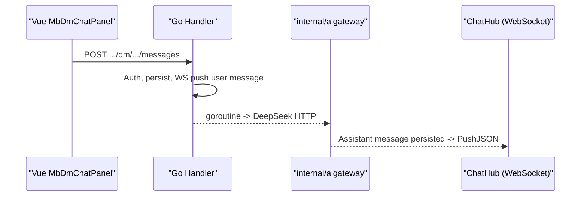
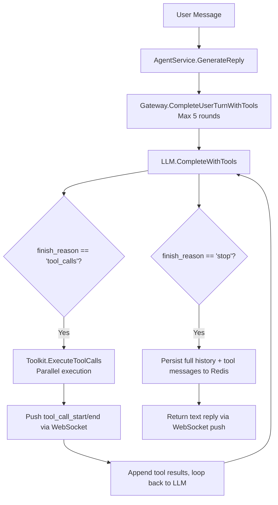

<p align="center">
  <a href="docs/ai-gateway.md">
    
  </a>
  <strong></strong>
</p>

  </a>
  </a>
</p>

  </a>
</p>

# Minibili AI Gateway (Message Center Assistant)

## Features

- Every logged-in user automatically gets a fixed **Minibili AI** conversation (`kind=agent`) in "My Messages."
- User messages go through existing `POST /api/v1/dm/conversations/:id/messages`; server asynchronously calls **DeepSeek**, assistant reply is persisted then pushed via **WebSocket** (`/api/v1/ws/chat`).
- Short-term context stored in **Redis** (`mb:agent:hist:{conversationId}`), daily quota `mb:agent:quota:{userId}:{date}`.

## Architecture



## Admin Configuration

Login to admin panel -> **AI Roles** (`/admin/agent`):

- **Multi-role cards**: Each role has independent name, avatar, persona, welcome message.
- **Welcome message pool**: Multiple welcome messages configurable; when user **first** establishes conversation with a role, **randomly** selects one.
- Each enabled role corresponds to a **separate conversation** (different system account).
- Max 12 roles; after disabling, new users won't get conversations but existing ones are preserved.

## Environment Variables

| Variable | Description |
|----------|-------------|
| `DEEPSEEK_API_KEY` | DeepSeek API Key (required for replies) |
| `DEEPSEEK_BASE_URL` | Default `https://api.deepseek.com` |
| `DEEPSEEK_MODEL` | Default `deepseek-chat` |
| `AGENT_BOT_USERNAME` | System account username, default `minibili_ai` |
| `AGENT_MAX_HISTORY` | Redis context round limit |
| `AGENT_HISTORY_TTL` | Redis context expiry (Go duration, default `720h` = 30 days) |
| `AGENT_DAILY_QUOTA` | Per-user daily call limit |

## Interview Highlights

1. **Gateway responsibilities**: Auth, sensitive words, quotas, timeouts, model adaptation -- decoupled from business APIs.
2. **Reuses IM**: Same DM tables, pagination, WS -- reducing frontend costs.
3. **Async replies**: User requests return quickly; LLM runs in background goroutine, results pushed.
4. **Observability extensions**: `trace_id`, Prometheus, streaming first-token latency (currently non-streaming full reply).

## Tool Use / Function Calling

### Architecture



### New WebSocket Protocol

**tool_call_start** -- Begin executing a tool:
```json
{
  "type": "tool_call_start",
  "body": {
    "trace_id": "a1b2c3d4",
    "span_id": "a1b2c3d4-t0",
    "parent_span_id": "a1b2c3d4",
    "tool_name": "search_videos",
    "arguments": { "keyword": "golang" },
    "started_at": "2026-07-23T10:00:00Z"
  }
}
```

**tool_call_end** -- Tool execution complete:
```json
{
  "type": "tool_call_end",
  "body": {
    "trace_id": "a1b2c3d4",
    "span_id": "a1b2c3d4-t0",
    "tool_name": "search_videos",
    "duration_ms": 42,
    "result_summary": "found 3 results"
  }
}
```

**tool_result_data** -- Structured results for frontend card rendering:
```json
{
  "type": "tool_result_data",
  "body": {
    "trace_id": "a1b2c3d4",
    "span_id": "a1b2c3d4-t0",
    "tool_name": "search_videos",
    "items": [
      { "id": 1, "title": "Super Electromagnetic Cannon", "author": "earthcake", "plays": 32, "cover": "https://...", "duration": "5:24" }
    ]
  }
}
```

### Defined Tools

| Tool | Parameters | Description |
|------|------------|-------------|
| `search_videos` | `keyword`(required), `page`, `page_size` | Keyword search, ES primary, DB LIKE fallback |
| `get_video_detail` | `video_id`(required) | Video detail + uploader info + tags |
| `get_trending` | `limit` | Hot video leaderboard (by play count) |
| `get_video_comments` | `video_id`(required), `page`, `page_size` | Video comment list |
| `get_video_danmaku` | `video_id`(required), `limit` | Video danmaku samples |

### Admin Toggles

Each tool can be independently enabled/disabled via RuntimeConfig, key format: `tool_{name}_enabled`, default `true`.

| Key | Description |
|-----|-------------|
| `tool_search_videos_enabled` | Search videos |
| `tool_get_video_detail_enabled` | Video detail |
| `tool_get_trending_enabled` | Leaderboard |
| `tool_get_video_comments_enabled` | Comments |
| `tool_get_video_danmaku_enabled` | Danmaku |

### Interview Highlights

1. **Tool Schema Design**: Each tool's description is detailed, parameters marked required, helping the model select accurately.
2. **Multi-round Orchestration**: 5-round cap + degradation on overflow, preventing dead loops.
3. **Parallel Execution**: Same-round tool_calls execute in goroutines, improving response speed.
4. **Three-layer Anti-abuse**: Quota check -> sensitive word input/output filter -> per-tool RuntimeConfig toggle.
5. **trace_id??**: Same trace_id in both Zap logs and frontend push, shared debugging chain.

## Related Code

- `internal/aigateway/` -- DeepSeek client & Redis context
- `internal/service/agent.go` -- Orchestration, quotas, persistence
- `internal/handler/dm.go` -- Agent conversation branch
- `internal/data/agent_seed.go` -- System user & conversation initialization
